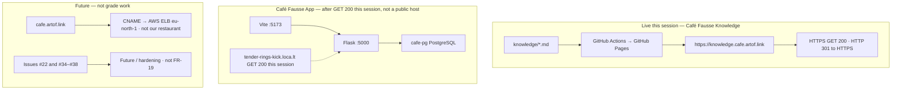

# Friday score-5 plan

Working reference for **Friday 2026-09-04 19:00 Europe/Berlin**. Not official Quantic dashboard text. Not the restaurant.

**Grade of 5** = official SRS only: **FR-1..FR-18** and **NFR-1..NFR-9**. PDF in `docs/official/` is source of truth. Do not invent FR-19 / NFR-10.

Friday’s job is **tech access** plus **lock the video and scenarios**. It is not a night to implement Future extras.

**App tunnel this session:** `https://tender-rings-kick.loca.lt/` — GET **200** (SPA HTML). `https://tender-rings-kick.loca.lt/api/health` — GET **200** `{"ok":true}`. Temporary localtunnel to Flask on cts-ai. **Not** `cafe.artof.link`. Clips stay the fallback if the tunnel drops. Never claim `cafe.artof.link` is Café Fausse.

Drafts that belong with this page: [10-minute video script](video-script.md), [slide outline](presentation-sample.md). Meeting notes stay on the [Brief](brief.md).

## Ready vs Unknown (plain language)

| Already true (code / CI / this-session probe) | Still **Unknown** — do not claim met |
|---|---|
| Restaurant MVP **on `main`** (PRs #9 + #12): React + JSX, Flask, PostgreSQL | **NFR-1** (3s broadband page load) — local Vite home 56 ms is a note, **not** “met” |
| Every freeze ID mapped on [Coverage](coverage.md) | **NFR-2** (2s form submit) — local `GET /api/site` 32 ms is not a submit stopwatch |
| Knowledge host HTTPS **GET 200** (2026-09-04 Europe/Berlin): `knowledge.cafe.artof.link` | **NFR-7** four-browser claim — Chrome / Safari **Unknown**. Partial only: Edge all routes + Firefox home (Vite-only) |
| HTTP `knowledge.cafe.artof.link` → **301** to HTTPS (this session) | `cafe.artof.link` as Café Fausse App — **not our restaurant** (CNAME to an AWS ELB) |
| Journey **J1–J8 PASS** (cts-ai, DB up) + **J9 / NFR-3 / NFR-8 PASS** (Vite-only; Edge `probe-nfr/` 375×812 home, 768×1024 menu, 1280×800 reservations) — [Coverage](coverage.md) / [#40](https://github.com/artofdream/aea-interactive-design/issues/40) / [#44](https://github.com/artofdream/aea-interactive-design/issues/44) | Reservations / `cafe-pg` on the tunnel — **not** claimed (no write probe this session). Old `https://nine-teams-try.loca.lt/` GET **503**. Vite `:5173` from this Knowledge VM **Unknown** |
| App tunnel `https://tender-rings-kick.loca.lt/` GET **200** this session (SPA HTML) + `/api/health` GET **200** `{"ok":true}` | Temporary localtunnel to Flask on cts-ai — **not** `cafe.artof.link`, not a permanent host |
| Silent clips on the brief (look, not a live restaurant host) | Do not claim Flask+Postgres or `cafe.artof.link` from the Vite-only J9 / NFR-7 probe |

Coverage records the Journey / NFR numbers. This page does **not** claim **NFR-1** / **NFR-2** met, and does **not** claim a full **NFR-7** four-browser matrix. J9 **PASS** is Vite-only.

## P0 — must for Friday / score-5 story

Plain language: show the assignment, not extras. Prove what is live. Stay honest where we have no probe.

1. **Freeze only.** Talk FR-1..FR-18 / NFR-1..NFR-9. Freeze data (prices, address, hours, owners, awards, reviews) is not “improved.”
2. **Primary live surface — Knowledge.** Open `https://knowledge.cafe.artof.link/` (HTTPS). This knowledge map is the public surface. Probe this session (2026-09-04): GET **200**.
3. **App tunnel to share.** `https://tender-rings-kick.loca.lt/` GET **200** this session (SPA HTML). Health `https://tender-rings-kick.loca.lt/api/health` GET **200** `{"ok":true}`. Temporary localtunnel to Flask on cts-ai. Written on the [Brief](brief.md). Clips stay fallback. **Do not** open `cafe.artof.link` and call it Café Fausse.
4. **P0 live-proof path**
   - [Issue #40](https://github.com/artofdream/aea-interactive-design/issues/40) / [#44](https://github.com/artofdream/aea-interactive-design/issues/44) — **recorded** on [Coverage](coverage.md): J1–J8 **PASS** (cts-ai, DB up); J9 / NFR-3 / NFR-8 **PASS** (Vite-only Edge screenshots + theme.css); **NFR-1** / **NFR-2** timings noted, **not** claimed met; **NFR-7** **partial** (Edge all routes with screenshots + Firefox home; Chrome not installed; Safari Unknown).
   - **Tunnel:** `https://tender-rings-kick.loca.lt/` GET **200** this session (SPA + `/api/health`). Temporary. **Fallback:** committed clips. Old loca.lt `https://nine-teams-try.loca.lt/` GET **503** this session — do not reuse it.
   - Demo data / happy book / full slot (**FR-9**) only after a this-session write probe. After the App handoff, `cafe-pg` was reported unreachable; do not claim reservations on the tunnel without that probe.
5. **Lock video + scenarios.** Use the [script](video-script.md) and scenario menu A–F. Share Knowledge + `https://tender-rings-kick.loca.lt/` (GET **200** this session). Clips stay fallback. Still a look at the in-repo App, not `cafe.artof.link`.
6. **Honesty line.** J1–J8 PASS is local cts-ai UX while the DB was up. J9 / NFR-3 / NFR-8 **PASS** is Vite-only (Edge `probe-nfr/` screenshots + theme.css) — not Flask+Postgres. **NFR-7** is **partial** (Edge + Firefox home; Chrome not installed; Safari Unknown). **NFR-1** / **NFR-2** stay not-claimed-met. Do not say the SRS broadband budgets are met. Tunnel URL written after GET **200** this session; do not claim `cafe-pg` writes from that GET.

## P1 — Friday polish (same grade floor)

Do these only after P0 access works. They do not add requirement IDs.

- Record or rehearse the ~10 minute video against the script (clips already on this site).
- Walk the [8-slide cut](presentation-sample.md) with [Coverage](coverage.md) as the FR/NFR map.
- Tunnel URL written on the [Brief](brief.md): `https://tender-rings-kick.loca.lt/` GET **200** this session (SPA + `/api/health`). Temporary. The old loca.lt URL is not that probe.
- Keep one happy reservation and one newsletter write on demo data. Fail closed if PostgreSQL is missing.

## P2 — not Friday, not grade gaps

These issues are **Future / hardening**. Missing them is **not** a missing grade item. Do not treat them as FR-19+.

| Issue | What it is |
|---|---|
| [#22](https://github.com/artofdream/aea-interactive-design/issues/22) | Public restaurant on `cafe.artof.link` (hosting). That DNS name is an AWS ELB today, **not** our app. |
| [#34](https://github.com/artofdream/aea-interactive-design/issues/34) | Reservation lifecycle (PENDING → ASSIGNED → RELEASED) |
| [#35](https://github.com/artofdream/aea-interactive-design/issues/35) | Cancel / checkout / admin release APIs |
| [#36](https://github.com/artofdream/aea-interactive-design/issues/36) | Menu as persistent tables + staff CRUD |
| [#37](https://github.com/artofdream/aea-interactive-design/issues/37) | Verbatim case-sensitive email as an FS rule |
| [#38](https://github.com/artofdream/aea-interactive-design/issues/38) | Automatic concurrency retry beyond the unique index |
| [#46](https://github.com/artofdream/aea-interactive-design/issues/46) / [PR #47](https://github.com/artofdream/aea-interactive-design/pull/47) | AWS `cafe_fausse_db` column map — **merged**; Future reuse notes, not a new FR freeze. Live GET `aws-schema-map.html` **200** |

Park them on [Future](future.md). Grade floor stays the official PDF. Teammate RDS dump vs local schema (readable without cts-ai): [AWS `cafe_fausse_db` map](future/aws-schema-map.md) / [#46](https://github.com/artofdream/aea-interactive-design/issues/46). Do not apply that DDL to MVP.

## Live vs local vs Future

Three different things. Do not mix the labels.

- **Live Knowledge** is this site over HTTPS (primary Friday share).
- **App** is the in-repo restaurant. Tunnel this session: `https://tender-rings-kick.loca.lt/` GET **200** (SPA + `/api/health`). Temporary localtunnel to Flask on cts-ai — not a public host, not `cafe.artof.link`. Clips (`clips/01-home-menu.mp4`, `clips/02-happy-book.mp4`) are the fallback look.
- **Future `cafe.artof.link`** is the *intended* restaurant hostname. It is **not** Café Fausse App today. Hosting is #22.

Same picture in words: [Honesty](honesty.md). Stack diagrams: [Stack](stack.md).

## Friday room checklist

1. Knowledge HTTPS tab open. App tunnel tab: `https://tender-rings-kick.loca.lt/` (GET **200** this session). Clips ready as fallback. Not the old loca.lt URL.
2. Script + scenario A–F locked. Slides = 8-slide cut unless the room wants the long outline.
3. Say J1–J8 **PASS** (cts-ai, DB up) and J9 / NFR-3 / NFR-8 **PASS** (Vite-only Edge screenshots + theme.css) from [Coverage](coverage.md) / [#40](https://github.com/artofdream/aea-interactive-design/issues/40) / [#44](https://github.com/artofdream/aea-interactive-design/issues/44). Say **NFR-7** is **partial** (Edge + Firefox home; Chrome not installed; Safari Unknown). Say not-claimed-met for **NFR-1** / **NFR-2**. Share Knowledge + `https://tender-rings-kick.loca.lt/` (GET **200** this session). Clips stay fallback. Do not claim `cafe-pg` writes from the health GET.
4. Say Future #22 / #34–#38 are parked, not missing SRS rows.
5. Author does not merge their own PR. MRC **COMMENT** is the role-approve signal; then `cursor[bot]` may merge after this-run green checks and Bugbot resolve-or-decline.
