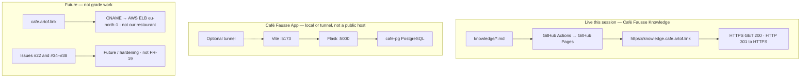

# Friday score-5 plan

Working reference for **Friday 2026-09-04 19:00 Europe/Berlin**. Not official Quantic dashboard text. Not the restaurant.

**Grade of 5** = official SRS only: **FR-1..FR-18** and **NFR-1..NFR-9**. PDF in `docs/official/` is source of truth. Do not invent FR-19 / NFR-10.

Friday’s job is **tech access** plus **lock the video and scenarios**. It is not a night to implement Future extras.

Drafts that belong with this page: [10-minute video script](video-script.md), [slide outline](presentation-sample.md). Meeting notes stay on the [Brief](brief.md).

## Ready vs Unknown (plain language)

| Already true (code / CI / this-session probe) | Still **Unknown** — do not claim met |
|---|---|
| Restaurant MVP **on `main`** (PRs #9 + #12): React + JSX, Flask, PostgreSQL | Journey 1–9 pass/fail — waits on [issue #40](https://github.com/artofdream/aea-interactive-design/issues/40) |
| Every freeze ID mapped on [Coverage](coverage.md) | **NFR-1** (3s page load) — no stopwatch this session |
| Knowledge host HTTPS **GET 200** (2026-09-02 Europe/Berlin): `knowledge.cafe.artof.link` | **NFR-2** (2s form submit) — a 2s DB timeout is not a UX timing probe |
| HTTP `knowledge.cafe.artof.link` → **301** to HTTPS; Pages `https_enforced=true` | **NFR-7** (Chrome / Firefox / Safari / Edge) — no browser matrix this session |
| Silent clips on the brief (look, not a live restaurant host) | `cafe.artof.link` as Café Fausse App — **not our restaurant** (CNAME to an AWS ELB) |

This page does **not** record Journey or NFR numbers. That is issue **#40**. Do not close or edit #40 from this work.

## P0 — must for Friday / score-5 story

Plain language: show the assignment, not extras. Prove what is live. Stay honest where we have no probe.

1. **Freeze only.** Talk FR-1..FR-18 / NFR-1..NFR-9. Freeze data (prices, address, hours, owners, awards, reviews) is not “improved.”
2. **Live Knowledge.** Open `https://knowledge.cafe.artof.link/` (HTTPS). This knowledge map is the public surface. Last probe this session: GET **200**.
3. **App access, not the wrong hostname.** Bring up local Vite `:5173` + Flask `:5000` + `cafe-pg`, **or** a temporary tunnel to that stack. **Do not** open `cafe.artof.link` and call it Café Fausse.
4. **P0 live-proof path** (still open work, not this PR):
   - [Issue #40](https://github.com/artofdream/aea-interactive-design/issues/40) — record Journey 1–9 and NFR timings **or** keep **Unknown**.
   - Tunnel (if the room cannot see localhost).
   - Demo data so a happy book and, if needed, a full slot (**FR-9**) can be shown without guessing.
5. **Lock video + scenarios.** Use the [script](video-script.md) and scenario menu A–F. If the stack is down, play the committed clips — say they are a look, not a public-host probe.
6. **Honesty line.** Journey / **NFR-1** / **NFR-2** / **NFR-7** stay **Unknown** until #40 has a this-session probe.

## P1 — Friday polish (same grade floor)

Do these only after P0 access works. They do not add requirement IDs.

- Record or rehearse the ~10 minute video against the script (clips already on this site).
- Walk the [8-slide cut](presentation-sample.md) with [Coverage](coverage.md) as the FR/NFR map.
- If a tunnel is used, write the URL on the brief **after** a GET this session. No hostname without a probe.
- Keep one happy reservation and one newsletter write on demo data. Fail closed if PostgreSQL is missing.

## P2 — not Friday, not grade gaps

These issues are **Future / hardening**. Missing them is **not** a missing grade item. Do not treat them as FR-19+.

| Issue | What it is |
|---|---|
| [#22](https://github.com/artofdream/aea-interactive-design/issues/22) | Public restaurant on `cafe.artof.link` (hosting). That DNS name is an AWS ELB today, **not** our app. |
| [#34](https://github.com/artofdream/aea-interactive-design/issues/34) | Reservation lifecycle (PENDING → ASSIGNED → RELEASED) |
| [#35](https://github.com/artofdream/aea-interactive-design/issues/35) | Cancel / checkout / admin release APIs |
| [#36](https://github.com/artofdream/aea-interactive-design/issues/36) | Menu as persistent tables + staff CRUD |
| [#37](https://github.com/artofdream/aea-interactive-design/issues/37) | Verbatim case-sensitive email as an FS rule |
| [#38](https://github.com/artofdream/aea-interactive-design/issues/38) | Automatic concurrency retry beyond the unique index |

Park them on [Future](future.md). Grade floor stays the official PDF.

## Live vs local vs Future

Three different things. Do not mix the labels.

- **Live Knowledge** is this site over HTTPS.
- **App** is the in-repo restaurant. Demo it locally or through a tunnel. Clips (`clips/01-home-menu.mp4`, `clips/02-happy-book.mp4`) are a fallback look.
- **Future `cafe.artof.link`** is the *intended* restaurant hostname. It is **not** Café Fausse App today. Hosting is #22.

Same picture in words: [Honesty](honesty.md). Stack diagrams: [Stack](stack.md).

## Friday room checklist

1. Knowledge HTTPS tab open. App local or tunnel tab open — or clips ready.
2. Script + scenario A–F locked. Slides = 8-slide cut unless the room wants the long outline.
3. Say **Unknown** for Journey / NFR-1 / NFR-2 / NFR-7 until #40.
4. Say Future #22 / #34–#38 are parked, not missing SRS rows.
5. Author does not merge their own PR. MRC **COMMENT** is the role-approve signal; then `cursor[bot]` may merge after this-run green checks and Bugbot resolve-or-decline.
