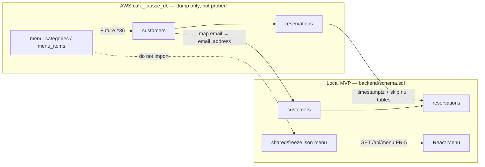
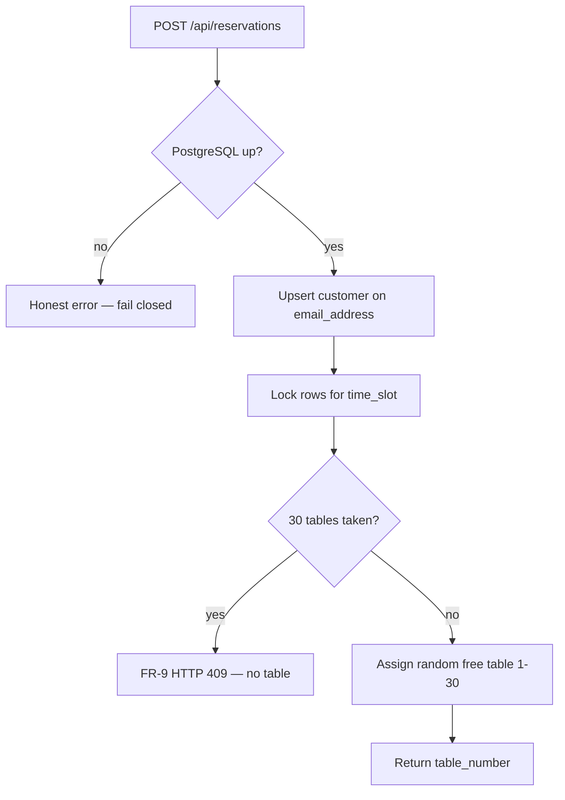

# AWS `cafe_fausse_db` vs local MVP schema

**Future / not-MVP.** Parked so a later cut can reuse a teammate dump of AWS RDS objects. This page is **not** a live RDS probe. This VM did **not** connect to AWS this session. No cts-ai / Vite / Flask required to read this.

Do **not** apply the AWS DDL onto local `backend/schema.sql`. The restaurant MVP stays the in-repo schema (FR-17 customers + reservations; FR-5 menu from freeze). Menu persistence is Future [#36](https://github.com/artofdream/aea-interactive-design/issues/36). Hosting / IAM tunnel is Future [#22](https://github.com/artofdream/aea-interactive-design/issues/22). Lifecycle extras [#34](https://github.com/artofdream/aea-interactive-design/issues/34)–[#38](https://github.com/artofdream/aea-interactive-design/issues/38) stay parked.

Portable copy (repo memory, not the live handoff): `research/random-thoughts/aws-schema-reuse.md`. Live handoff: `research/daily-briefs/2026-09-05.md`.

## Source of this dump (honesty)

Reported 2026-09-04 by a teammate as already initialized on AWS:

- Database: `cafe_fausse_db`
- Session: `cafe_fausse_developer` / `cafe_fausse_developer`
- Auth: **RDS IAM**, temporary token (~15 minutes). `PGPASSWORD` is the token, not a stored password.
- Connect path they used: `LOCAL_PORT=15433 ./infrastructure/database/scripts/run-sql.sh` (that tree is **not** in this repo).
- Do **not** mint or share a permanent password for `cafe_fausse_developer`.

Status of that RDS instance from this Knowledge/App VM: **Unknown** (no `psql` / IAM token this session).

## Rationale: keep local tighter

The AWS dump looks like a looser CMS/hosting schema. The local MVP is a **fail-closed booking store**. Copying AWS as-is would weaken FR-8 / FR-9 / NFR-5.

| Choice | Why local wins for MVP | Why AWS shape exists |
|---|---|---|
| `email_address` UNIQUE + Flask `.lower()` | One customer key; `ON CONFLICT` upsert (FR-17 / FR-18) | Dump did not list UNIQUE. If missing, duplicate emails break upsert. FS [#37](https://github.com/artofdream/aea-interactive-design/issues/37) wanted case-sensitive identity — local already folds case. |
| `customer_name NOT NULL` | Reservation path requires a name | AWS nullable name fits newsletter-only rows. Local already fills `"Newsletter subscriber"` in app code. |
| `time_slot TIMESTAMPTZ` | Slots are America/New_York (`shared/freeze.json`). Naive timestamps are DST-ambiguous. | AWS `timestamp without time zone` is easier to type, worse to import. |
| `table_number NOT NULL` 1–30 | FR-8 assigns in the same transaction; FR-9 / NFR-5 need a real table | AWS nullable `table_number` looks like PENDING-before-assign ([#34](https://github.com/artofdream/aea-interactive-design/issues/34)). That is Future, not the SRS cut. |
| `UNIQUE (time_slot, table_number)` | NFR-5: two writers cannot take the same table | Dump listed no indexes. Treat AWS uniqueness as **Unknown**. |
| Menu in freeze JSON | FR-5 SoT; do not “improve” prices | `menu_*` is staff CRUD ([#36](https://github.com/artofdream/aea-interactive-design/issues/36)). |

**Do not** rename local columns to match AWS (`email`, `newsletter_opt_in`). Flask SQL uses `email_address` / `newsletter_signup`. Map on import only.

## Diagrams

How the two stores relate. AWS extras stay off the MVP write path.

Reservation write (local). AWS nullable table would skip the assign step — that is not MVP.

## Column map

### `customers`

| AWS column | AWS type | AWS null | Local MVP (`backend/schema.sql`) | Reuse |
|---|---|---|---|---|
| `customer_id` | `bigint` | NO | `SERIAL` / `INTEGER` PK | Same role. Import IDs only if they fit `INTEGER`. Else let `SERIAL` assign. |
| `customer_name` | `varchar` | **YES** | `TEXT NOT NULL` | Reject empty names on reservation import. Newsletter-only: use the same placeholder the app uses. |
| `email` | `varchar` | NO | `email_address TEXT NOT NULL UNIQUE` | **Rename.** Fold to lower-case to match `validate_email`. |
| `phone_number` | `varchar` | YES | `TEXT` nullable | Same idea. |
| `newsletter_opt_in` | `boolean` | NO | `newsletter_signup BOOLEAN NOT NULL DEFAULT FALSE` | **Rename.** |
| `created_at` | `timestamptz` | NO | `timestamptz NOT NULL DEFAULT NOW()` | Same. |
| `updated_at` | `timestamptz` | NO | `timestamptz NOT NULL DEFAULT NOW()` | Same. |

### `reservations`

| AWS column | AWS type | AWS null | Local MVP | Reuse |
|---|---|---|---|---|
| `reservation_id` | `bigint` | NO | `SERIAL` PK | Same role. |
| `customer_id` | `bigint` | NO | `INTEGER NOT NULL` FK → `customers` | Same role. |
| `time_slot` | **`timestamp without time zone`** | NO | **`TIMESTAMPTZ NOT NULL`** | Interpret as America/New_York, store UTC timestamptz. Do not assume UTC. |
| `guest_count` | `smallint` | NO | `INTEGER NOT NULL CHECK (1..20)` | Drop or reject outside 1–20. |
| `table_number` | `smallint` | **YES** | `INTEGER NOT NULL CHECK (1..30)` | Skip nulls. Not a local booking. |

Local also has `reservations.created_at` (no AWS twin in the dump).

### `menu_categories` / `menu_items` (not in local MVP)

| AWS table | Columns (as dumped) | Local MVP |
|---|---|---|
| `menu_categories` | `category_id`, `category_name`, `display_order` | No table. FR-5 = freeze. |
| `menu_items` | `menu_item_id`, `category_id`, `item_name`, `description`, `price`, `display_order`, `is_available` | No table. Freeze prices/names are SoT. |

Dump did not show FKs or UNIQUE on menu names. Treat those as **Unknown**.

## Improvements (Future only — not this PR)

Do **not** put these into `backend/schema.sql` for the score-5 cut.

1. **On AWS (if they keep RDS):** add `UNIQUE (email)` or unique lower(email); `UNIQUE (time_slot, table_number)`; `CHECK` 1–30 / 1–20; migrate `time_slot` to `timestamptz`; add explicit `reservation_status` instead of nullable `table_number` ([#34](https://github.com/artofdream/aea-interactive-design/issues/34)).
2. **On local (later, not MVP):** keep TIMESTAMPTZ and the unique slot+table index. Optional later: `BIGINT` identities if merging AWS ids; `updated_at` + status for cancel/checkout ([#35](https://github.com/artofdream/aea-interactive-design/issues/35)).
3. **Menu:** if #36 happens, **seed from freeze**, do not overwrite freeze from AWS prices. Add `UNIQUE (category_name)` and `menu_items.category_id` FK.
4. **Import script (not written):** CSV/SQL export, not a live IAM session from CI. Map columns, fold email, zone-cast slots, skip illegal rows, fail closed if local Postgres is down.
5. **Do not** add a `tables` inventory or party-size fit — FR-8 is random assignment among 30. Extra seating logic is not an SRS ID.

## What a local reuse script would do (not written)

1. Read an export (not CI → RDS IAM).
2. Map `email` → `email_address` (lower), `newsletter_opt_in` → `newsletter_signup`.
3. Cast `time_slot` as America/New_York → timestamptz.
4. Skip null `table_number`, guests outside 1–20, tables outside 1–30.
5. Leave `menu_*` unimported until #36.
6. Fail closed if PostgreSQL is missing.

## AWS side (later, not this PR)

- IAM token + `run-sql.sh` + port `15433` stay on the AWS/infra tree.
- Do not add a permanent DB password.
- Do not point `cafe.artof.link` at a shared RDS from this cut. Weekend staging ([#57](https://github.com/artofdream/aea-interactive-design/issues/57)) uses **on-box Postgres (MSAIE staging)** on the Lightsail instance. Last restaurant probe this session (2026-09-05): `https://cafe.artof.link/` HTTPS **GET 200**. Permanent hosting stays [#22](https://github.com/artofdream/aea-interactive-design/issues/22). Shared RDS liveness stays **Unknown** (no `psql` / IAM token this session).
- This page is readable without cts-ai.
- Do not invent FR-19 / NFR-10.
