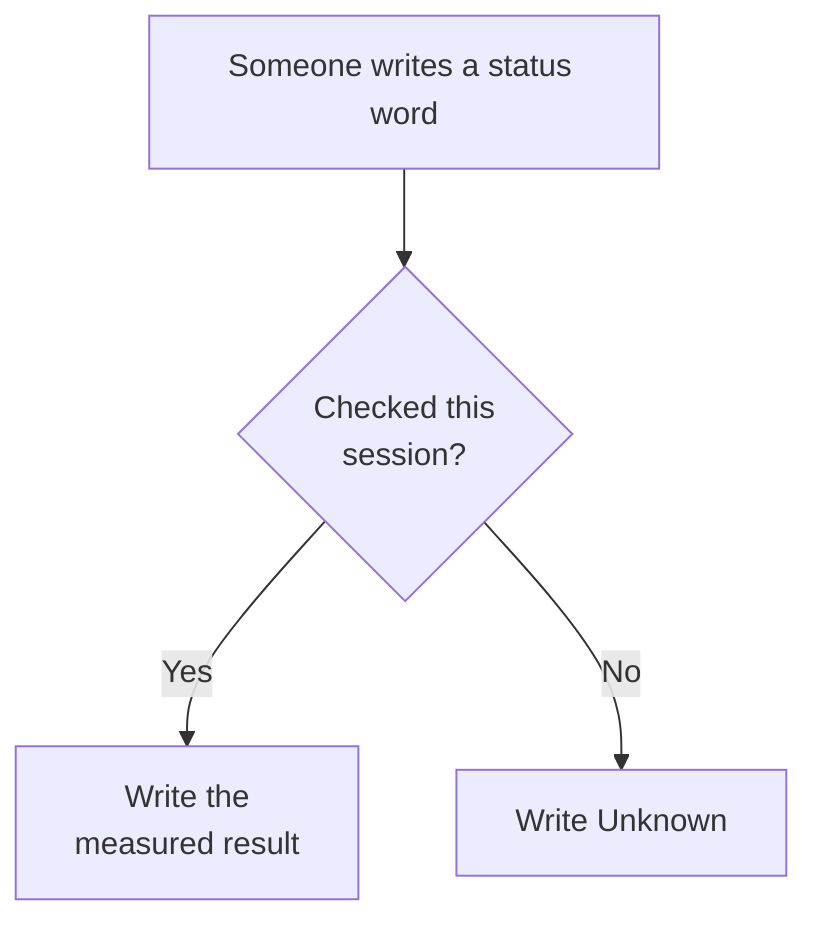

# Glossary

**In plain English:** This page explains the short labels used on this map and lists the sources those words point at. It is not a second product and not a florist glossary.

This site is a **map** of the Café Fausse student project. It is **not** the restaurant. You cannot book a table here.

## How to read a status word

**Yes** means a command, an HTTP GET, a CI log, or a committed file — this session. A previous session is not a check. Closing a pull request is not a check. Publishing a hostname is not a check.

## Everyday terms

| Term | In plain English |
|---|---|
| **This knowledge map** | The GitHub Pages site you are on (`knowledge.cafe.artof.link`). Explains the project. Does not take reservations. |
| **The restaurant / App** | The Café Fausse website (`cafe.artof.link`). React + JSX, Flask, PostgreSQL. Weekend staging is not forever production. |
| **MVP** | The first restaurant cut: only the official assignment list ([SRS freeze](srs.md), **FR-1..FR-18**, **NFR-1..NFR-9**). Extra ideas go to [Future](future.md). |
| **Freeze** | Do not invent or rename requirement IDs. The official PDF is the source of truth; `docs/srs.md` is the working copy. |
| **`freeze.json`** | Official restaurant *copy* (menu, hours, awards, reviews, site text) in `shared/freeze.json`. Not the ID freeze. Not a Postgres menu. Why / how / scope below. |
| **FR / NFR** | Functional / non-functional requirement IDs from the official SRS. Do not invent **FR-19** or **NFR-10**. |
| **Probe** | A check **this session**: a command, an HTTP GET, a CI log, or a **committed** file that exists now. |
| **Unknown** | Honest status when no probe has been run this session. Prefer this over a guessed yes. |
| **Live** | Checked on a public host this session. This map can be live while the restaurant is only weekend staging. |
| **Staging (#57)** | Weekend Lightsail share of `cafe.artof.link`. Prefer it for recording. Not a permanent hosting claim. |
| **Permanent hosting (#22)** | Always-on restaurant hosting. Still [Future](future.md). Staging does not close it. |
| **Fail closed** | Missing database, a full 30-table slot (**FR-9**), a timeout, or a missing freeze file → honest **no**, not a guessed yes. |
| **Quantic hub** | [Quantic / MSAIE](quantic.md) lists course delivery pages. Those pages stay complete. They are not dumped into the top nav. |

## Project terms

- **Café Fausse Knowledge** — team that owns this map (`knowledge.cafe.artof.link`, GitHub Pages).
- **Café Fausse App** — team that owns the restaurant (`cafe.artof.link`; in-repo MVP; weekend Lightsail staging [#57](https://github.com/artofdream/aea-interactive-design/issues/57); permanent hosting [#22](https://github.com/artofdream/aea-interactive-design/issues/22)).
- **Implementation site** — the restaurant. AWS is not in the restaurant MVP *code* PR. Weekend staging is not forever production.
- **`/operator`** — read-only recording helper (customers + reservations). **Not FR-19.** Not an admin console.
- **Newsletter** — **FR-15** / **FR-16** store and register an email. There is no outbound mailer in this MVP.
- **DATE_RE** — `^[0-9]{4}-[0-9]{2}-[0-9]{2}$`. The live handoff file is `research/daily-briefs/YYYY-MM-DD.md` only.
- **Shared memory** — committed git plus today’s daily brief. Uncommitted files do not count.
- **Ratchet** — a failure adds a tighter guide or sensor. Deleting a guard to go green is a regression. Do not call this system antifragile.
- **Outer harness** — the checks around the freeze: guides, CI sensors, one-issue-one-PR loop, daily briefs, permissions, and honesty. Not a 14-hat library.
- **MRC COMMENT** — the role-approve signal on a pull request until a non-author can `APPROVE`. The author does not merge their own PR.
- **Delivery-only page** — Brief, Friday plan, video script, must-film shots, talk, slides. Linked from the Quantic hub, not from the global top nav ([#79](https://github.com/artofdream/aea-interactive-design/issues/79)).
- **SoT** — source of truth. For requirements, that is the official PDF.
- **Journal** — process index: principles, lessons, meeting MoM overview ([#100](https://github.com/artofdream/aea-interactive-design/issues/100)).

## freeze.json

**In plain English:** Official restaurant *copy* lives in one file so the frontend and the API do not tell two stories. This is not a database-hosted menu.

**Purpose:** one official source of truth for restaurant copy the SRS cares about — menu, hours, awards, reviews, site text — so FE and API do not drift into two stories.

**How:** `shared/freeze.json`. React pages (Home / Menu / Gallery / About) import that file at build. They do **not** call `GET /api/menu` for those surfaces. Flask still serves the same official copy via `GET /api/menu` and `GET /api/site`. CI freeze lock (`test_freeze.py`) fail-closes if the file is missing or drifts from the official SRS.

**Scope:** display and content only. Not bookings. Not customers. Not gallery binaries — those are `GET /images/…`, not an API of pictures. The menu is **not** in Postgres.

**Why not DB:** graded / official copy stays immutable in the freeze. Mutable data (reservations, newsletter signups) stays in Postgres.

The **Freeze** row above is the ID freeze (do not invent **FR-19**). `freeze.json` is the copy file that holds that official text. Do not “improve” prices, address, hours, owners, awards, or reviews in the MVP.

## Sources and links

These are the sources this repo actually uses. Do not invent a second official SRS.

| Source | What it is | Open |
|---|---|---|
| Official SRS PDF | Assignment source of truth (7 pages). Local copy `docs/official/MSEE_Web_Application_and_Interface_Design_Cafe_Fausse_SRS.pdf`. | [Provenance](https://github.com/artofdream/aea-interactive-design/blob/main/docs/official/PROVENANCE.md) |
| Working freeze | ID freeze of that PDF. Cite **FR-1..FR-18** / **NFR-1..NFR-9** from here. | [SRS freeze](srs.md), full copy [srs-full](../docs/srs.md) |
| Menu / site freeze data | Prices, hours, owners — do not “improve” in the MVP. Official copy, not a DB menu. | `shared/freeze.json` — why / how / scope in the freeze.json section |
| Official image pack | Four webps only. Extras are student-recovered, not Quantic-official. | `docs/official/` zip + [Stack](stack.md) notes |
| This GitHub repo | Issues, PRs, Actions. GitHub only. | [artofdream/aea-interactive-design](https://github.com/artofdream/aea-interactive-design) |
| Knowledge host | This map. GitHub Actions → GitHub Pages. | [https://knowledge.cafe.artof.link/](https://knowledge.cafe.artof.link/) |
| Restaurant host | Weekend Lightsail staging (#57), not forever. | [https://cafe.artof.link/](https://cafe.artof.link/) |
| Health | App liveness JSON. | [https://cafe.artof.link/api/health](https://cafe.artof.link/api/health) |
| Operator | Read-only recording helper. **Not FR-19.** | [https://cafe.artof.link/operator](https://cafe.artof.link/operator) |
| Coverage | Each freeze ID: where in-repo, evidence class. | [Coverage](coverage.md) |
| Honesty | Probe rules; live vs local vs Future. | [Honesty](honesty.md) |
| Stack | HLD as-is / to-be; GitHub-only CI. | [Stack](stack.md) |
| Quantic hub | Course delivery index. Sister pages stay complete. | [Quantic / MSAIE](quantic.md) |
| Future | Permanent hosting #22; FS extras #34–#38. | [Future](future.md) |
| Daily brief | Live handoff. Date must match `DATE_RE`. Europe/Berlin. | `research/daily-briefs/YYYY-MM-DD.md` |
| Session SOP | Teams, ID freeze, fail closed, PR loop. | `AGENTS.md` |
| Slack | Teammate / owner feedback. Claude opens GitHub issues. | Slack workspace (no public URL claimed here) |

This-session GETs (2026-09-06): Knowledge `/` **200**; `/glossary.html` **200**; restaurant `/` **200**; `/api/health` **200** `{"ok":true}`; `/operator` **200**. The new `freeze.json` section is on this branch until Pages deploys.

## What this glossary is not

Not Lily’s Florist, Path B, 14 hats, 3DX Lab, or another project’s product dictionary. Keep terms local to Café Fausse and this GitHub harness.

If [#89](https://github.com/artofdream/aea-interactive-design/pull/89) also ships a thin glossary, **this page is the follow-up** that adds the sources index ([#101](https://github.com/artofdream/aea-interactive-design/issues/101)). Rebase rather than duplicate after #89 lands.

An older stub still exists at [Future / glossary](future/glossary.md) so old links do not vanish. This page is the one in the top nav.
