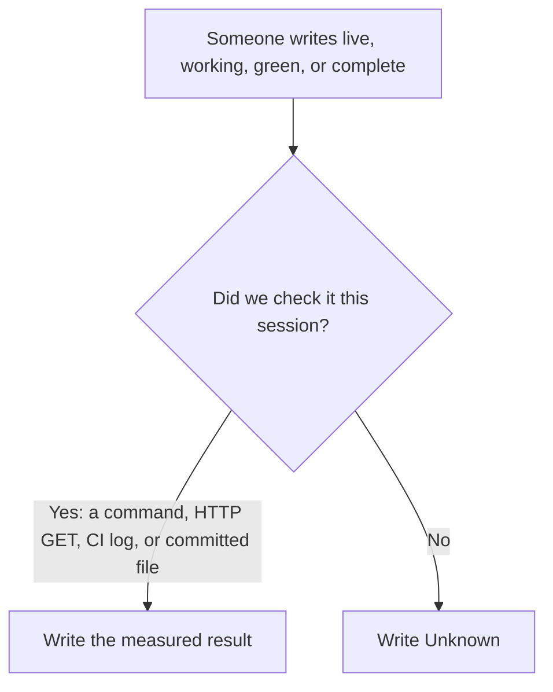

# Glossary

**In plain English:** This page translates the short labels used on this map and in the repo talk track. It also lists the sources and links those words point at. It is not a second product and not a florist glossary.

This site is a **map** of the Café Fausse student project. It is **not** the restaurant. You cannot book a table here. Words like **probe**, **Unknown**, and **MVP** have a fixed meaning so a status word is not a guess.

The restaurant lives at [cafe.artof.link](https://cafe.artof.link/) (weekend Lightsail staging [#57](https://github.com/artofdream/aea-interactive-design/issues/57) — not forever production). Course delivery pages stay under [Quantic / MSAIE](quantic.md). Extra product ideas stay under [Future](future.md). Lessons: [Journal](journal.md). Home: [Knowledge home](index.md).

**Honesty this session (2026-09-05):** live `https://knowledge.cafe.artof.link/glossary.html` is **404** until this PR (and [PR #89](https://github.com/artofdream/aea-interactive-design/pull/89)) deploy.

## How to read a status word

A previous session is not a check. Closing a pull request is not a check. Publishing a hostname is not a check.

## Everyday terms

| Term | In plain English | See |
|---|---|---|
| **This knowledge map** | The GitHub Pages site you are on (`knowledge.cafe.artof.link`). Explains the project. Does not take reservations. | [Home](index.md) · [Stack](stack.md) |
| **The restaurant / App** | The Café Fausse website (`cafe.artof.link`). React + JSX, Flask, PostgreSQL. | [Stack](stack.md) · [Honesty](honesty.md) |
| **Thin map** | A small set of pages (home, stack, SRS, honesty, Future, plus hubs). Not a CMS. | [Home](index.md) |
| **MVP** | The first restaurant cut: only the official assignment list (**FR-1..FR-18**, **NFR-1..NFR-9**). | [SRS freeze](srs.md) |
| **Freeze** | Do not invent or rename requirement IDs. Official PDF is source of truth; `docs/srs.md` is the working copy. | [SRS freeze](srs.md) · official PDF in Sources |
| **FR / NFR** | Functional / non-functional requirement IDs from the official SRS. Do not invent **FR-19** or **NFR-10**. | [Coverage](coverage.md) |
| **Probe** | A check **this session**: a command, an HTTP GET, a CI log, or a **committed** file that exists now. | [Honesty](honesty.md) |
| **Unknown** | Honest status when no probe has been run this session. Prefer this over a guessed yes. | [Honesty](honesty.md) |
| **Live** | Checked on a public host this session. This map can be live while the restaurant is only weekend staging. | [Honesty](honesty.md) |
| **SoT** | Source of truth. For requirements, that is the official PDF. | [SRS freeze](srs.md) |
| **Working freeze** | `docs/srs.md` — the markdown ID freeze of the PDF. | [srs-full](srs-full.html) |

## Assignment / grade-floor terms

| Term | In plain English | See |
|---|---|---|
| **MSAIE / Quantic / Smartly** | The course and the school site that issued the official Café Fausse SRS PDF. | [Quantic hub](quantic.md) |
| **Grade floor** | What must be delivered for the course: official SRS only. | [Home — tactical split](index.md#tactical-split) |
| **FR-1..FR-4** | Home: name, contact/hours, nav. | [Coverage](coverage.md) |
| **FR-5** | Menu categories, descriptions, freeze prices. Do not “improve” them. | [Coverage](coverage.md) |
| **FR-6..FR-9** | Reservation form, slot, tables 1–30, success or full-book error. **FR-9** = no table when the slot is full. | [Coverage](coverage.md) · [Must-film shots](must-film-shots.md) |
| **FR-12..FR-14** | Gallery images, awards, reviews (freeze text). | [Coverage](coverage.md) |
| **FR-15 / FR-16** | Newsletter store / register. No outbound mailer in this MVP. | [Honesty](honesty.md) |
| **FR-17 / FR-18** | Flask processes the booking and stores it in PostgreSQL. | [Coverage](coverage.md) |
| **NFR-1 / NFR-2** | 3s page load / 2s form submit. Local Vite notes are **not** “met.” | [Honesty](honesty.md) · [Coverage](coverage.md) |
| **NFR-3 / NFR-4 / NFR-8** | Theme, Flexbox/Grid, viewports / readability. Spirit of App [#91](https://github.com/artofdream/aea-interactive-design/issues/91) and Knowledge [#92](https://github.com/artofdream/aea-interactive-design/issues/92). | [Coverage](coverage.md) |
| **NFR-6** | Fail closed when the database is down — honest error, not a guessed booking. | [Honesty](honesty.md) |
| **NFR-7** | Chrome, Firefox, Safari, Edge. Recorded **partial** (Edge + Firefox home; Chrome/Safari **Unknown**). | [Coverage](coverage.md) · [#44](https://github.com/artofdream/aea-interactive-design/issues/44) |
| **NFR-9** | (See Coverage — do not invent a tenth.) | [Coverage](coverage.md) |
| **J1–J9** | Local journey probes on Coverage. J1–J8 **PASS** was cts-ai with DB up (2026-09-02). J9 **PASS** is Vite-only. Not a public-host write probe. | [Coverage](coverage.md) · [#40](https://github.com/artofdream/aea-interactive-design/issues/40) |
| **FS v0.1** | Team Functional Spec extras. **Not** a new freeze. Compare lives on the Brief. | [Brief](brief.md) |
| **`/operator`** | Read-only customers + reservations for recording. **Not FR-19.** Not an admin console. | [Honesty](honesty.md) · [#54](https://github.com/artofdream/aea-interactive-design/issues/54) |
| **Bruschetta placeholder** | Menu photo with no clear official filename match. Stay honest; do not invent an official pack file. | App menu notes on [Coverage](coverage.md) |
| **Official image pack** | Four webps in `docs/official/…Images.zip` only. | `docs/official/PROVENANCE.md` |
| **quantic-grader** | Required assignment collaborator. **The owner must add that person.** An agent must not. | [Stack](stack.md) |

## Hosts and hosting

| Term | In plain English | See |
|---|---|---|
| **Staging (#57)** | Weekend Lightsail share of `cafe.artof.link`. Prefer it for recording. Not a permanent hosting claim. | [Stack](stack.md) · [#57](https://github.com/artofdream/aea-interactive-design/issues/57) |
| **Permanent hosting (#22)** | Always-on restaurant hosting. Still Future. Staging does not close it. | [Future](future.md) · [To-be](to-be.md) |
| **Lightsail / Route53 / Caddy** | AWS instance, DNS A record, HTTPS edge used for weekend staging. AWS is **not** in the restaurant MVP *code* PR. | [Stack](stack.md) |
| **AEA RDS** | Shared AEA Postgres (`aea-pilot-postgres`). **Untouched** by Café Fausse staging. | [Stack](stack.md) |
| **sslip.io** | Interim backup URL for the same Lightsail IP. Not the primary paste. | [Honesty](honesty.md) |
| **Stale tunnel** | Old localtunnel hosts (`shaky-deer-drive`, `happy-glasses-film`, `real-goats-shop`). Do not share as live. | [Honesty](honesty.md) |
| **Evaluate-only Monday** | **2026-09-08 16:00 Europe/Berlin** — decide, do not auto tear down. | [Honesty](honesty.md) |
| **Vite / cafe-pg** | Local App path (frontend :5173, Flask :5000, Docker Postgres). This Knowledge VM did not reach Vite. | [Stack](stack.md) |
| **cts-ai** | Owner’s App workstation (not this cloud agent). Journey PASS records came from there. | [Coverage](coverage.md) |
| **GitHub Pages** | How this map publishes (`knowledge-site.yml` → `knowledge.cafe.artof.link`). | [Stack](stack.md) |
| **HLD** | High-level diagram (as-is / staging / to-be SVGs on Stack). | [Stack](stack.md) · [To-be](to-be.md) |
| **As-is / to-be** | As-is = grade floor + what is true now. To-be = planned Future, not missing FRs. | [To-be](to-be.md) · [Future](future.md) |

## Process / harness

| Term | In plain English | See |
|---|---|---|
| **Outer harness** | Guides, CI sensors, one-issue-one-PR loop, daily briefs, permissions, honesty. Not a 14-hat library. | [Home](index.md) · `AGENTS.md` |
| **DATE_RE** | `^[0-9]{4}-[0-9]{2}-[0-9]{2}$`. Live handoff is `research/daily-briefs/YYYY-MM-DD.md` only. | [Journal — handoff](journal.md#handoff) |
| **Shared memory** | Committed git plus today’s daily brief. Uncommitted files do not count. | [Journal](journal.md) |
| **Ratchet** | A failure adds a tighter guide or sensor. Deleting a guard to go green is a regression. Do not call this system antifragile. | [Honesty](honesty.md) |
| **Fail closed** | Missing database, a full 30-table slot (**FR-9**), a timeout, or a missing freeze file → honest **no**. | [Honesty](honesty.md) |
| **MRC COMMENT** | Role-approve signal on a pull request until a non-author can `APPROVE`. | [PR coordinator](https://github.com/artofdream/aea-interactive-design/blob/main/.cursor/skills/pr-coordinator/SKILL.md) |
| **Author does not merge** | The login that opened the PR does not merge it. Same login cannot `APPROVE` itself. | [Journal — principles](journal.md#principles) |
| **Bugbot** | Cursor review comments. A signal: resolve or explicitly decline. Not the merge gate. Autofix = new branch. | `.cursor/skills/pr-coordinator/SKILL.md` |
| **cursor[bot]** | Cursor GitHub App. Distinct identity for merging `artofdream`-authored PRs after green checks. Must not merge its own PRs. | Issue [#13](https://github.com/artofdream/aea-interactive-design/issues/13) / [PR #14](https://github.com/artofdream/aea-interactive-design/pull/14) |
| **Delivery-only page** | Brief, Friday plan, video, must-film, talk, slides, meeting packs, Meghna, handoff, to-be. Linked from the Quantic hub, not the global top nav ([#79](https://github.com/artofdream/aea-interactive-design/issues/79)). | [Quantic / MSAIE](quantic.md) |
| **Hub-only** | Quantic page lists links. It does not steal clips or HLD from sister pages ([#74](https://github.com/artofdream/aea-interactive-design/issues/74)). | [Quantic / MSAIE](quantic.md) |
| **PROTOTYPE** | A clip that is a look, not the Quantic submission (Zoom dry-run, silent Meghna cut). | [Video script](video-script.md) · [Meghna materials](meghna-materials.md) |
| **Must-film** | Four camera beats graders should see: happy book → `/operator`, newsletter, full-book **HTTP 409**, NFR-6 via Coverage/CI. | [Must-film shots](must-film-shots.md) |
| **Talk track** | What people say on camera. Coverage is the ID map, not a slide deck. | [Talk cuts](presentation.md) · [Handoff](quantic-handoff.md) |
| **Europe/Berlin** | Repo “today” zone for DATE_RE briefs. | [Journal](journal.md) |
| **America/New_York** | US meeting / docs clock (Saturday slot; Sunday docs 9:00). Write both zones when a US slot is used. | [Saturday](meeting-saturday.md) · [Sunday](meeting-sunday.md) |
| **Hats (four)** | knowledge-guardian, coherence-guardian, product-owner, engineer. `pr-coordinator` is procedure memory, not a fifth hat. | `AGENTS.md` |
| **Cloud-only** | This work runs as a Cursor cloud agent. It does not use cts-ai. | [Journal](journal.md) |

## People and Saturday VIDEO

| Term | In plain English | See |
|---|---|---|
| **Meghna** | Teammate who walks the live restaurant (~3 min): Home → Gallery → Menu → Reservations. Spoken / VO = **plain English only**. | [Meghna materials](meghna-materials.md) · [Meghna demo](meghna-cafe-demo.md) · [Meghna VO](meghna-voiceover.md) |
| **Hiren / Claude** | Teammates for Variant B (architecture) and Variant C (coding). Hiren chooses; Claude takes the other. Speaker lock is **Unknown**. | [Saturday](meeting-saturday.md) · [Talk cuts](presentation.md) |
| **Variant A / B / C** | Older standalone talk cuts. Saturday locked a **five-part** VIDEO, not “pick one variant.” | [Talk cuts](presentation.md) · [Saturday](meeting-saturday.md) |
| **Issues → Slack → Claude** | File a GitHub issue, Slack the number, Claude addresses it. Do not invent a close. | [Home — feedback](index.md#feedback) · [Journal](journal.md) |

## Project teams (names)

- **Café Fausse Knowledge** — owns this map (`knowledge.cafe.artof.link`, GitHub Pages).
- **Café Fausse App** — owns the restaurant (`cafe.artof.link`; in-repo MVP; weekend Lightsail staging [#57](https://github.com/artofdream/aea-interactive-design/issues/57); permanent hosting [#22](https://github.com/artofdream/aea-interactive-design/issues/22)).

## What this glossary is not

Not Lily’s Florist, Path B, 14 hats, 3DX Lab, Kafka/BFF, Grafana, or [architecture.artof.link](https://architecture.artof.link/) case studies. That site is a **tone bar** (plain English, a glossary link) — do not copy it. Keep terms local to Café Fausse and this GitHub harness.

An older stub still exists at [Future / glossary](future/glossary.md) so old links do not vanish. This page is the one in the top nav.

## Sources and links

Cite these instead of guessing. Live host claims need a GET **this session** or stay **Unknown**.

### Official freeze

- Official SRS PDF (SoT): [`docs/official/MSEE_Web_Application_and_Interface_Design_Cafe_Fausse_SRS.pdf`](https://github.com/artofdream/aea-interactive-design/blob/main/docs/official/MSEE_Web_Application_and_Interface_Design_Cafe_Fausse_SRS.pdf) — SHA256 `6075e5964601aa3e3c7a3085c626eab820e3d733a396b00e20339cfdc77a9d82`
- Provenance: [`docs/official/PROVENANCE.md`](https://github.com/artofdream/aea-interactive-design/blob/main/docs/official/PROVENANCE.md)
- Working freeze: [`docs/srs.md`](https://github.com/artofdream/aea-interactive-design/blob/main/docs/srs.md) · [SRS freeze](srs.md) · [srs-full](srs-full.html)

### Knowledge map (this site)

- [Home](index.md) — executive overview (mission, split, lessons)
- [Journal](journal.md) — principles, lessons, meeting MoM
- [Coverage](coverage.md) — each **FR-1..FR-18** / **NFR-1..NFR-9**
- [Honesty](honesty.md) — probe ledger
- [Stack](stack.md) — two hostnames, HLD, CI
- [Future](future.md) — parked extras, schema notes
- [To-be](to-be.md) — Quantic-facing Future (not the grade floor)
- [Quantic / MSAIE](quantic.md) — delivery hub
- [Quantic deliverable handoff](quantic-handoff.md) — paste pack
- [Brief](brief.md) · [Friday plan](friday-plan.md) · [Video script](video-script.md) · [Must-film shots](must-film-shots.md) · [Talk cuts](presentation.md) · [Slide outline](presentation-sample.md)

### Meetings + Meghna

- [Wednesday](meeting-wednesday.md) · [Friday](meeting-friday.md) · [Saturday](meeting-saturday.md) · [Sunday](meeting-sunday.md)
- [Meghna materials](meghna-materials.md) · [Meghna demo](meghna-cafe-demo.md) · [Meghna VO](meghna-voiceover.md)
- MoM index: [Journal — meetings](journal.md#meeting-mom-overview)

### GitHub

- Repo: [artofdream/aea-interactive-design](https://github.com/artofdream/aea-interactive-design)
- Issues: [open issues](https://github.com/artofdream/aea-interactive-design/issues)
- Weekend staging: [#57](https://github.com/artofdream/aea-interactive-design/issues/57)
- Permanent hosting: [#22](https://github.com/artofdream/aea-interactive-design/issues/22)
- Future extras: [#34](https://github.com/artofdream/aea-interactive-design/issues/34)–[#38](https://github.com/artofdream/aea-interactive-design/issues/38)
- Plain-English / glossary seed: [#87](https://github.com/artofdream/aea-interactive-design/issues/87) · this depth: [#101](https://github.com/artofdream/aea-interactive-design/issues/101)
- Home rewrite: [#99](https://github.com/artofdream/aea-interactive-design/issues/99) · Journal: [#100](https://github.com/artofdream/aea-interactive-design/issues/100)
- Delivery hub / nav: [#74](https://github.com/artofdream/aea-interactive-design/issues/74) · [#79](https://github.com/artofdream/aea-interactive-design/issues/79)
- Open follow-up PR **#89** (glossary + meetings + to-be) — live Pages for those URLs stay **Unknown** until merge

### Public hosts (re-probe or write Unknown)

- Knowledge: `https://knowledge.cafe.artof.link/` — this session HTTPS **GET 200**
- Restaurant: `https://cafe.artof.link/` — this session HTTPS **GET 200**; `/api/health` **200** `{"ok":true}`; `/operator` **200**
- Do not invent other domains. Do not configure DNS from an agent.

### Guides in the repo (not pages)

- [`AGENTS.md`](https://github.com/artofdream/aea-interactive-design/blob/main/AGENTS.md)
- Daily briefs: [`research/daily-briefs/`](https://github.com/artofdream/aea-interactive-design/tree/main/research/daily-briefs)
- Skills: knowledge-guardian, coherence-guardian, product-owner, engineer, pr-coordinator under `.cursor/skills/`
