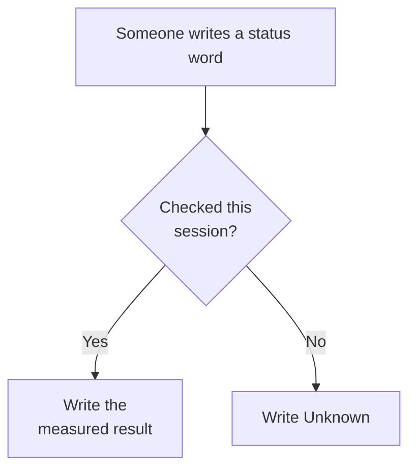

# Honesty

**In plain English:** This page is the honesty companion for probes and **Unknown**. A status word is a claim: if we have not just checked it this session, we write **Unknown**. A **probe** is a command, an HTTP GET, a CI log, or a **committed** file that exists now — a previous session, an uncommitted file, a published hostname, or a closed pull request is not a probe. Where a row cites a freeze ID, this companion uses official **FR-1..FR-18** and **NFR-1..NFR-9** only; the official SRS PDF is the source of truth and `docs/srs.md` is the working freeze. It does not invent **FR-19** or **NFR-10**. If this page and the freeze disagree, the freeze wins.

Short labels: [Glossary](glossary.md). Do not say NFR-1 / NFR-2 **met** from a fast staging GET, a local Vite sample, or the ROG Wi‑Fi device stopwatch. **NFR-1** is honest **met** / **PASS** on the Samsung A36 Brave owner-claimed-broadband cold Home ([#123](https://github.com/artofdream/aea-interactive-design/issues/123)). **NFR-2** is honest **met** / **PASS** on the Samsung A36 Brave owner-claimed-broadband reservation submit ([#125](https://github.com/artofdream/aea-interactive-design/issues/125)). `/operator` is **not FR-19**. Agent skill ids (Grok Bot; recipes not hosted on this map): [Agent skills matrix](skills-matrix.md).

**Probe date for the live rows below:** 2026-09-06 Europe/Berlin (this session). Journey **J1–J8** and the Vite-only J9 / NFR-7 slice stay the 2026-09-02 records on [Coverage](coverage.md). **NFR-7** / **NFR-8** add the owner/sponsor mobile UX report (Safari on iPhone 16 + A36) and the Café Fausse App Chrome + Firefox public-host **PASS** ([#120](https://github.com/artofdream/aea-interactive-design/issues/120)). **NFR-7** also adds Chrome-on-Android **PASS 5/5** (ROG) as Partial evidence. **NFR-1** **met** / **PASS** is the A36 Brave owner-claimed-broadband cold Home **466 ms** ([#123](https://github.com/artofdream/aea-interactive-design/issues/123)). **NFR-2** **met** / **PASS** is the A36 Brave owner-claimed-broadband reservation submit **233 ms** ([#125](https://github.com/artofdream/aea-interactive-design/issues/125)). The ROG Wi‑Fi device stopwatch ([#119](https://github.com/artofdream/aea-interactive-design/issues/119) / [#122](https://github.com/artofdream/aea-interactive-design/pull/122)) stays a separate evidence note — not the broadband **met**.

## This repo, this session

| Claim | Status |
|---|---|
| Knowledge site `knowledge.cafe.artof.link` | HTTPS **GET 200** (`curl` this session, 2026-09-06): `/`, `/coverage.html`, `/honesty.html`. HTTP `http://knowledge.cafe.artof.link/` last recorded **301** `Location: https://knowledge.cafe.artof.link/`. TLS VERIFY_OK last recorded 2026-09-04 (CN/SAN `knowledge.cafe.artof.link`, Let’s Encrypt, `notAfter=2026-11-30`). DNS CNAME `artofdream.github.io`. Pages API enforce/cert: **Unknown** this session (last recorded 2026-09-02). |
| Restaurant hostname `cafe.artof.link` | **Prefer live share this session.** HTTPS **GET 200** (SPA HTML, title Café Fausse). `/operator` **200**. `/api/operator` **200**. `/api/health` **200** `{"ok":true}`. Knowledge GET: root **200** (~0.5s); `/operator` **200** (~0.6s); `/api/operator` **200** (~0.5s); `/api/health` **200** `{"ok":true}` (~0.6s). This agent: root **200** (~0.04s); HTTP **308** to HTTPS; DNS A `54.165.102.60`. TLS CN/SAN `cafe.artof.link`, Let’s Encrypt, `notAfter=2026-12-04`. Lightsail staging (us-east-1, [#57](https://github.com/artofdream/aea-interactive-design/issues/57)) — **not** a permanent hosting claim. Staging stays **up until Quantic scoring is done**, or the owner overrides tear-down (owner lock 2026-09-09). Knowledge Pages stay up the same window. Whether Quantic graders need the host up for video evaluation remains **Unknown** until the owner shares correspondence. Longer-term hosting stays [Future #22](https://github.com/artofdream/aea-interactive-design/issues/22). Do not over-claim production forever. |
| Restaurant MVP in-repo | **On `main`** (PRs #9 + timezone #12). React + JSX, Flask, PostgreSQL. Local path: Vite `127.0.0.1:5173`, Flask `:5000`, `cafe-pg`. App 2026-09-02 (cts-ai): Journey **J1–J8 PASS** (DB up); **J9 / NFR-3 / NFR-8 PASS** (Vite-only Edge `probe-nfr/` screenshots + theme.css; not Flask+Postgres). This Knowledge VM did not reach Vite on `:5173`. **Live share this session (prefer):** `https://cafe.artof.link/` GET **200** (SPA + `/operator` + `/api/health`). **Interim backup** (same Lightsail, not the primary paste): `https://54-165-102-60.sslip.io/`. After the J1–J8 handoff, App reported `cafe-pg` unreachable — do not claim writes from the health GET. Old `https://shaky-deer-drive.loca.lt/` is **stale** (Knowledge GET **503**; this agent timed out, curl 28). Old `https://happy-glasses-film.loca.lt/` and `https://real-goats-shop.loca.lt/` stay **stale**. Read-only `/operator` ([PR #58](https://github.com/artofdream/aea-interactive-design/pull/58) / [#54](https://github.com/artofdream/aea-interactive-design/issues/54)) — **not FR-19**. |
| Official SRS PDF at `docs/official/…SRS.pdf` | Committed freeze file; working copy `docs/srs.md`; CI fails closed if missing or SHA256 mismatches. |
| AWS / `cafe.artof.link` hosting | Lightsail `cafe-fausse-staging` us-east-1, `small_3_0` (~$12/mo), IP `54.165.102.60` ([#57](https://github.com/artofdream/aea-interactive-design/issues/57)). Route53 **A** TTL 60 overrides the `*.artof.link` ELB wildcard (that wildcard is **not** Café Fausse). Caddy + Let’s Encrypt. Flask + built React SPA. **On-box Postgres (MSAIE staging)** — not a shared RDS. IAM `cts` account `737290977112`. **Not** a permanent hosting claim. Staging stays **up until Quantic scoring is done**, or the owner overrides tear-down (owner lock 2026-09-09). Knowledge Pages stay up the same window. Whether Quantic graders need the host up for video evaluation remains **Unknown** until the owner shares correspondence. Longer-term hosting remains [Future #22](https://github.com/artofdream/aea-interactive-design/issues/22). AWS is **not** in the restaurant MVP cut. HLD: [stack](stack.md) / [staging SVG](assets/hld-aws-staging.svg). |
| Newsletter outbound mailer | **Not in the SRS MVP.** **FR-15** / **FR-16** are store/register only. Do not claim a mailer. This session (2026-09-12): App public-host store probe — `POST /api/newsletter` → **201**; `email_delivery`: **skipped** / `"email not configured"`; operator stored `customer_id` 76, `ses-probe-20260912@artof.link`; host tip `73d202d` ([#138](https://github.com/artofdream/aea-interactive-design/issues/138)); container has **no** `SES_FROM_EMAIL` / `SES_REGION` / `PUBLIC_BASE`. Inbox receive **N/A** until SES env + verified From are wired. May claim **FR-15** / **FR-16** store. Do **not** claim outbound send. [#198](https://github.com/artofdream/aea-interactive-design/issues/198) |
| NFR-1 (3s page load on standard broadband) | **met** / **PASS** — owner-claimed broadband + measured cold Home. Samsung A36; **Brave (not Chrome)**; broadband (owner claim); Wi‑Fi+5G icons visible; method `from_recording`, png_burst ~200ms, Phone Link on cts-ai, 2026-09-06. Cold Home **466 ms** (0.466 s) — blank viewport frame `046242` → full Home+hero `046708`; first content ~235 ms at `046477`; URL `cafe.artof.link`. Report path on cts-ai (cite only; do not invent contents): `C:\Users\claud\Documents\cafe-artof-evidence\phonelink-a36-stopwatch.json`. [#123](https://github.com/artofdream/aea-interactive-design/issues/123). ROG Wi‑Fi device stopwatch ([#119](https://github.com/artofdream/aea-interactive-design/issues/119) / [#122](https://github.com/artofdream/aea-interactive-design/pull/122)) stays a separate evidence note — not this broadband **met**. Staging GETs this session are still not the stopwatch. |
| NFR-2 (2s form submit) | **met** / **PASS** — owner-claimed broadband + measured reservation submit. Samsung A36; **Brave (not Chrome)**; broadband (owner claim); method `from_recording`, png_burst, 2026-09-06. Form: reservation on `cafe.artof.link/reservations`. Submit **233 ms** (0.233 s) — start frame `027357` button Booking... → success frame `027590` green Reservation confirmed. Table 27…; pre frame `027124` Reserve a table. Report path on cts-ai (cite only; do not invent contents): `C:\Users\claud\Documents\cafe-artof-evidence\phonelink-a36-submit2-stopwatch.json`. [#125](https://github.com/artofdream/aea-interactive-design/issues/125). **NFR-1** stays **met** / **PASS** from the prior A36 Brave cold Home **466 ms** ([#123](https://github.com/artofdream/aea-interactive-design/issues/123)). Newsletter on this broadband take was not observed. ROG Wi‑Fi reservation **242 ms** → confirmed and newsletter **156 ms** → subscribed remain a **separate** Wi‑Fi evidence note only (2026-09-05 23:28 CEST, ASUS_I001DC / Chrome 152.0.7977.75 / SSID `tsarafidy` −53 dBm / CDP via adb forward). Reports on cts-ai (path only): `C:\Users\claud\Documents\cafe-artof-evidence\rog-device-stopwatch-issue-119.json` (+ `.md`). Local Vite `GET /api/site` **32 ms** is not a submit stopwatch. Staging GETs this session are still not the stopwatch. |
| NFR-7 (Chrome, Firefox, Safari, Edge) | **Partial** — Chrome **PASS** (Café Fausse App handoff this session, 2026-09-05): Chrome **152.0.7977.83** on cts-ai desktop; five SRS routes **PASS** on `https://cafe.artof.link/` (`/`, `/menu`, `/gallery`, `/reservations`, `/about`); Chrome headless dump-dom. Firefox **PASS** (same App handoff): Firefox **155.0.1**; same five routes; Firefox headless screenshots. Reports `C:\Users\Public\cafe-nfr7-probe.json` / `.txt` on cts-ai (not in this repo). Chrome-on-Android **PASS 5/5** (ROG): Home/Menu/Gallery/Reservations/About on **device stopwatch (ROG / Android / Chrome / Wi‑Fi)** (ASUS_I001DC / Chrome 152.0.7977.75 / Wi‑Fi `tsarafidy` / 2026-09-05 23:28 CEST / CDP via adb forward). Safari **PASS** (owner/sponsor report, [#117](https://github.com/artofdream/aea-interactive-design/issues/117)): Safari on iPhone 16, restaurant App + Knowledge mobile fit. This is **mobile Safari**, not a desktop Safari probe. Edge **PASS** all routes with screenshots (Vite-only `:5173`, 2026-09-02 — prior evidence). A36 this take: **Brave (not Chrome)** ([#123](https://github.com/artofdream/aea-interactive-design/issues/123)) — still not a four-browser claim. **NFR-7** stays **Partial**. **NFR-1** **met** / **PASS** is the owner-claimed-broadband cold Home on that take ([#123](https://github.com/artofdream/aea-interactive-design/issues/123)). **NFR-2** **met** / **PASS** is the later owner-claimed-broadband reservation submit ([#125](https://github.com/artofdream/aea-interactive-design/issues/125)). [#44](https://github.com/artofdream/aea-interactive-design/issues/44) / [#117](https://github.com/artofdream/aea-interactive-design/issues/117) / [#119](https://github.com/artofdream/aea-interactive-design/issues/119) / [#120](https://github.com/artofdream/aea-interactive-design/issues/120) / [#123](https://github.com/artofdream/aea-interactive-design/issues/123) / [#125](https://github.com/artofdream/aea-interactive-design/issues/125). |
| Journey 1–9 pass/fail | **J1–J8 PASS** (cts-ai local UX, DB up). **J9 / NFR-3 / NFR-8 PASS** (Vite-only Edge `probe-nfr/` screenshots + theme.css; not Flask+Postgres). Public-host mobile note this session (2026-09-05, owner/sponsor): iPhone 16 Safari + A36 UX fit on `cafe.artof.link` and Knowledge — Vite-only J9 is not the only **NFR-8** evidence. Recorded on [Coverage](coverage.md). Do not treat J1–J8 as a public-host write probe. **NFR-1** **met** / **PASS** is the A36 Brave owner-claimed-broadband cold Home, not this Journey table. **NFR-2** **met** / **PASS** is the A36 Brave owner-claimed-broadband reservation submit, not this Journey table. |
| App live share tonight | **Prefer** `https://cafe.artof.link/` GET **200** (SPA HTML, title Café Fausse). `/api/health` GET **200** `{"ok":true}`. Knowledge GET: root **200** (~0.5s); `/operator` **200** (~0.6s); `/api/operator` **200** (~0.5s); `/api/health` **200** `{"ok":true}` (~0.6s). Lightsail staging (#57) — weekend recording window, not production forever. Fast this session; still staging. Clips stay fallback. **Interim backup:** `https://54-165-102-60.sslip.io/`. Old `https://shaky-deer-drive.loca.lt/`, `https://happy-glasses-film.loca.lt/`, and `https://real-goats-shop.loca.lt/` are **stale**. |
| Operator view `/operator` | Read-only recording helper: customers + reservations so you can see the DB after a booking. **Not** an admin console (no CRUD / cancel). **Not FR-19.** Prefer `https://cafe.artof.link/operator` — Knowledge GET **200** (~0.6s). Interim backup: `https://54-165-102-60.sslip.io/operator`. Landed on `main` via [PR #58](https://github.com/artofdream/aea-interactive-design/pull/58) / [issue 54](https://github.com/artofdream/aea-interactive-design/issues/54). |
| System is antifragile | **Do not claim this.** Use ratchet: failures add guides/sensors. |

## Skills / process (Grok + Café)

This table is process memory for the Knowledge lane. A listed skill does **not** prove Live, **met**, or a freeze ID. Status words still need a probe **this session** or stay **Unknown**. The table cites official **FR-1..FR-18** / **NFR-1..NFR-9** only when a row points at promotions — it does not invent **FR-19** or **NFR-10**. Keep-until-scoring language on the claim rows above is unchanged.

**Keep learning and apply** ([AEA #434](https://gitlab.com/artof-group/adaptive-experience-architecture/-/work_items/434); Café adopt tracker [#213](https://github.com/artofdream/aea-interactive-design/issues/213)): learn from Café/AEA history → encode into skills/matrix → the next PR **applies** it. Why/What: when the build teaches something, write it into the harness before the next loop. Shared Grok skills on this table (`pr-train-rebase`, `honesty-ledger-gate`, `companion-plain-docs`, `persona-journey-validation`) plus `knowledge-pages-ratchet` (tracker [#204](https://github.com/artofdream/aea-interactive-design/issues/204)) are the apply/publish loop — a this-session Pages probe closes the claim. Status is **Documented** until that probe shows this matrix live. Do not claim **Probed** / **Live** from this markdown alone. GitHub remains the Café tracker; the GitLab URL is the AEA principle cite only.

| Skill | Scope | Status | Notes |
|---|---|---|---|
| Keep learning and apply ([AEA #434](https://gitlab.com/artof-group/adaptive-experience-architecture/-/work_items/434)) | Knowledge process | **Documented** | Why/What: when the build teaches something, write it into the harness before the next loop. Learn from Café/AEA history → encode into skills/matrix → next PR **applies** it. Apply/publish loop: shared Grok skills + `knowledge-pages-ratchet`. Café [#213](https://github.com/artofdream/aea-interactive-design/issues/213). Not **Probed** / **Live** from docs alone. |
| PR train rebase (`pr-train-rebase`) | Parallel PRs on this repo | Shared Grok skill — adopt | Historical: [#108](https://github.com/artofdream/aea-interactive-design/issues/108)→[#116](https://github.com/artofdream/aea-interactive-design/issues/116); [#201](https://github.com/artofdream/aea-interactive-design/pull/201) after [#202](https://github.com/artofdream/aea-interactive-design/pull/202) |
| Honesty ledger gate (`honesty-ledger-gate`) | FR/NFR / Coverage / Honesty promotions | Shared Grok skill — adopt | **Unknown** until probe; SES store-only [#198](https://github.com/artofdream/aea-interactive-design/issues/198) |
| Companion plain docs (`companion-plain-docs`) | knowledge.cafe.artof.link companion + mobile | Shared Grok skill — adopt | Companion pass [#191](https://github.com/artofdream/aea-interactive-design/issues/191)–[#199](https://github.com/artofdream/aea-interactive-design/issues/199); mobile probe 2026-09-12 **PASS** (sponsor / [#203](https://github.com/artofdream/aea-interactive-design/issues/203) cite — not a new device probe from this matrix PR) |
| Persona journey validation (`persona-journey-validation`) | Live UX audit → issues | Shared Grok skill — adopt | Complements J1–J8; named personas optional |
| Knowledge Pages ratchet (`knowledge-pages-ratchet`) | Knowledge publish claims | Created (Grok skill) | Freeze-first; one finding→PR; MRC COMMENT; Pages probe before claim (apply/publish loop). Complements `.cursor/skills/knowledge-guardian`. Tracker [#204](https://github.com/artofdream/aea-interactive-design/issues/204) |

This page documents the matrix only. It does **not** close [#204](https://github.com/artofdream/aea-interactive-design/issues/204) (Pages ratchet skill body).

## Live vs local vs Future

Three labels. Mixing them is a false claim.

| Label | What it is | What it is not |
|---|---|---|
| **Live** | This knowledge map at `knowledge.cafe.artof.link` (HTTPS GET **200** this session; HTTP **301** to HTTPS). | Not the restaurant. Not a reservation host. |
| **Local / staging share** | Café Fausse App on `main`. Prefer `https://cafe.artof.link/` GET **200** (SPA + `/operator` + `/api/health`). Lightsail staging (#57) for the weekend recording window. Interim backup `https://54-165-102-60.sslip.io/`. Silent clips are the **fallback** look. Old `https://shaky-deer-drive.loca.lt/`, `https://happy-glasses-film.loca.lt/`, and `https://real-goats-shop.loca.lt/` are **stale**. | Not a permanent hosting claim. Not production forever. Not proof that every reservation write works without a this-session write probe. |
| **Future** | Longer-term restaurant hosting ([#22](https://github.com/artofdream/aea-interactive-design/issues/22)); FS extras [#34](https://github.com/artofdream/aea-interactive-design/issues/34)–[#38](https://github.com/artofdream/aea-interactive-design/issues/38). | Not missing grade rows. #57 staging does not close #22. |

Picture: [Friday plan](friday-plan.md) mermaid. Same rule on the [Brief](brief.md) Friday section.

## Fail closed (restaurant MVP)

Missing PostgreSQL / no connection / timeout → honest **no** on reservation and newsletter writes, and on the operator read (`GET /api/operator` → 503 / `ok: false`). Time slot at 30 tables → **FR-9**; no table assigned. Red CI, missing checks, or checks not probed this session → do not merge. Unreviewed PR (no MRC **COMMENT** role-approve, and no non-author merge path) → do not merge. Author does not merge.

## What this site is not

Florist Path B, Lily’s Florist, 14 hats, Kafka, BFF, 3DX Lab, GitLab Pages/CI. Public repo. GitHub only.
