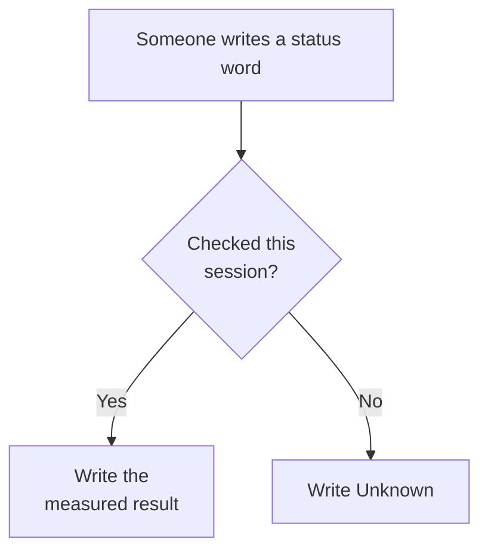

# Honesty

**In plain English:** A status word is a claim. If we have not just checked it, we write **Unknown**. A green light from last week does not count today.

A **probe** is a command, an HTTP GET, a CI log, or a **committed** file that exists **now**, **this session**. Remembering a previous session, uncommitted files, publishing a hostname, or closing a pull request is not a probe.

Short labels: [Glossary](glossary.md). Do not say **NFR-1** / **NFR-2** are met from a fast staging GET. `/operator` is **not FR-19**.

**Probe date for the live rows below:** 2026-09-05 Europe/Berlin (this session). Journey / NFR evidence rows stay the 2026-09-02 records on [Coverage](coverage.md) — not re-probed tonight.

## This repo, this session

| Claim | Status |
|---|---|
| Knowledge site `knowledge.cafe.artof.link` | HTTPS **GET 200** (`curl` this session, 2026-09-05). HTTP `http://knowledge.cafe.artof.link/` → **301** `Location: https://knowledge.cafe.artof.link/`. TLS VERIFY_OK last recorded 2026-09-04 (CN/SAN `knowledge.cafe.artof.link`, Let’s Encrypt, `notAfter=2026-11-30`). DNS CNAME `artofdream.github.io`. Pages API enforce/cert: **Unknown** this session (last recorded 2026-09-02). |
| Restaurant hostname `cafe.artof.link` | **Prefer live share this session.** HTTPS **GET 200** (SPA HTML, title Café Fausse). `/operator` **200**. `/api/operator` **200**. `/api/health` **200** `{"ok":true}`. Knowledge GET: root **200** (~0.5s); `/operator` **200** (~0.6s); `/api/operator` **200** (~0.5s); `/api/health` **200** `{"ok":true}` (~0.6s). This agent: root **200** (~0.04s); HTTP **308** to HTTPS; DNS A `54.165.102.60`. TLS CN/SAN `cafe.artof.link`, Let’s Encrypt, `notAfter=2026-12-04`. Lightsail staging (us-east-1, [#57](https://github.com/artofdream/aea-interactive-design/issues/57)) — **not** a permanent hosting claim. Staging stays **up** until the owner explicitly requests tear-down. Monday **2026-09-08 16:00 Europe/Berlin** is evaluate-only (not automatic tear-down). Whether Quantic graders need the host up for video evaluation remains **Unknown** until the owner shares correspondence. Longer-term hosting stays [Future #22](https://github.com/artofdream/aea-interactive-design/issues/22). Do not over-claim production forever. |
| Restaurant MVP in-repo | **On `main`** (PRs #9 + timezone #12). React + JSX, Flask, PostgreSQL. Local path: Vite `127.0.0.1:5173`, Flask `:5000`, `cafe-pg`. App 2026-09-02 (cts-ai): Journey **J1–J8 PASS** (DB up); **J9 / NFR-3 / NFR-8 PASS** (Vite-only Edge `probe-nfr/` screenshots + theme.css; not Flask+Postgres). This Knowledge VM did not reach Vite on `:5173`. **Live share this session (prefer):** `https://cafe.artof.link/` GET **200** (SPA + `/operator` + `/api/health`). **Interim backup** (same Lightsail, not the primary paste): `https://54-165-102-60.sslip.io/`. After the J1–J8 handoff, App reported `cafe-pg` unreachable — do not claim writes from the health GET. Old `https://shaky-deer-drive.loca.lt/` is **stale** (Knowledge GET **503**; this agent timed out, curl 28). Old `https://happy-glasses-film.loca.lt/` and `https://real-goats-shop.loca.lt/` stay **stale**. Read-only `/operator` ([PR #58](https://github.com/artofdream/aea-interactive-design/pull/58) / [#54](https://github.com/artofdream/aea-interactive-design/issues/54)) — **not FR-19**. |
| Official SRS PDF at `docs/official/…SRS.pdf` | Committed freeze file; working copy `docs/srs.md`; CI fails closed if missing or SHA256 mismatches. |
| AWS / `cafe.artof.link` hosting | Lightsail `cafe-fausse-staging` us-east-1, `small_3_0` (~$12/mo), IP `54.165.102.60` ([#57](https://github.com/artofdream/aea-interactive-design/issues/57)). Route53 **A** TTL 60 overrides the `*.artof.link` ELB wildcard (that wildcard is **not** Café Fausse). Caddy + Let’s Encrypt. Flask + built React SPA. PostgreSQL **on the instance**. AEA RDS untouched. IAM `cts` account `737290977112`. **Not** a permanent hosting claim. Staging stays **up** until the owner explicitly requests tear-down. Monday **2026-09-08 16:00 Europe/Berlin** is evaluate-only (not automatic tear-down). Whether Quantic graders need the host up for video evaluation remains **Unknown** until the owner shares correspondence. Longer-term hosting remains [Future #22](https://github.com/artofdream/aea-interactive-design/issues/22). AWS is **not** in the restaurant MVP cut. HLD: [stack](stack.md) / [staging SVG](assets/hld-aws-staging.svg). |
| Newsletter outbound mailer | **Not in the SRS MVP.** **FR-15** / **FR-16** are store/register only. Do not claim a mailer. |
| NFR-1 / NFR-2 timings (3s page load, 2s form submit) | **Unknown** as an SRS-budget claim. Local Vite notes on [Coverage](coverage.md) / [#40](https://github.com/artofdream/aea-interactive-design/issues/40): home **56 ms**, `GET /api/site` **32 ms**. Do not say NFR-1 / NFR-2 **met**. Staging GETs this session are fast; that is still not an SRS broadband stopwatch. |
| NFR-7 (Chrome, Firefox, Safari, Edge) | **Partial** — Edge **PASS** all routes with screenshots; Firefox **PASS** home; Chrome **Unknown** (not installed on cts-ai); Safari **Unknown** (not reported). Vite-only `:5173`. Not a four-browser claim. [#44](https://github.com/artofdream/aea-interactive-design/issues/44). |
| Journey 1–9 pass/fail | **J1–J8 PASS** (cts-ai local UX, DB up). **J9 / NFR-3 / NFR-8 PASS** (Vite-only Edge `probe-nfr/` screenshots + theme.css; not Flask+Postgres). Recorded on [Coverage](coverage.md). Do not treat J1–J8 as a public-host probe. |
| App live share tonight | **Prefer** `https://cafe.artof.link/` GET **200** (SPA HTML, title Café Fausse). `/api/health` GET **200** `{"ok":true}`. Knowledge GET: root **200** (~0.5s); `/operator` **200** (~0.6s); `/api/operator` **200** (~0.5s); `/api/health` **200** `{"ok":true}` (~0.6s). Lightsail staging (#57) — weekend recording window, not production forever. Fast this session; still staging. Clips stay fallback. **Interim backup:** `https://54-165-102-60.sslip.io/`. Old `https://shaky-deer-drive.loca.lt/`, `https://happy-glasses-film.loca.lt/`, and `https://real-goats-shop.loca.lt/` are **stale**. |
| Operator view `/operator` | Read-only recording helper: customers + reservations so you can see the DB after a booking. **Not** an admin console (no CRUD / cancel). **Not FR-19.** Prefer `https://cafe.artof.link/operator` — Knowledge GET **200** (~0.6s). Interim backup: `https://54-165-102-60.sslip.io/operator`. Landed on `main` via [PR #58](https://github.com/artofdream/aea-interactive-design/pull/58) / [issue 54](https://github.com/artofdream/aea-interactive-design/issues/54). |
| System is antifragile | **Do not claim this.** Use ratchet: failures add guides/sensors. |

## Live vs local vs Future

Three labels. Mixing them is a false claim.

| Label | What it is | What it is not |
|---|---|---|
| **Live** | This knowledge map at `knowledge.cafe.artof.link` (HTTPS GET **200** this session; HTTP **301** to HTTPS). | Not the restaurant. Not a reservation host. |
| **Local / staging share** | Café Fausse App on `main`. Prefer `https://cafe.artof.link/` GET **200** (SPA + `/operator` + `/api/health`). Lightsail staging (#57) for the weekend recording window. Interim backup `https://54-165-102-60.sslip.io/`. Silent clips are the **fallback** look. Old `https://shaky-deer-drive.loca.lt/`, `https://happy-glasses-film.loca.lt/`, and `https://real-goats-shop.loca.lt/` are **stale**. | Not a permanent hosting claim. Not production forever. Not proof that every reservation write works without a this-session write probe. |
| **Future** | Longer-term restaurant hosting ([#22](https://github.com/artofdream/aea-interactive-design/issues/22)); FS extras [#34](https://github.com/artofdream/aea-interactive-design/issues/34)–[#38](https://github.com/artofdream/aea-interactive-design/issues/38). | Not missing grade rows. #57 staging does not close #22. |

Picture: [Friday plan](friday-plan.md) mermaid. Same rule on the [Brief](brief.md) Friday section.

## Fail closed (restaurant MVP)

Missing PostgreSQL / no connection / timeout → honest **no** on reservation and newsletter writes, and on the operator read (`GET /api/operator` → 503 / `ok: false`). Time slot at 30 tables → **FR-9**; no table assigned. Red CI, missing checks, or checks not probed this session → do not merge. Unreviewed PR (no MRC **COMMENT** role-approve, and no non-author merge path) → do not merge. Author does not merge.

## What this site is not

Florist Path B, Lily’s Florist, 14 hats, Kafka, BFF, 3DX Lab, GitLab Pages/CI. Public repo. GitHub only.
