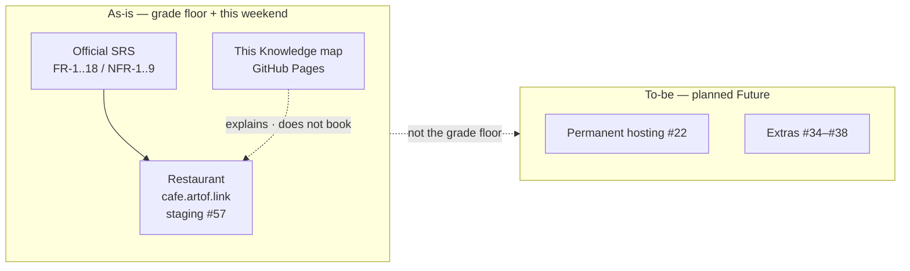

# Café Fausse Knowledge

This is the public map of the Café Fausse student project. It is **not** the restaurant. You cannot book a table here.

The restaurant is a separate site: [cafe.artof.link](https://cafe.artof.link/) (weekend Lightsail staging [#57](https://github.com/artofdream/aea-interactive-design/issues/57) — **not** forever production). Course delivery pages stay under [Quantic / MSAIE](quantic.md). They are not dumped into the top nav ([#79](https://github.com/artofdream/aea-interactive-design/issues/79)). Short labels live on the [Glossary](glossary.md). Lessons and meeting notes live on the [Journal](journal.md).

## What this repo is for

[artofdream/aea-interactive-design](https://github.com/artofdream/aea-interactive-design) is the Quantic **MSAIE** Café Fausse assignment plus a small GitHub harness around it. The assignment is a restaurant website (React + JSX, Flask, PostgreSQL). The harness is how this team tells the truth: official SRS freeze, this-session probes, one issue → one PR, author does not merge.

## Executive summary

Two public surfaces. Two jobs.

| If you want… | Open | Do not treat it as… |
|---|---|---|
| The restaurant | [cafe.artof.link](https://cafe.artof.link/) | Forever production. Permanent hosting stays [#22](https://github.com/artofdream/aea-interactive-design/issues/22). |
| This map | [knowledge.cafe.artof.link](https://knowledge.cafe.artof.link/) | A booking site or a CMS |
| The grade list | [SRS freeze](srs.md) (**FR-1..FR-18**, **NFR-1..NFR-9**) | A new ID invented here |
| Evidence per ID | [Coverage](coverage.md) | A claim that **NFR-1** / **NFR-2** are met |
| Whether a URL is up | [Honesty](honesty.md) | A hostname on a slide |
| How the two sites sit | [Stack](stack.md) | Florist Path B / 14 hats |
| Course packs + video | [Quantic / MSAIE](quantic.md) | Those links in the global top nav |
| A word you do not know | [Glossary](glossary.md) | Guessing |
| Lessons and meetings | [Journal](journal.md) | The live handoff file |

**This session (2026-09-05 Europe/Berlin):** `GET https://knowledge.cafe.artof.link/` **200**. HTTP **301** to HTTPS. `GET https://cafe.artof.link/` **200**; `/api/health` **200** `{"ok":true}`; `/operator` **200**. Live `/glossary.html`, `/journal.html`, and `/to-be.html` are **404** until this PR (and [PR #89](https://github.com/artofdream/aea-interactive-design/pull/89)) merge and Pages deploys. A health GET is not a reservation-write probe.

## Mission

Ship the official Café Fausse restaurant (the SRS freeze, nothing invented) and keep a thin Knowledge map that says what is live, what is weekend staging, and what is still **Unknown**.

## Vision

A restaurant people can actually use, plus a small GitHub harness that fails closed and learns from mistakes. Extra product ideas stay in [Future](future.md). This map does not become a second product. Do not claim the system is antifragile.

## Tactical split

The grade and the product are not the same sentence.

| | MSAIE / Quantic grade floor | The product (after the floor) |
|---|---|---|
| What it is | Official SRS only: **FR-1..FR-18**, **NFR-1..NFR-9**. PDF is source of truth. | Restaurant app + this Knowledge harness |
| Must ship | Home, menu, reservations, about, gallery, newsletter store, fail-closed booking | Honesty probes, Coverage, Journal, GitHub-only loop |
| Must not | Invent **FR-19** / **NFR-10**. “Improve” freeze prices, address, hours, owners, awards, reviews. | Treat weekend staging as forever. Copy florist Path B. |
| Where to read | [SRS freeze](srs.md) · [Coverage](coverage.md) · [Quantic hub](quantic.md) | [Stack](stack.md) · [Honesty](honesty.md) · [Journal](journal.md) · [To-be](to-be.md) |

`/operator` is a read-only recording helper — **not FR-19**. Newsletter is **FR-15** / **FR-16** store only (no outbound mailer). **NFR-1** / **NFR-2** stay not-claimed-met. **NFR-7** is **partial**.

## High-level diagram

As-is (what the grade asks for, plus what is up this weekend) sits next to to-be (planned Future). To-be is **not** a missing grade row.

Pictures and hosting facts: [Stack](stack.md) (as-is / staging / to-be HLD). Planned Future in words: [Future](future.md) and the Quantic-facing [To-be](to-be.md) page (lands with [PR #89](https://github.com/artofdream/aea-interactive-design/pull/89); live `/to-be.html` is **404** this session). Course hub: [Quantic / MSAIE](quantic.md).

## Feedback

How the team reports a problem:

1. Open a GitHub issue on [artofdream/aea-interactive-design](https://github.com/artofdream/aea-interactive-design/issues).
2. Slack the issue number to the room.
3. Claude (or the App agent) addresses it: one finding → one branch → one PR against `main`.
4. The author does **not** merge their own PR. MRC **COMMENT** is the role-approve signal until a non-author can `APPROVE`.

Do not invent a close. Do not paste florist process. Course talk-track notes stay on the [Journal](journal.md) and the [Quantic hub](quantic.md).

## Top 5 lessons learned

Full list and meeting minutes: [Journal](journal.md). The five we keep saying out loud:

1. **A status word is a claim.** Probe **this session** (command, HTTP GET, CI log, or a committed file) or write **Unknown**. A previous session is not a probe.
2. **The grade floor is the official SRS only.** **FR-1..FR-18** / **NFR-1..NFR-9**. Extras are Future, not missing FRs. Do not invent **FR-19**.
3. **Fail closed.** Missing database, a full 30-table slot (**FR-9**), a timeout, or a missing freeze file → honest **no**, not a guessed yes.
4. **Two surfaces.** This map is not the restaurant. Weekend staging is not forever production. Permanent hosting stays [#22](https://github.com/artofdream/aea-interactive-design/issues/22).
5. **Uncommitted files are not shared memory.** Live handoff is committed git plus today’s `research/daily-briefs/YYYY-MM-DD.md`. The author does not merge their own PR.

## Teams

| Team | Owns | Hostname | This session (2026-09-05) |
|---|---|---|---|
| Café Fausse Knowledge | This map (GitHub Pages) | `knowledge.cafe.artof.link` | HTTPS **GET 200**. HTTP **301** to HTTPS. |
| Café Fausse App | Restaurant MVP (React + JSX, Flask, PostgreSQL) | `cafe.artof.link` | HTTPS **GET 200** (SPA + `/api/health` + `/operator`). Lightsail staging [#57](https://github.com/artofdream/aea-interactive-design/issues/57). Not production forever. Staging stays **up** until the owner asks to tear it down. Monday **2026-09-08 16:00 Europe/Berlin** is evaluate-only (not auto tear-down). Whether graders need the host for video evaluation remains **Unknown** until the owner shares correspondence. |

Do not invent other domains. Interim App backup (same host, not the primary paste): `https://54-165-102-60.sslip.io/`. Old tunnels (`shaky-deer-drive`, `happy-glasses-film`, `real-goats-shop`) are **stale**.

## Honesty

If evidence is missing, write **Unknown**. Closing a task is not a probe. See [Honesty](honesty.md). Do not claim this harness is antifragile.
