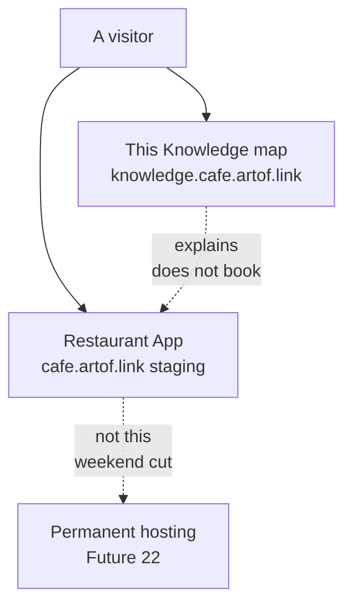

# Café Fausse Knowledge

This GitHub repo is the student Café Fausse project for Quantic **MSAIE**. It holds the official assignment freeze, a small restaurant website, and this map. You are on the map. You cannot book a table here.

## Executive summary

Two public surfaces. This site (`knowledge.cafe.artof.link`) explains the work. The restaurant (`cafe.artof.link`) is the product: React + JSX, Flask, PostgreSQL.

**Grade floor** = official SRS only (**FR-1..FR-18**, **NFR-1..NFR-9**). Extra ideas are [Future](future.md), not missing grade rows.

This session: Knowledge home HTTPS **GET 200**. Restaurant root and `/api/health` HTTPS **GET 200** on weekend Lightsail staging ([#57](https://github.com/artofdream/aea-interactive-design/issues/57)) — not production forever. Permanent hosting stays [#22](https://github.com/artofdream/aea-interactive-design/issues/22). **NFR-1** / **NFR-2** stay **Unknown**. `/operator` is a recording helper — **not FR-19**.

## Mission

Ship an honest Café Fausse restaurant that matches the official SRS, and keep a thin Knowledge map so the team can say what is live, what is local, and what is Future.

## Vision

A visitor can use the restaurant. A teammate can find the freeze, the evidence, and the next decision without a second product on this map.

## Tactical split

**MSAIE / Quantic (must deliver).** Official SRS PDF is source of truth. Working freeze: [SRS](srs.md) and [Coverage](coverage.md). Course handouts live under [Quantic / MSAIE](quantic.md) (hub only — those pages stay complete). Do not invent **FR-19** or **NFR-10**.

**The product (high level).** Café Fausse App is the restaurant. Café Fausse Knowledge is this map (GitHub Pages). AWS is not in the restaurant MVP *code* PR. Staging is not forever.

| Team | Owns | Hostname | This session |
|---|---|---|---|
| Café Fausse Knowledge | This map (GitHub Pages) | `knowledge.cafe.artof.link` | HTTPS **GET 200** |
| Café Fausse App | Restaurant MVP | `cafe.artof.link` | HTTPS **GET 200** (Lightsail #57, not forever). Permanent host stays #22. |

Deep FR tables and CI jargon stay on Coverage, Stack, and Honesty — not here.

## High-level diagram

As-is this weekend vs planned Future. Detail and HLD SVGs stay on [Stack](stack.md). The labeled Future / to-be page is [Future](future.md) (a dedicated Quantic to-be page is [#98](https://github.com/artofdream/aea-interactive-design/issues/98) / open [#89](https://github.com/artofdream/aea-interactive-design/pull/89) — live `/to-be.html` stays **Unknown** until that lands).

## Feedback

Teammates and the owner report problems in **Slack**. Claude opens or updates a **GitHub issue**, then a branch and PR. Do not batch unrelated findings. The author does not merge their own PR. GitHub only — no GitLab.

## Top 5 lessons learned

Longer write-up: [Journal](journal.md) (merged [#103](https://github.com/artofdream/aea-interactive-design/pull/103) / [#100](https://github.com/artofdream/aea-interactive-design/issues/100)). Short labels: [Glossary](glossary.md) (merged [#105](https://github.com/artofdream/aea-interactive-design/pull/105) / [#101](https://github.com/artofdream/aea-interactive-design/issues/101)). This session: `/journal.html` and `/glossary.html` HTTPS **GET 200**.

1. A status word is a claim. Probe **this session** or write **Unknown**.
2. Grade floor is the official SRS IDs only. Functional Spec extras are Future.
3. This map and the restaurant are different sites with different jobs.
4. One finding → one issue → one branch → one PR. The author does not merge.
5. Fail closed: missing database, a full 30-table slot (**FR-9**), a timeout, or a missing freeze file → honest **no**.

## Where to go next

- [Quantic / MSAIE](quantic.md) — course delivery hub
- [SRS freeze](srs.md) — FR-1..FR-18 / NFR-1..NFR-9
- [Coverage](coverage.md) — each ID, evidence class
- [Honesty](honesty.md) — probes and Unknown
- [Stack](stack.md) — how the two sites are hosted
- [Journal](journal.md) — principles, lessons, meeting MoM
- [Glossary](glossary.md) — terms and sources
- [Future / not-MVP](future.md) — hosting #22 and FS extras #34–#38
