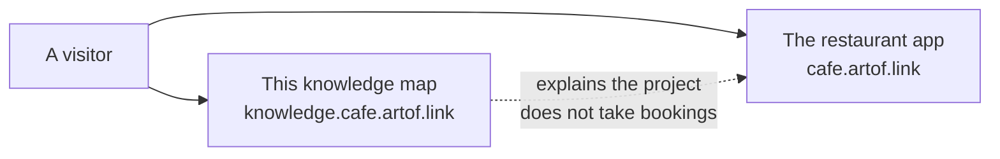

# Café Fausse — knowledge map

**In plain English:** This site is a map of the student project. It explains the assignment rules, what is built, and what we have actually checked. It is **not** the restaurant website. You cannot book a table here.

The restaurant is at [cafe.artof.link](https://cafe.artof.link/) (weekend Lightsail staging [#57](https://github.com/artofdream/aea-interactive-design/issues/57) — not forever production). Course handouts live under [Quantic / MSAIE](quantic.md) so they stay one click away without crowding the top nav. Short labels are on the [Glossary](glossary.md).

**MVP** means the official assignment list only ([SRS freeze](srs.md): **FR-1..FR-18**, **NFR-1..NFR-9**; source of truth = official PDF). Extra ideas go to [Future / not-MVP](future.md).

## Two public sites

This map and the restaurant are different sites with different jobs. They do not share a server.

| If you want… | Open | Not this |
|---|---|---|
| The assignment rules | [SRS freeze](srs.md) | A new FR/NFR invented here |
| What each ID covers | [Coverage](coverage.md) | A claim that **NFR-1** / **NFR-2** are met |
| Whether a URL is actually up | [Honesty](honesty.md) | A hostname on a slide |
| How the two sites are hosted | [Stack](stack.md) | Florist Path B / 14 hats |
| Course briefing, video, slides | [Quantic / MSAIE](quantic.md) | Those links in the global top nav |
| A word you do not recognize | [Glossary](glossary.md) | Guessing |

## Teams

| Team | Owns | Intended hostname | Live URL (probe 2026-09-05 Europe/Berlin) |
|---|---|---|---|
| Café Fausse Knowledge | This knowledge site (GitHub Pages) | `knowledge.cafe.artof.link` | HTTPS **GET 200** this session (2026-09-05); HTTP **301** to HTTPS. |
| Café Fausse App | Restaurant MVP (React + JSX, Flask, PostgreSQL) | `cafe.artof.link` | Prefer live share this session: HTTPS **GET 200** (SPA + `/operator` + `/api/health`). Lightsail `cafe-fausse-staging` us-east-1, Route53 A `54.165.102.60` (TTL 60), Caddy + LE, Postgres **on the instance**. AEA RDS untouched. Weekend #57 — not production forever. Staging kept until owner decision. Monday **2026-09-08 16:00 Europe/Berlin** evaluate-only (not auto tear-down). Whether graders need the host for video evaluation remains **Unknown** until the owner shares correspondence. App is **in-repo on `main`** (PRs #9 + timezone #12). Longer-term hosting stays [Future #22](https://github.com/artofdream/aea-interactive-design/issues/22). |

AWS is not in the restaurant MVP *code* PR. Prefer the live share `https://cafe.artof.link/` this session (GET **200**). Interim backup: `https://54-165-102-60.sslip.io/`. Old tunnels `shaky-deer-drive`, `happy-glasses-film`, and `real-goats-shop` are **stale**. Read-only `/operator` is a recording helper ([PR #58](https://github.com/artofdream/aea-interactive-design/pull/58) / [#54](https://github.com/artofdream/aea-interactive-design/issues/54)) — **not FR-19**. Journey **J1–J8 PASS** and **J9 PASS** stay the 2026-09-02 records on [Coverage](coverage.md). **NFR-7** is **partial**. **NFR-1** / **NFR-2** stay not-claimed-met.

## How the work is organized

Three pieces. AI may interpret. The restaurant database decides bookings. Status words are claims; they need a [probe](glossary.md).

| Piece | In plain English | What it is not |
|---|---|---|
| Shared understanding | The reviewable rules: official SRS, today’s daily brief, honesty vocabulary | Not a chatbot notepad. Not a second SRS. |
| Domain services | The restaurant runtime (React + JSX, Flask, PostgreSQL). The database is authoritative for reservations and newsletter writes. | Not this knowledge site. |
| Outer harness | Guides, CI sensors, one-issue-one-PR, daily briefs, permissions, and honesty | Not 14 hats. Not florist Path B. |

## Honesty

If evidence is missing, write **Unknown**. Closing a task is not a probe. See [Honesty](honesty.md). Do not claim this harness is antifragile.

## Course dates (delivery pages)

Meeting packs (delivery-only, listed on [Quantic / MSAIE](quantic.md)): [Wednesday](meeting-wednesday.md) **2026-09-02 19:00 Europe/Berlin** (owner locked **1, 3, 4** — not 2); [Friday](meeting-friday.md) **2026-09-04 19:00 Europe/Berlin** (score 5 / tech access); [Saturday](meeting-saturday.md) **2026-09-05 19:00 Europe/Berlin** / **~13:00 America/New_York** (recording). [Sunday](meeting-sunday.md) is a placeholder (**Unknown**). Source pages stay complete: [Brief](brief.md), [Friday plan](friday-plan.md), [video script](video-script.md), [slides](presentation-sample.md), [talk cuts](presentation.md). They are not extra restaurant features.

## On this map (thin)

Nav icons match the links below. That is a map affordance — not an **NFR-1** / **NFR-2** claim.

- [Quantic / MSAIE](quantic.md) — navigation hub only (delivery vs implementation). Source pages stay complete.
- [Glossary](glossary.md) — short labels in plain English (probe, Unknown, MVP, staging)
- [Brief](brief.md) — teammate meeting 2026-09-02 19:00 CET; owner locked 1/3/4; silent demo clips; FS v0.1 vs SRS MVP compare; Friday score-5 section
- [Friday plan](friday-plan.md) — 2026-09-04 19:00 Europe/Berlin; P0/P1/P2; live Knowledge HTTPS vs App local/tunnel vs Future hostname
- [Video script](video-script.md) — ~10 minute beats; clips; scenario menu A–F
- [Talk cuts](presentation.md) — Saturday recording: three ~10 min variants + shared close
- [Slide outline](presentation-sample.md) — 12-slide outline + 8-slide cut
- [Stack](stack.md) — AWS staging HLD + as-is / to-be (weekend #57 vs permanent #22); GitHub-only CI
- [SRS freeze](srs.md) — FR-1..FR-18, NFR-1..NFR-9
- [Coverage](coverage.md) — each freeze ID: where in-repo, evidence class, why it matters
- [Honesty](honesty.md) — probes, Unknown; live vs local vs Future
- [Future / not-MVP](future.md) — schema notes (including [AWS `cafe_fausse_db` map](future/aws-schema-map.md)), journal stub, E2E beyond assignment
