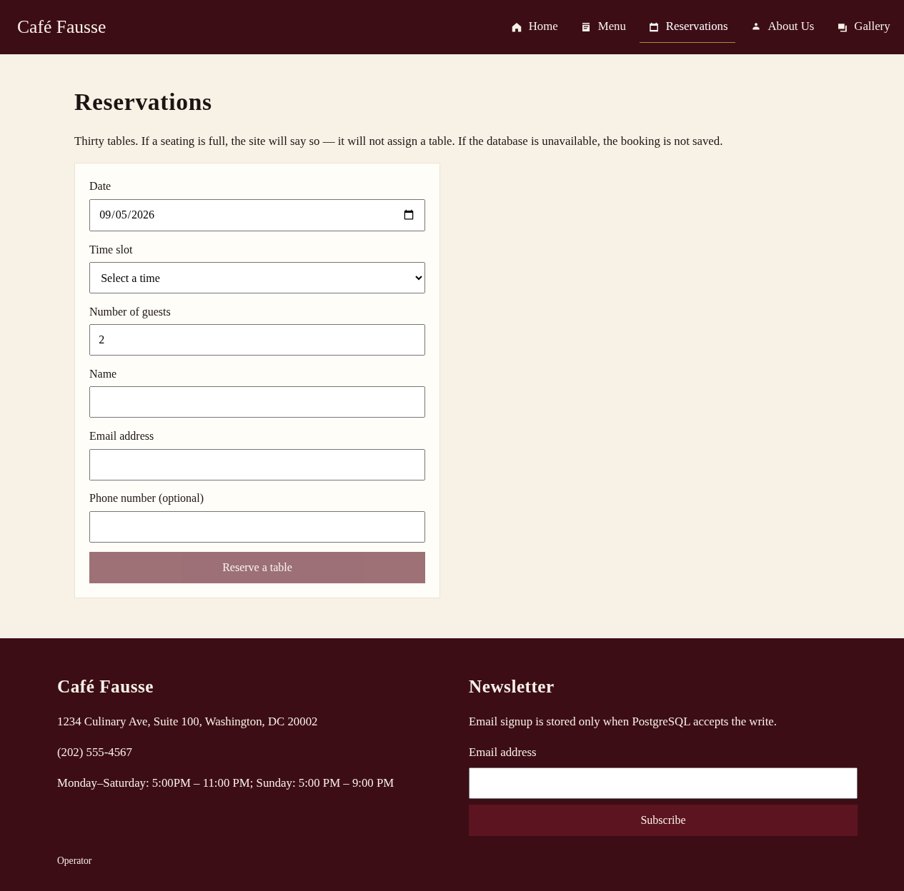
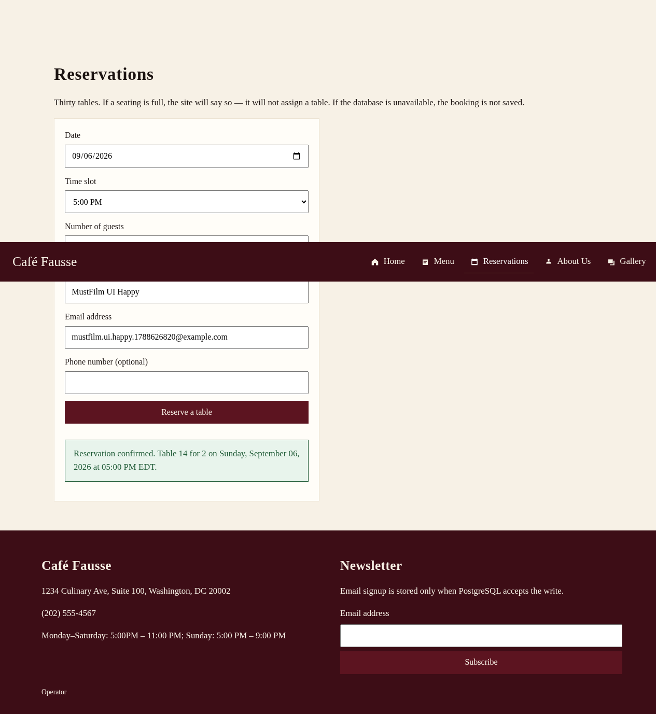
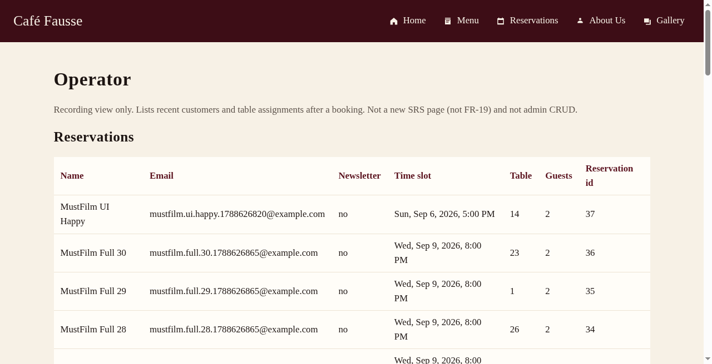
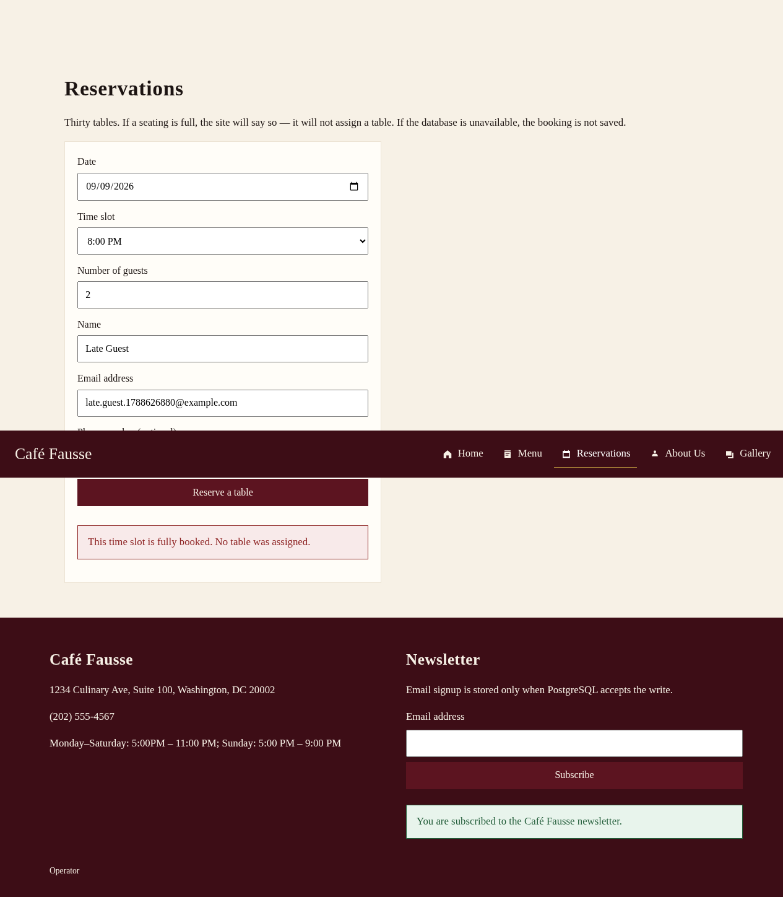
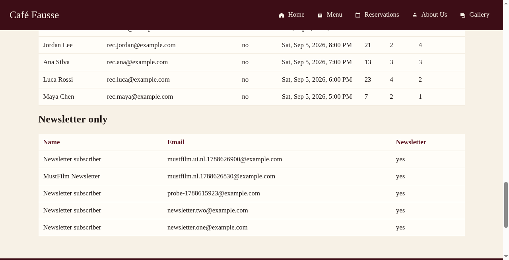
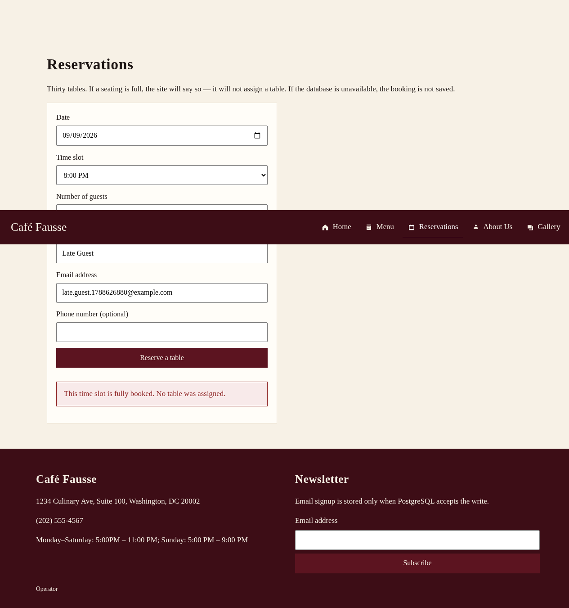

# Café Fausse — Quantic must-film shot list

**Surface:** live share `https://cafe.artof.link/` (Lightsail staging #57 — weekend window, **not** production forever)  
**Companion map:** `https://knowledge.cafe.artof.link/` ([Coverage](coverage.md), [video script](video-script.md), [Quantic hub](quantic.md))  
**Audience:** Zoom / Quantic recording room  
**Built:** 2026-09-05 (Europe/Berlin)

---

## TLDR (for the room)

Film **four** live shots on `cafe.artof.link`: (1) happy book → `/operator`, (2) newsletter → `/operator` newsletter-only, (3) full slot → honest **HTTP 409**, (4) **NFR-6** via Coverage/CI cite (optional staged **503** only if the owner asks). Point at freeze menu talk picks (**Bruschetta**, **Grilled Salmon**, etc.) when walking UX. Say out loud: `/operator` is **not FR-19**; host is staging not forever; **NFR-1/2 not claimed**; **NFR-7 partial**.

| # | Shot | Freeze IDs | Exit |
| --- | --- | --- | --- |
| 1 | Happy book | FR-6..9 success, FR-17..18 | `/operator` row |
| 2 | Newsletter | FR-15..16 | `/operator` newsletter-only |
| 3 | Full-book | FR-9 + NFR-5 | HTTP **409** |
| 4 | Fail-closed evidence | NFR-6 | Coverage/CI (503 optional) |

**Pre-flight (30s, mute):** `GET https://cafe.artof.link/api/health` → `{"ok":true}`; open `/reservations` and confirm a **future** date still lists slots; open `/operator` once so it is warm.

---

## Honesty (say once; do not walk back)

> **PROTOTYPE / recording-helper evidence** — staging UI+API thumbs from `cafe.artof.link` (Lightsail #57). Not the Quantic submission video. `/operator` is **not FR-19**. Shot 4 stays Coverage/CI (no live 503 claim from these thumbs).


- **`/operator` is not FR-19.** Read-only recording helper (PR #58 / issue #54). No CRUD, no cancel, not an admin console.
- **`cafe.artof.link` is Lightsail staging** for this session / weekend share — **not** production forever. Tear-down only on owner request.
- **NFR-1 / NFR-2:** do **not** claim met (local Vite timings are notes only).
- **NFR-7:** **partial** (Edge + Firefox home; Chrome / Safari Unknown) — not a four-browser pass.
- Grade floor = official SRS only (**FR-1..FR-18**, **NFR-1..NFR-9**). Do not invent IDs.
- Freeze talk picks (prices from page / `shared/freeze.json`, do not invent): **Bruschetta $8.50**, **Caesar Salad $9.00**, **Grilled Salmon $22.00**, **Ribeye Steak $28.00**, **Tiramisu $7.50**, **Espresso $3.00**.

---

## Shot 1 — Happy book → `/operator`

### Goal + freeze IDs

Prove a live reservation write: form fields → valid slot → random table **1–30** → success banner → DB visible on read-only `/operator`.

**Freeze IDs:** **FR-6** (fields), **FR-7** (slot available/valid), **FR-8** (random table 1–30), **FR-9** (success), **FR-17** (Customers + Reservations), **FR-18** (Flask insert/confirm).

### Exact click path / fields

1. Open `https://cafe.artof.link/` (optional 5s Home beat: name, hours — FR-1..4).
2. Optional Menu beat for talk: nav → **Menu**; point at **Bruschetta** / **Grilled Salmon** (FR-5) — prices from the page.
3. Nav → **Reservations** (`/reservations`).
4. Fill form (use a **unique** email each take):
   - **Date:** a **future** restaurant day with remaining seats. Prefer probing first:  
     `GET https://cafe.artof.link/api/slots?date=YYYY-MM-DD`  
     Example probed this session: **2026-09-07** (Mon) returns 17:00–22:00 America/New_York; **2026-09-06** (Sun) returns 17:00–20:00 only (Sunday last seating).
   - **Time slot:** pick any listed future slot (e.g. `2026-09-07` → **7:00 PM** / ISO value from the select).
   - **Number of guests:** `2` (or 1–20).
   - **Name:** `Quantic Demo` (or presenter name).
   - **Email:** `happy.book.<timestamp>@example.com` (must be unique / valid).
   - **Phone (optional):** `(202) 555-0100` or leave blank.
5. Click **Reserve a table**.
6. On green success banner, open **`https://cafe.artof.link/operator`** (or type `/operator` in the address bar — not in primary nav). Hard-refresh if the prior snapshot is cached.

### Staging evidence thumbs (PROTOTYPE)







### What success looks like on screen

- Reservations page: green banner approx.  
  **`Reservation confirmed. Table N …`** with **N** between **1 and 30**.
- `/operator`: page title **Operator**; note “Recording view only… not FR-19”; **Reservations** table shows a top row with your **Name**, **Email**, **Time slot**, **Table** (= N), **Guests**, **Reservation id**.

### Follow-up / operator check

- Confirm the new row is **first** (or near top) in **Reservations**.
- Say: “Write landed in Postgres — Customers + Reservations. This view is read-only; not FR-19.”
- Optional: DevTools Network → `POST /api/reservations` → **201** (do not dwell).

### Spoken one-liner

“Happy book: live form, random table one through thirty, success — then `/operator` shows the Postgres row. Not FR-19.”

### Timing estimate

**~90–120 s** (incl. optional Menu point + operator check). Cut Menu if tight → **~70 s**.

---

## Shot 2 — Newsletter → `/operator` newsletter-only

### Goal + freeze IDs

Prove newsletter email validation + store, then show a **newsletter-only** customer (no reservation) on `/operator`.

**Freeze IDs:** **FR-15** (email-format validation), **FR-16** (store in backend DB). Adjacent honesty: missing DB would be honest no (**NFR-6**) — not this shot’s happy path.

### Exact click path / fields

1. Stay on `https://cafe.artof.link/` (any page with footer) or open Home.
2. Scroll to footer **newsletter** form (`NewsletterForm`).
3. **Email address:** `newsletter.only.<timestamp>@example.com`  
   - Use a **fresh** address not already used for a reservation.  
   - Optional talk: strip + lower happens server-side before store (Future #37 parked — not a new FR).
4. Click **Subscribe**.
5. Open **`https://cafe.artof.link/operator`** → scroll to section **Newsletter only**.

### Staging evidence thumbs (PROTOTYPE)





### What success looks like on screen

- Footer: green banner **`You are subscribed to the Café Fausse newsletter.`** (input may clear).
- `/operator` → **Newsletter only** table: row with email (lowercased), **Newsletter** = **yes**, and that customer does **not** appear as a reservation row for this take.

### Follow-up / operator check

- Point at **Newsletter only** (not the Reservations table) — proves FR-16 without a booking.
- Bad-email beat (optional, 10s): submit `not-an-email` → error, nothing new on `/operator` (FR-15 / fail-closed adjacency).
- Network optional: `POST /api/newsletter` → **201** / ok.

### Spoken one-liner

“Newsletter: validate email, store only when Postgres accepts — then `/operator` newsletter-only shows the customer without a reservation.”

### Timing estimate

**~45–60 s** (happy path + operator). Optional bad-email → **~70 s**.

---

## Shot 3 — Full-book → HTTP 409

### Goal + freeze IDs

Prove the slot cannot over-book: after **30** tables for one `time_slot`, the next attempt is an honest **no** — no guessed 31st table.

**Freeze IDs:** **FR-9** (fully booked error), **NFR-5** (no double / over-booking; unique `(time_slot, table_number)` + 30-table cap).

### Exact click path / fields

**Pre-stage (mute / off-camera preferred — ~1–2 min):** fill one future slot to 30 tables via API so the camera only shows the 31st attempt.

1. Pick a **dedicated** future slot not used for Shot 1, e.g. after probe:  
   `DATE=2026-09-13` (or next open day) → choose one ISO slot from `GET /api/slots?date=…`  
   Example shape: `2026-09-13T19:00:00-04:00`.
2. Loop 30× (operator laptop / second machine):

```bash
SLOT='2026-09-13T19:00:00-04:00'   # replace with a live future slot from /api/slots
for i in $(seq 1 30); do
  curl -sS -X POST https://cafe.artof.link/api/reservations \
    -H 'Content-Type: application/json' \
    -d "{\"time_slot\":\"$SLOT\",\"guest_count\":2,\"customer_name\":\"Full $i\",\"email\":\"full.$i@example.com\"}"
  echo
done
```

   Expect **201** / `"ok":true` / `table_number` covering **1..30**. If a call fails mid-loop, stop and pick a fresh slot.

3. **On camera:**
   - Open `/reservations`.
   - **Date** = that same day; **Time slot** = the filled slot (still selectable even when full — submit is what fails).
   - **Guests** `2`; **Name** `Late Guest`; **Email** `late.fullbook.<timestamp>@example.com`.
   - Click **Reserve a table**.
4. Optional Network panel: `POST /api/reservations` → status **409**, body `code: "fully_booked"`.

### Staging evidence thumbs (PROTOTYPE)



API overflow probe: [`assets/mustfilm/fr9-409.json`](assets/mustfilm/fr9-409.json) (`status` 409, `code` `fully_booked`, `fr9_verified` true).

### What success looks like on screen

- Red/error banner: **`This time slot is fully booked. No table was assigned.`**
- **No** success banner; **no** table number shown.
- Network: **HTTP 409** + `"ok": false` + `"code": "fully_booked"`.
- `/operator` (optional follow-up): **no** new row for `late.fullbook…`; prior 30 remain.

### Follow-up / operator check

- Say: “Thirty tables is the freeze cap — unique slot+table index is NFR-5; full slot is FR-9, not a guessed table.”
- Do **not** claim you stopped Postgres for this shot (that is Shot 4 optional).

### Spoken one-liner

“Full book: thirty tables taken, thirty-first gets HTTP 409 — fully booked, no table assigned. That’s FR-9 and NFR-5.”

### Timing estimate

**~40–60 s on camera** after pre-stage. Pre-stage itself **~60–120 s** off-mic. If pre-stage fails live, fall back to Coverage + `test_fail_closed.py` cite and **do not invent a success**.

---

## Shot 4 — NFR-6 fail-closed (Coverage/CI preferred)

### Goal + freeze IDs

Show **fail-closed** evidence without breaking staging: missing DB / unreachable / timeout / 31st-table paths are locked in tests and mapped on Coverage.

**Freeze IDs:** **NFR-6** (user-friendly failure handling; honest **no**). Adjacent: **FR-9** / **NFR-5** already shown in Shot 3; J8 local PASS was HTTP **503** when DB down.

### Exact click path / fields (preferred — film this)

1. Open [Coverage](coverage.md) (`https://knowledge.cafe.artof.link/coverage.html`).
2. Point at:
   - Journey **J8** — DB down → **PASS** / HTTP **503** fail-closed (**NFR-6**).
   - NFR table row **NFR-6** — `test_fail_closed.py` (missing DB, unreachable, timeout, full slot); frontend error banners.
3. Optional second tab: GitHub Actions / in-repo mention of `backend/tests/test_fail_closed.py` (CI evidence class).
4. **Do not** stop Lightsail Postgres on `cafe.artof.link` for the camera.

### Optional staged 503 (**only if owner asks**)

If the **owner explicitly requests** a live 503 demo:

1. Owner coordinates a controlled DB-down window on staging (not ad-hoc by the presenter).
2. On camera: submit a reservation **or** newsletter **or** open `/operator`.
3. Expect honest error banner / API **503** (`ok: false`) — booking/signup **not** saved; operator read fails closed.
4. Owner restores DB before continuing other shots.

If owner does **not** ask: skip live 503; Coverage/CI cite is enough.

### What success looks like on screen

- **Preferred:** Coverage table visible with NFR-6 / J8 language; speaker states “code + CI; we are not killing staging Postgres for the grade story.”
- **Optional owner 503:** red banner / Network **503**; no fake success; `/api/health` may show `ok: false` during the window.

### Follow-up / operator check

- Tie back: “A write is only a write if Postgres accepts it.”
- Reiterate honesty lines: NFR-1/2 not claimed; NFR-7 partial; host is staging.

### Spoken one-liner

“NFR-6 is fail-closed — Coverage and `test_fail_closed` in CI. We cite that; we only stage a live 503 if the owner asks.”

### Timing estimate

**~45–60 s** (Coverage/CI). Optional live 503 add **~30–45 s** plus owner restore time.

---

## Suggested camera order & room clock

| Order | Shot | On-camera | Notes |
| ---: | --- | ---: | --- |
| 0 | Pre-flight health + slots | 0:30 | Mute |
| 1 | Happy book → `/operator` | 1:30 | Unique email |
| 2 | Newsletter → newsletter-only | 1:00 | Different email |
| 3 | Full-book 409 | 1:00 | Pre-stage 30 off-mic |
| 4 | NFR-6 Coverage/CI | 1:00 | 503 only if owner asks |
| — | Honesty close (host / NFR-1/2 / NFR-7 / not FR-19) | 0:30 | Once |

**Total must-film block:** ~**5–6 minutes** plus optional Menu talk (~20s) and optional owner 503.

### Fallback if staging drops

1. Knowledge HTTPS + [Coverage](coverage.md) + this shot list.  
2. Play committed clip **02-happy-book** as a **look** only — not a this-session write claim.  
3. Say out loud: fallback look; App not probed live this minute.

---

## Do-not-say checklist (cut these)

- “`/operator` is FR-19” / “admin console”
- “`cafe.artof.link` is production forever” / “live Café Fausse forever”
- “NFR-1 met” / “NFR-2 met”
- “NFR-7 pass on Chrome, Firefox, Safari, and Edge”
- Invented freeze prices or a guessed table on a full slot
