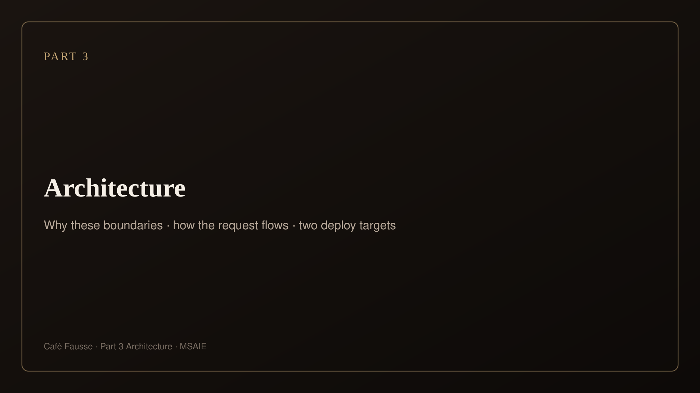
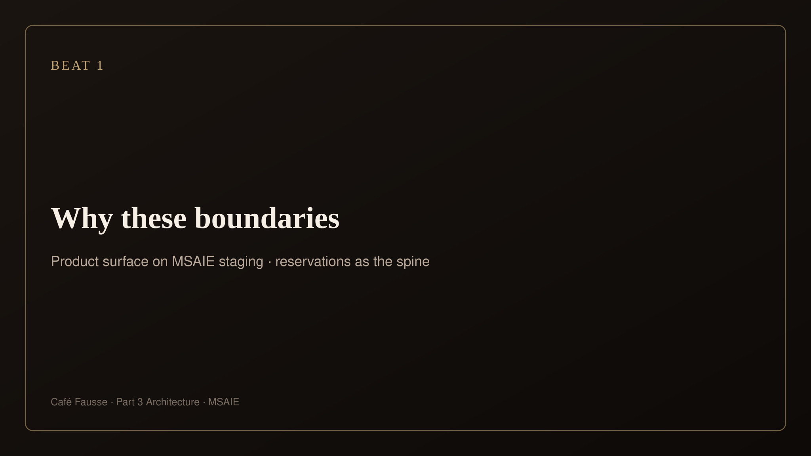
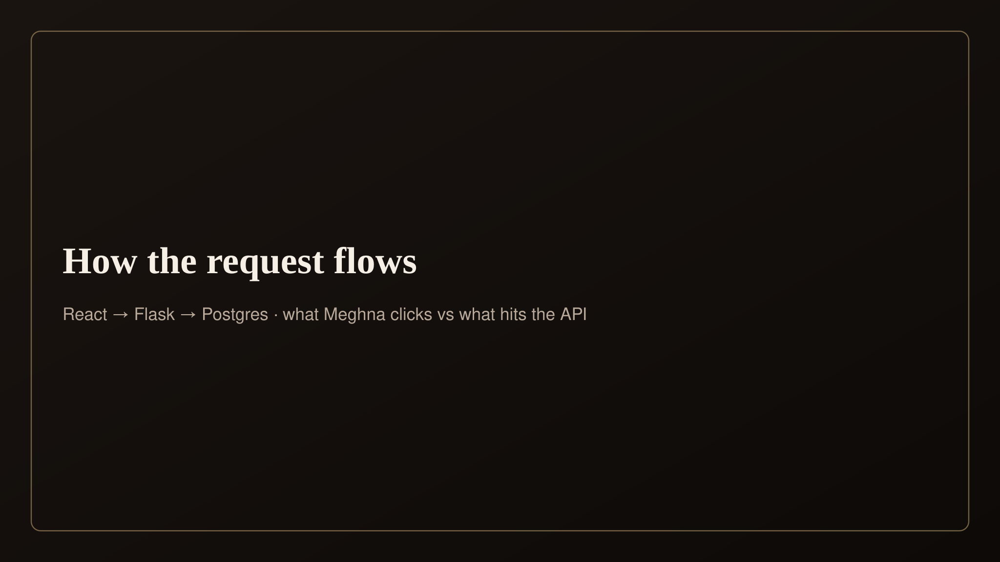
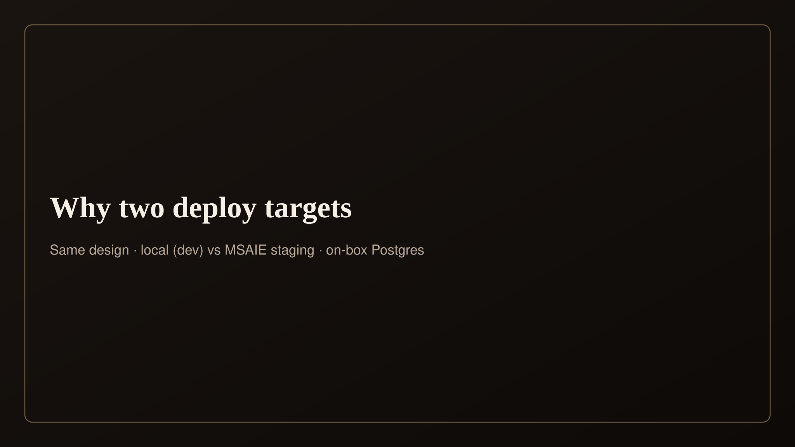
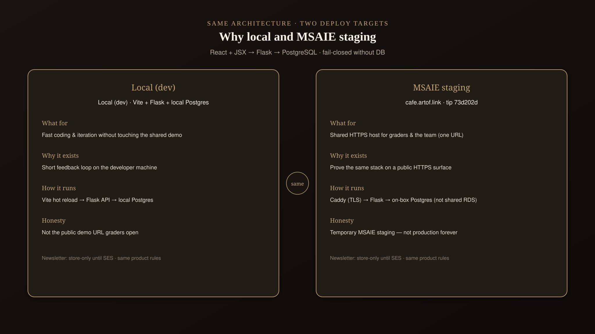
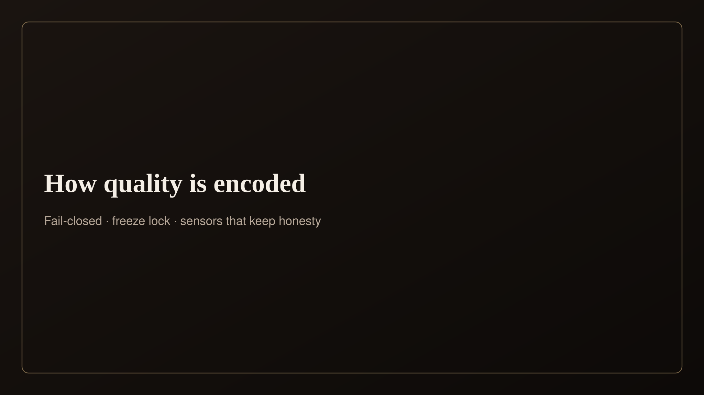
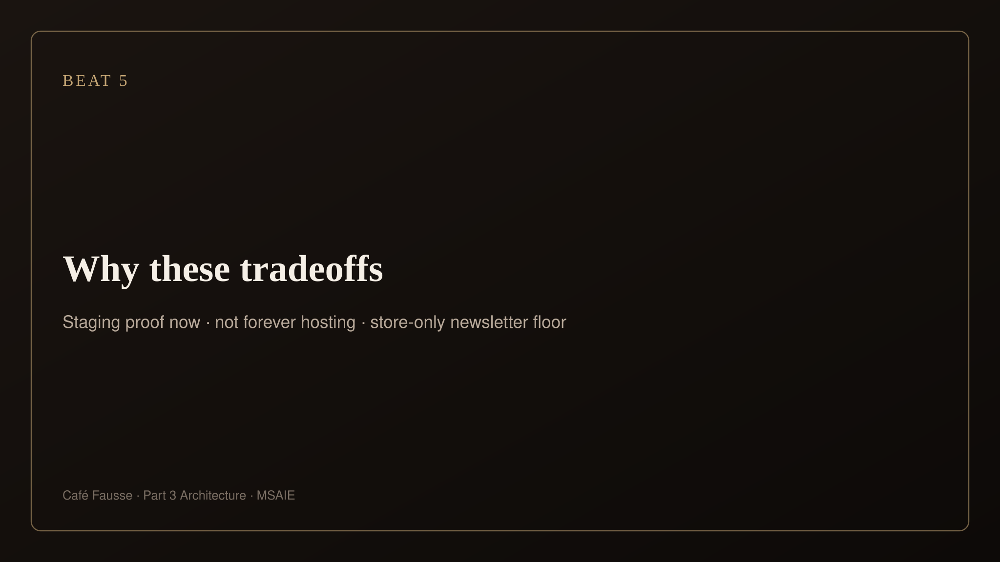
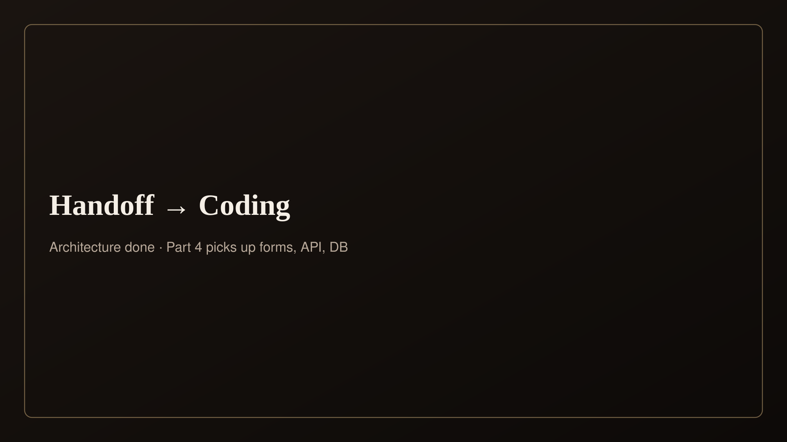
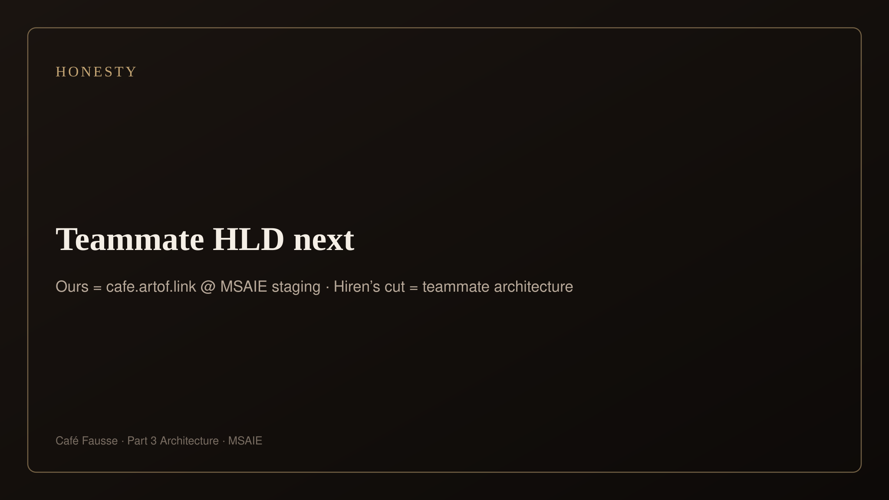

# Part 3 — Present (diagrams only)

**Claude · Architecture · supporting deck**  
Script: [NATURAL](part3-variant-b-script-natural.html) · Live: [cafe.artof.link](https://cafe.artof.link/)  
Use this page while speaking — one beat per section. No FR/NFR IDs on camera. Say **MSAIE staging** for cafe.artof.link.

---

## Beat 1 — Why these boundaries (~0:00–0:25)

Product surface: Reservations on MSAIE staging (or still).

---

## Beat 2 — How the request flows (~0:25–0:55)

React → Flask → Postgres (what Meghna clicks vs what hits the API).

---

## Beat 3 — Why two deploy targets (~0:55–1:35)

Same design · local vs MSAIE staging · on-box Postgres on staging.

---

## Beat 4 — How quality is encoded (~1:35–2:10)

Fail-closed · unique slot+table · freeze/CI.

---

## Beat 5 — Why these tradeoffs (~2:10–2:45)

Two targets · Knowledge ≠ App · newsletter store-only · staging temporary.

---

## Beat 6 — Handoff → Coding (~2:45–3:00)

Hiren’s cut is teammate architecture — not ours. Ours is cafe.artof.link at MSAIE staging. Side page: [Teammate HLD (Hiren)](teammate-hld.md) — labeled teammate, never our MSAIE map.

