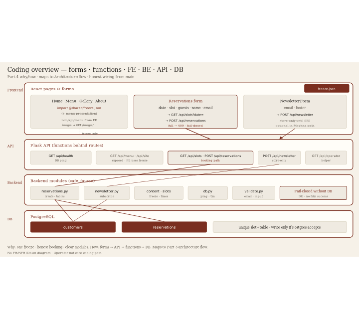
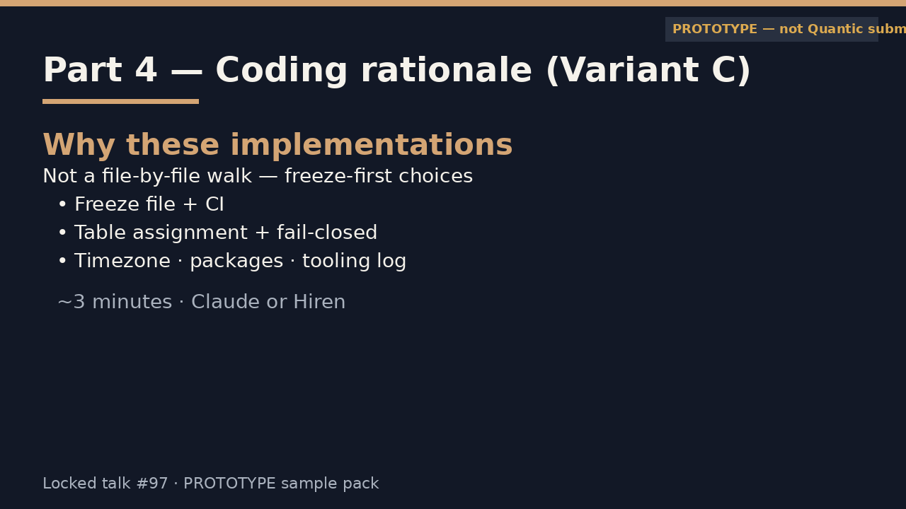
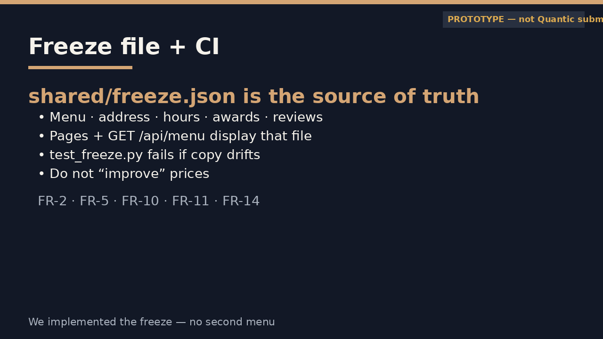
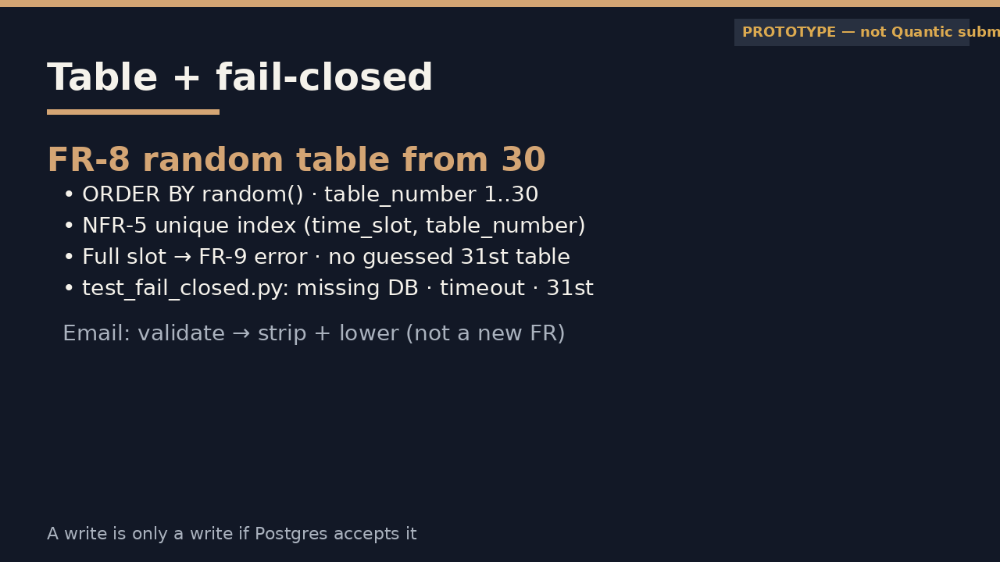
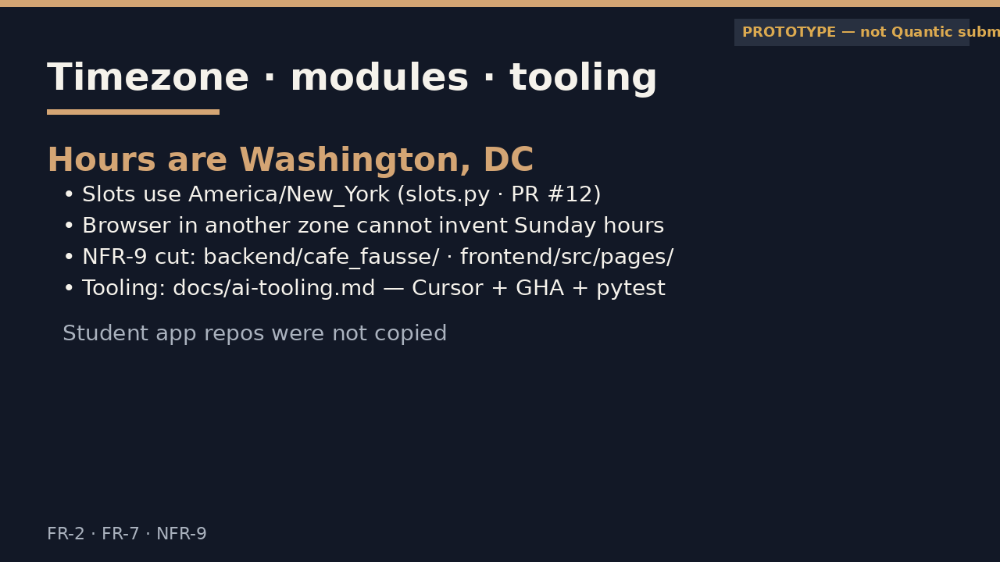
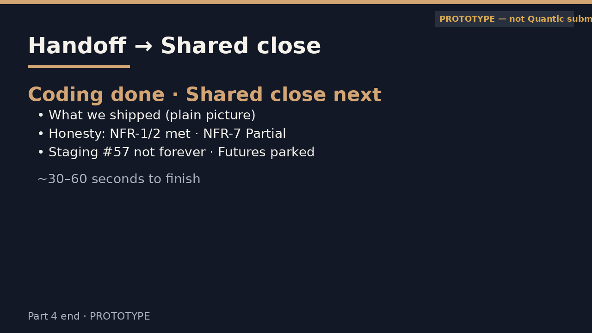

# Part 4 — Present (diagrams only)

**Hiren · Coding · supporting deck**  
Script: [NATURAL](part4-variant-c-script-natural.html)  
One beat per section. No FR/NFR IDs on camera. Demo host = MSAIE staging at cafe.artof.link.

---

## Beat 1 — Open / coding map (~0:00–0:15)

---

## Beat 2 — Why freeze + how CI locks it (~0:15–1:00)

---

## Beat 3 — Why fail-closed + table integrity (~1:00–2:00)

---

## Beat 4 — Why Eastern hours + modules (~2:00–2:45)

---

## Beat 5 — Handoff → Shared close (~2:45–3:00)

