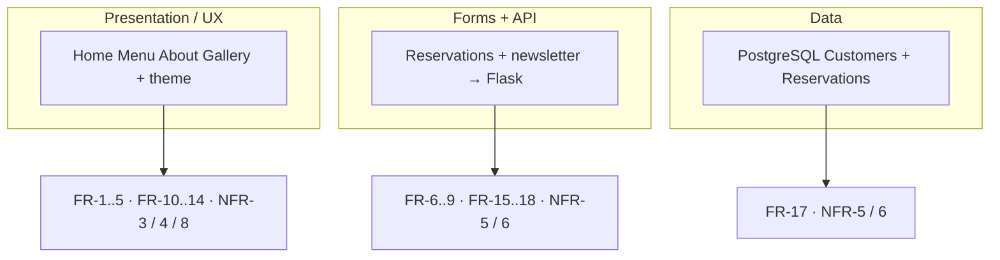
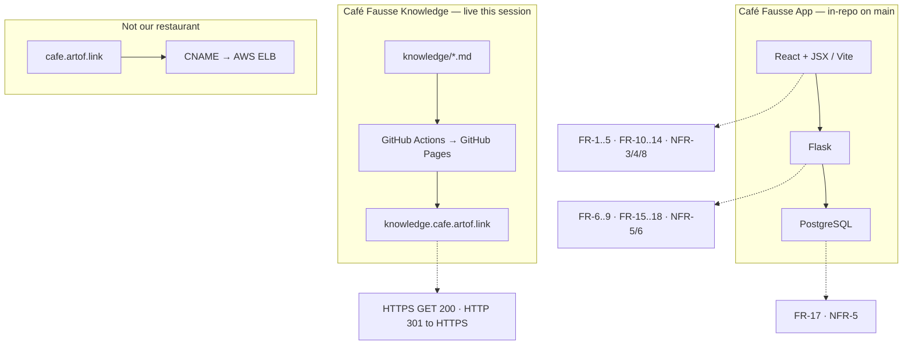
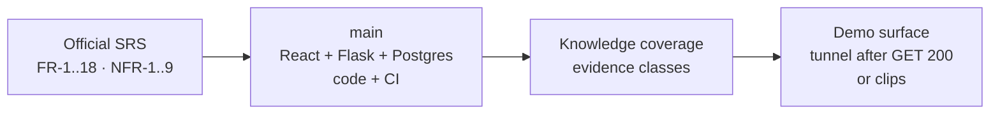

# Presentation — three recording cuts

Working talk tracks for Saturday **2026-09-05 ~13:00 America/New_York** (19:00 Europe/Berlin). Café Fausse Knowledge only. Not official Quantic dashboard text. Not the restaurant.

Pick **one** cut (~10 minutes). Every cut uses the same open and the same close. Spoken timing lives here; the [8/12-slide outline](presentation-sample.md) stays the Friday slide deck. Scenario menu A–F and clips live on the [video script](video-script.md). Every freeze ID is on [Coverage](coverage.md). Friday room notes: [Friday plan](friday-plan.md), [Brief](brief.md).

**Grade floor:** official SRS only — **FR-1..FR-18**, **NFR-1..NFR-9**. Do not invent FR-19 / NFR-10. Freeze prices, address, hours, owners, awards, and reviews stay as written.

**Honesty (do not skip):** **NFR-1** / **NFR-2** stay **Unknown** as SRS-budget claims — do not say they are met. **NFR-7** is **partial** (Edge + Firefox home; Chrome / Safari **Unknown**). Journey **J1–J8 PASS** (cts-ai, DB up). **J9 PASS** is Vite-only. Future [#22](https://github.com/artofdream/aea-interactive-design/issues/22) / [#34](https://github.com/artofdream/aea-interactive-design/issues/34)–[#38](https://github.com/artofdream/aea-interactive-design/issues/38) are parked, not grade gaps. Never call `cafe.artof.link` Café Fausse.

**Demo this session (2026-09-04 Europe/Berlin):** Knowledge HTTPS `https://knowledge.cafe.artof.link/` GET **200**. App tunnel `https://real-goats-shop.loca.lt/` GET **200** (SPA + `/api/health`). Knowledge GET: root **200** ~15s; `/api/health` **200** ~15s. **Slow (~10–20s)**; **interstitial-possible** in browsers. Short timeouts can look like failure. Not snappy. Not always-on. Clips stay fallback. Old `https://tender-rings-kick.loca.lt/` is stale — do not keep as the live share URL. **Not** `cafe.artof.link`. Do not claim writes from the health GET.

## Shared open (~1:00)

Use this minute on every cut.

| Clock | Say / show |
|---|---|
| 0:00–0:20 | Café Fausse. Quantic MSAIE. Two teams: Knowledge (`knowledge.cafe.artof.link`) and App (in-repo). |
| 0:20–0:40 | Stack as assigned: **React + JSX**, **Flask**, **PostgreSQL**. Grade floor = **FR-1..FR-18** / **NFR-1..NFR-9** only. |
| 0:40–1:00 | Knowledge map is live HTTPS. Demo = a **this-session** tunnel GET **200**, or the committed clips. **Not** `cafe.artof.link` (AWS ELB, not our restaurant). |

Then jump to the cut you chose.

---

## Variant A — Layers → FR/NFR (~10 min)

~1 minute open, then map three runtime layers to freeze IDs. Open [Coverage](coverage.md) if you want the table on screen.

| Clock | Beat | Say / show | Freeze IDs |
|---|---|---|---|
| 0:00–1:00 | **Open** | Shared open above. | — |
| 1:00–3:30 | **Presentation / UX** | Five SRS pages + theme. Home name, contact, hours, nav (**FR-1..FR-4**). Menu categories from freeze (**FR-5**). About history and founders (**FR-10**, **FR-11**). Gallery images, lightbox, awards, reviews (**FR-12..FR-14**). Theme + Flex/Grid (**NFR-3**, **NFR-4**, **NFR-8**). Clip **01** if you need a look. | FR-1..FR-5, FR-10..FR-14, NFR-3, NFR-4, NFR-8 |
| 3:30–6:30 | **Forms + API** | Reservation form fields (**FR-6**). Slot check (**FR-7**). Random table 1–30 (**FR-8**). Success or full-book (**FR-9**). Flask insert / confirm (**FR-18**). Newsletter validate + store (**FR-15**, **FR-16**). Clip **02** for a happy book. Missing DB → honest no (**NFR-6**). Unique slot+table (**NFR-5**). | FR-6..FR-9, FR-15..FR-18, NFR-5, NFR-6 |
| 6:30–8:30 | **Data** | PostgreSQL **Customers** and **Reservations** (**FR-17**). Cap of 30 tables. Unique `(time_slot, table_number)`. Fail-closed tests: missing DB, timeout, 31st table. A write is only a write if Postgres accepts it. | FR-17, NFR-5, NFR-6 |
| 8:30–10:00 | **Close** | Three layers → freeze IDs (diagram below). Then the [shared close](#shared-close). Say the Unknowns out loud. | NFR-1 / NFR-2 not claimed met; NFR-7 partial |

---

## Variant B — Architecture + diagrams (~10 min)

Same open. Walk the as-is picture, then map boxes to IDs. Static copies of the HLD: [as-is SVG](assets/hld-as-is.svg), [to-be SVG](assets/hld-to-be.svg). Same story in words on [Stack](stack.md).

| Clock | Beat | Say / show |
|---|---|---|
| 0:00–1:00 | **Open** | Shared open. Two hostnames are not one shop. |
| 1:00–4:00 | **HLD as-is** | Diagram below. React (Vite) talks to Flask talks to Postgres. Knowledge is GitHub Pages. App is local / tunnel, not a public restaurant host. `cafe.artof.link` is an AWS ELB — **not** Café Fausse. |
| 4:00–7:00 | **Boxes → FR/NFR** | Walk [Coverage](coverage.md). React pages = **FR-1..FR-5**, **FR-10..FR-14**. Flask APIs = **FR-6..FR-9**, **FR-15..FR-18**. Postgres tables = **FR-17**. Integrity / fail-closed = **NFR-5**, **NFR-6**. Theme / nav / viewports = **NFR-3**, **NFR-4**, **NFR-8**. |
| 7:00–9:00 | **Sensors** | GitHub Actions: freeze file + PDF SHA256 must exist. `test_freeze.py` locks menu copy. `test_fail_closed.py` locks missing-DB / full slot. Author does not merge. That is the outer harness, not a new FR. |
| 9:00–10:00 | **Close** | As-is vs Future. [#22](https://github.com/artofdream/aea-interactive-design/issues/22) and [#34](https://github.com/artofdream/aea-interactive-design/issues/34)–[#38](https://github.com/artofdream/aea-interactive-design/issues/38) stay parked. Then the [shared close](#shared-close). |

---

## Variant C — Coding rationale (~10 min)

Same open. Why these implementations — not a code walk of every file.

| Clock | Beat | Why this, not that | Freeze IDs |
|---|---|---|---|
| 0:00–1:00 | **Open** | Shared open. “We implemented the freeze; we did not invent a second menu.” | — |
| 1:00–4:00 | **Freeze file + CI** | Menu, address, hours, awards, reviews live in `shared/freeze.json`. Pages and `GET /api/menu` **display** that file. `test_freeze.py` fails if copy drifts. Do not “improve” prices. Optional demo picks below are **existing SRS categories only**. | FR-2, FR-5, FR-10, FR-11, FR-14 |
| 4:00–7:00 | **Table + fail-closed** | **FR-8** asks for a random table from 30. `ORDER BY random()` plus `table_number BETWEEN 1 AND 30`. **NFR-5** is the unique index `reservations_slot_table` on `(time_slot, table_number)` — a slot cannot get the same table twice. Full slot → **FR-9** error, no guessed table. `test_fail_closed.py` covers missing DB, unreachable DB, timeout, 31st table. Email is `validate_email` → strip + **lower** before store (not a new FR; Future [#37](https://github.com/artofdream/aea-interactive-design/issues/37) is verbatim-case, parked). | FR-8, FR-9, FR-15, NFR-5, NFR-6 |
| 7:00–9:00 | **Timezone + modules + tooling** | Hours are Washington, DC. Slots use `America/New_York` from the freeze (`slots.py`, PR #12) so a browser in another zone does not invent Sunday hours. Packages under `backend/cafe_fausse/` and page components under `frontend/src/pages/` are the **NFR-9** cut. Tooling log: `docs/ai-tooling.md` — Cursor + GitHub Actions + pytest; student app repos were not copied. | FR-2, FR-7, NFR-9 |
| 9:00–10:00 | **Close** | [Shared close](#shared-close) diagram. Same honesty line. | — |

---

## Shared close

One picture. Use it at 8:30–10:00 (cut A) or 9:00–10:00 (cuts B and C).

**What we shipped (plain language):** restaurant MVP **on `main`** (code + CI). Knowledge map **live** HTTPS. Evidence on [Coverage](coverage.md) — including the Unknowns.

Say out loud before you stop:

- **NFR-1** / **NFR-2** — not claimed met.
- **NFR-7** — partial (Edge + Firefox home; Chrome / Safari Unknown).
- **J1–J8 PASS** with DB up; **J9 PASS** Vite-only.
- Future #22 / #34–#38 are not missing grade rows.
- `cafe.artof.link` is not Café Fausse.

---

## Optional freeze-menu demo picks

Point at **existing SRS categories** on the Menu page or in clip 01. Do **not** change `shared/freeze.json`. Do not say a different price.

| Category (SRS / FR-5) | One freeze item to point at |
|---|---|
| Starters | Bruschetta |
| Main Courses | Grilled Salmon |
| Desserts | Tiramisu |
| Beverages | Espresso |

If time is tight, one starter + one main is enough. Read the price from the page, not from memory.

## What not to say on camera

- “NFR-1 / NFR-2 met” or “four browsers.”
- “Live restaurant at `cafe.artof.link`.”
- Future #22 / #34–#38 as missing official requirements.
- A fifth team, GitLab, AWS in the MVP cut, or invented IDs.

## Sister pages

- [Slide outline](presentation-sample.md) — 12-slide outline + 8-slide cut (keep that file).
- [Video script](video-script.md) — Friday ~10 min beats + scenarios A–F.
- [Coverage](coverage.md) — every freeze ID.
- [Friday plan](friday-plan.md) / [Brief](brief.md) — Friday room.
- [Honesty](honesty.md) — probe vocabulary.
