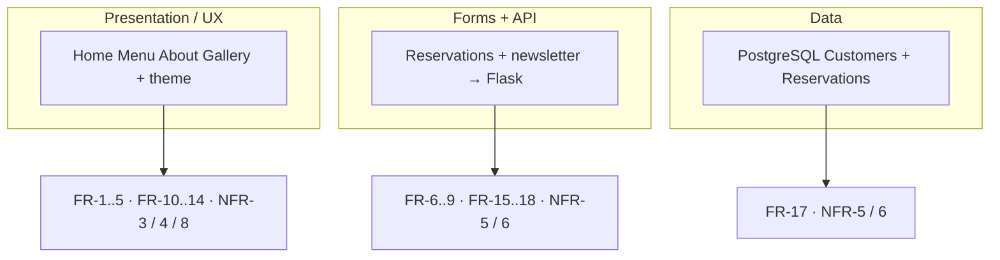
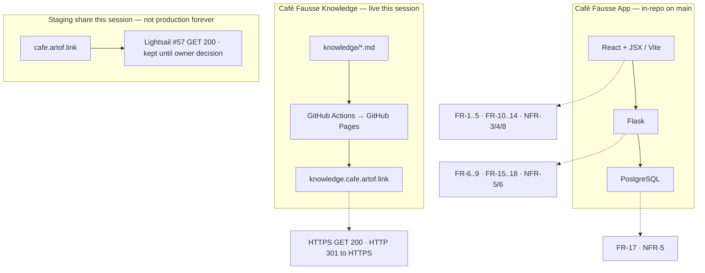
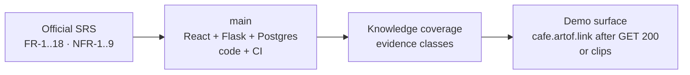

# Presentation — talk cuts (locked Saturday VIDEO)

Working talk tracks for Saturday **2026-09-05 ~13:00 America/New_York** (19:00 Europe/Berlin). Café Fausse Knowledge only. Not official Quantic dashboard text. Not the restaurant.

**Locked cut (owner notes 2026-09-05 / [#97](https://github.com/artofdream/aea-interactive-design/issues/97)):** one ~10 minute VIDEO. **Not** “pick Variant A or B or C.”

**Casting lock (2026-09-06 owner):** Meghna = Part 2 UX · **Claude = Part 3 Architecture** · **Hiren = Part 4 Coding** · Shared close Part 5 TBD.

| Clock | Part | Who | Source on this page |
|---|---|---|---|
| 0:00–0:30 | Team + ID verification | Shared | First 30s of the shared open below |
| 0:30–3:30 | Website demo `https://cafe.artof.link/` — Home, Gallery, Menu, Reservations | **Meghna** | [Meghna demo](meghna-cafe-demo.md); must-film on [Must-film shots](must-film-shots.md) |
| 3:30–6:30 | Architecture + Diagram (**Variant B**) | **Claude** | **Camera:** [natural script](part3-variant-b-script-natural.md) · [natural VO](part3-variant-b-voiceover-natural.md) · **Compare:** [technical](part3-variant-b-script.md) · Variant B section below |
| 6:30–9:30 | Coding rationale (**Variant C**) | **Hiren** | **Camera:** [natural script](part4-variant-c-script-natural.md) · [natural VO](part4-variant-c-voiceover-natural.md) · **Compare:** [technical](part4-variant-c-script.md) · Variant C section below |
| 9:30–10:00 | Shared close | Shared | **Camera:** [natural script](part5-shared-close-script-natural.md) · [natural VO](part5-shared-close-voiceover-natural.md) · **Compare:** [technical](part5-shared-close-script.md) · Shared close section below |

**Voice-over TBD.** Variant A below stays a draft / rehearsal pack. It is **not** the locked Saturday cut. Zoom dry-run on the [video script](video-script.md) is **PROTOTYPE** (Variant A).

Spoken timing for the standalone drafts still lives here; the [8/12-slide outline](presentation-sample.md) stays the Friday slide deck. Scenario menu A–F and clips live on the [video script](video-script.md). Every freeze ID is on [Coverage](coverage.md). Friday room notes: [Friday plan](friday-plan.md), [Brief](brief.md). Meghna pack: [materials](meghna-materials.md). Parts 3–5 rehearsal pack: [Parts 3–5 materials](parts-345-materials.md) (silent **PROTOTYPE** + technical **PROTOTYPE TTS** + **PROTOTYPE TTS** natural — not teammate VO · not Quantic submit). **Prefer natural for camera.** Talk spine: Part 2 UX/business · Part 3 architecture why/how · Part 4 coding why/how · Part 5 honesty. Architect deploy table: [Local vs AWS](part3-local-vs-aws.md) (also on [Stack](stack.md)). Architect visuals: [HLD + Meghna FE/BE](part3-hld-flow-notes.md) · [Part 4 coding overview](part4-coding-overview.md). FR/NFR map: [handoff mapping](parts-345-handoff-mapping.md) — **not spoken on camera**.

**Grade floor:** official SRS only — **FR-1..FR-18**, **NFR-1..NFR-9**. Do not invent FR-19 / NFR-10. Freeze prices, address, hours, owners, awards, and reviews stay as written.

**Honesty (do not skip, 2026-09-06 update):** **NFR-1** is **met** — A36 Brave broadband cold Home **466 ms** ([#123](https://github.com/artofdream/aea-interactive-design/issues/123) / [PR #124](https://github.com/artofdream/aea-interactive-design/pull/124)). **NFR-2** is **met** — reservation submit **233 ms** ([#125](https://github.com/artofdream/aea-interactive-design/issues/125) / [PR #126](https://github.com/artofdream/aea-interactive-design/pull/126)). That is not a four-browser claim. **NFR-7** stays **Partial**. Journey **J1–J8 PASS** (cts-ai, DB up). **J9 PASS** is Vite-only. Future [#22](https://github.com/artofdream/aea-interactive-design/issues/22) / [#34](https://github.com/artofdream/aea-interactive-design/issues/34)–[#38](https://github.com/artofdream/aea-interactive-design/issues/38) are parked, not grade gaps. Prefer `https://cafe.artof.link/` as the **staging environment for the MSAIE project** (temporary — not production forever; tracker [#57](https://github.com/artofdream/aea-interactive-design/issues/57) is off-camera). Do **not** invent **FR-19**.

**Demo this session (2026-09-05 Europe/Berlin):** Knowledge HTTPS `https://knowledge.cafe.artof.link/` GET **200**. Prefer live share `https://cafe.artof.link/` GET **200** (SPA + `/operator` + `/api/health`). Knowledge GET: root **200** (~0.5s); `/operator` **200** (~0.6s); `/api/operator` **200** (~0.5s); `/api/health` **200** `{"ok":true}` (~0.6s). TLS CN/SAN `cafe.artof.link`, Let’s Encrypt, `notAfter=2026-12-04`. Lightsail staging (#57) — weekend recording window, not permanent. Fast this session; still staging. Clips stay fallback. **Interim backup:** `https://54-165-102-60.sslip.io/`. Old `https://shaky-deer-drive.loca.lt/`, `https://happy-glasses-film.loca.lt/`, and `https://real-goats-shop.loca.lt/` are **stale**. Do not claim writes from the health GET.

**Operator view (recording helper — not FR-19):** read-only `/operator` shows customers + reservations so you can see the DB after a booking. **Not** an admin console (no CRUD / cancel). Prefer `https://cafe.artof.link/operator` — Knowledge GET **200** (~0.6s). Interim backup: `https://54-165-102-60.sslip.io/operator`. Landed on `main` via [PR #58](https://github.com/artofdream/aea-interactive-design/pull/58) / [issue 54](https://github.com/artofdream/aea-interactive-design/issues/54). 

## Shared open (~1:00)

Use this minute on every cut.

| Clock | Say / show |
|---|---|
| 0:00–0:20 | Café Fausse. Quantic MSAIE. Two teams: Knowledge (`knowledge.cafe.artof.link`) and App (in-repo). |
| 0:20–0:40 | Stack as assigned: **React + JSX**, **Flask**, **PostgreSQL**. Grade floor = **FR-1..FR-18** / **NFR-1..NFR-9** only. |
| 0:40–1:00 | Knowledge map is live HTTPS. Demo = prefer `https://cafe.artof.link/` GET **200** this session (Lightsail staging #57 — not production forever), or the committed clips. |

Then, for the **locked Saturday VIDEO**, jump to Meghna’s live demo — not to a standalone Variant A/B/C. The standalone drafts below stay as talking-point sources (B and C = 3-minute segments).

---

## Variant A — Layers → FR/NFR (~10 min)

~1 minute open, then map three runtime layers to freeze IDs. Open [Coverage](coverage.md) if you want the table on screen.

| Clock | Beat | Say / show | Freeze IDs |
|---|---|---|---|
| 0:00–1:00 | **Open** | Shared open above. | — |
| 1:00–3:30 | **Presentation / UX** | Five SRS pages + theme. Home name, contact, hours, nav (**FR-1..FR-4**). Menu categories from freeze (**FR-5**). About history and founders (**FR-10**, **FR-11**). Gallery images, lightbox, awards, reviews (**FR-12..FR-14**). Theme + Flex/Grid (**NFR-3**, **NFR-4**, **NFR-8**). Clip **01** if you need a look. | FR-1..FR-5, FR-10..FR-14, NFR-3, NFR-4, NFR-8 |
| 3:30–6:30 | **Forms + API** | Reservation form fields (**FR-6**). Slot check (**FR-7**). Random table 1–30 (**FR-8**). Success or full-book (**FR-9**). Flask insert / confirm (**FR-18**). Newsletter validate + store (**FR-15**, **FR-16**). Clip **02** for a happy book. Missing DB → honest no (**NFR-6**). Unique slot+table (**NFR-5**). | FR-6..FR-9, FR-15..FR-18, NFR-5, NFR-6 |
| 6:30–8:30 | **Data** | PostgreSQL **Customers** and **Reservations** (**FR-17**). Cap of 30 tables. Unique `(time_slot, table_number)`. Fail-closed tests: missing DB, timeout, 31st table. A write is only a write if Postgres accepts it. After a booking, open read-only `/operator` (`https://cafe.artof.link/operator`) to show the DB effect — **not** an admin console, **not FR-19** (PR #58 / #54). | FR-17, NFR-5, NFR-6 |
| 8:30–10:00 | **Close** | Three layers → freeze IDs (diagram below). Then the [shared close](#shared-close). Say the honesty lines out loud. | NFR-1 / NFR-2 **met** (466 ms / 233 ms); NFR-7 Partial |

---

## Variant B — Architecture + diagrams (~10 min)

Same open. Walk the dual-env picture, then map boxes to IDs. **Prefer** [local HLD](assets/hld-local.svg) + [MSAIE staging HLD](assets/hld-aws-msaie.svg) + [Meghna FE↔BE](assets/flow-meghna-fe-be.svg) ([notes](part3-hld-flow-notes.md)). Older [AWS staging SVG](assets/hld-aws-staging.svg) / [as-is SVG](assets/hld-as-is.svg) stay as **history / probe archive**. [To-be SVG](assets/hld-to-be.svg) still the Future cut. Same story in words on [Stack](stack.md). Locked 3-min cut: **camera** [natural script](part3-variant-b-script-natural.md) · [natural VO](part3-variant-b-voiceover-natural.md) · **compare** [technical script](part3-variant-b-script.md) · [technical VO](part3-variant-b-voiceover.md) · silent **PROTOTYPE** + technical / natural **PROTOTYPE TTS** on [Parts 3–5 materials](parts-345-materials.md). Architect deploy table: [Local vs AWS](part3-local-vs-aws.md). Prefer live diagrams for the real recording. On camera: **cafe.artof.link** = MSAIE staging (not “weekend Lightsail”).

| Clock | Beat | Say / show |
|---|---|---|
| 0:00–1:00 | **Open** | Shared open. Two hostnames are not one shop. |
| 1:00–4:00 | **HLD dual-env** | Prefer [local HLD](assets/hld-local.svg) + [MSAIE staging HLD](assets/hld-aws-msaie.svg). Knowledge is GitHub Pages. Prefer `https://cafe.artof.link/` (MSAIE staging — on-box Postgres, not AEA RDS). Off-camera: Route53 A → Lightsail, Caddy + LE. The `*.artof.link` ELB wildcard is **not** Café Fausse. Temporary staging — not production forever. Longer-term hosting stays #22. History still: [AWS staging SVG](assets/hld-aws-staging.svg). |
| 4:00–7:00 | **Boxes → FR/NFR** | Walk [Coverage](coverage.md). React pages = **FR-1..FR-5**, **FR-10..FR-14**. Flask APIs = **FR-6..FR-9**, **FR-15..FR-18**. Postgres tables = **FR-17**. Integrity / fail-closed = **NFR-5**, **NFR-6**. Theme / nav / viewports = **NFR-3**, **NFR-4**, **NFR-8**. |
| 7:00–9:00 | **Sensors** | GitHub Actions: freeze file + PDF SHA256 must exist. `test_freeze.py` locks menu copy. `test_fail_closed.py` locks missing-DB / full slot. Author does not merge. That is the outer harness, not a new FR. |
| 9:00–10:00 | **Close** | As-is vs Future. [#22](https://github.com/artofdream/aea-interactive-design/issues/22) and [#34](https://github.com/artofdream/aea-interactive-design/issues/34)–[#38](https://github.com/artofdream/aea-interactive-design/issues/38) stay parked. Then the [shared close](#shared-close). |

---

## Variant C — Coding rationale (~10 min)

Same open. Why these implementations — not a code walk of every file. Coding map: [Part 4 coding overview](part4-coding-overview.md) ([SVG](assets/flow-coding-overview.svg)) — freeze for static pages; booking `GET /api/slots` + `POST /api/reservations`; newsletter `POST /api/newsletter` store-only. Locked 3-min cut: **camera** [natural script](part4-variant-c-script-natural.md) · [natural VO](part4-variant-c-voiceover-natural.md) · **compare** [technical script](part4-variant-c-script.md) · [technical VO](part4-variant-c-voiceover.md) · silent **PROTOTYPE** + technical / natural **PROTOTYPE TTS** on [Parts 3–5 materials](parts-345-materials.md).

| Clock | Beat | Why this, not that | Freeze IDs |
|---|---|---|---|
| 0:00–1:00 | **Open** | Shared open. “We implemented the freeze; we did not invent a second menu.” | — |
| 1:00–4:00 | **Freeze file + CI** | Menu, address, hours, awards, reviews live in `shared/freeze.json`. Pages and `GET /api/menu` **display** that file. `test_freeze.py` fails if copy drifts. Do not “improve” prices. Optional demo picks below are **existing SRS categories only**. | FR-2, FR-5, FR-10, FR-11, FR-14 |
| 4:00–7:00 | **Table + fail-closed** | **FR-8** asks for a random table from 30. `ORDER BY random()` plus `table_number BETWEEN 1 AND 30`. **NFR-5** is the unique index `reservations_slot_table` on `(time_slot, table_number)` — a slot cannot get the same table twice. Full slot → **FR-9** error, no guessed table. `test_fail_closed.py` covers missing DB, unreachable DB, timeout, 31st table. Email is `validate_email` → strip + **lower** before store (not a new FR; Future [#37](https://github.com/artofdream/aea-interactive-design/issues/37) is verbatim-case, parked). | FR-8, FR-9, FR-15, NFR-5, NFR-6 |
| 7:00–9:00 | **Timezone + modules + tooling** | Hours are Washington, DC. Slots use `America/New_York` from the freeze (`slots.py`, PR #12) so a browser in another zone does not invent Sunday hours. Packages under `backend/cafe_fausse/` and page components under `frontend/src/pages/` are the **NFR-9** cut. Tooling log: `docs/ai-tooling.md` — Cursor + GitHub Actions + pytest; student app repos were not copied. | FR-2, FR-7, NFR-9 |
| 9:00–10:00 | **Close** | [Shared close](#shared-close) diagram. Same honesty line. | — |

---

## Shared close

One picture. Use it at 8:30–10:00 (cut A) or 9:00–10:00 (cuts B and C).

Locked 30–60s cut: **camera** [natural script](part5-shared-close-script-natural.md) · [natural VO](part5-shared-close-voiceover-natural.md) · **compare** [technical script](part5-shared-close-script.md) · [technical VO](part5-shared-close-voiceover.md) · silent **PROTOTYPE** + technical / natural **PROTOTYPE TTS** on [Parts 3–5 materials](parts-345-materials.md).

**What we shipped (plain language):** restaurant MVP **on `main`** (code + CI). Knowledge map **live** HTTPS. Evidence on [Coverage](coverage.md) — including **NFR-7 Partial** and parked Futures.

Say out loud before you stop:

- **NFR-1** **met** — A36 Brave broadband cold Home **466 ms** ([#124](https://github.com/artofdream/aea-interactive-design/pull/124)).
- **NFR-2** **met** — reservation submit **233 ms** ([#126](https://github.com/artofdream/aea-interactive-design/pull/126)).
- **NFR-7** — **Partial** (do **not** claim four browsers).
- **J1–J8 PASS** with DB up; **J9 PASS** Vite-only.
- Future #22 / #34–#38 are not missing grade rows.
- `cafe.artof.link` is the **staging environment for the MSAIE project** — temporary, not production forever.
- No **FR-19**. `/operator` is a read-only helper.

---

## Optional freeze-menu demo picks

Point at **existing SRS categories** on the Menu page or in clip 01. Do **not** change `shared/freeze.json`. Do not say a different price.

| Category (SRS / FR-5) | One freeze item to point at |
|---|---|
| Starters | Bruschetta |
| Main Courses | Grilled Salmon |
| Desserts | Tiramisu |
| Beverages | Espresso |

If time is tight, one starter + one main is enough. Read the price from the page, not from memory.

## What not to say on camera

- “Four browsers” or **NFR-7** complete. **NFR-7** stays **Partial**.
- **NFR-1** / **NFR-2** **met** from a fast GET, local Vite, or the ROG Wi‑Fi note. The recorded **met** is A36 Brave broadband: cold Home **466 ms** ([#124](https://github.com/artofdream/aea-interactive-design/pull/124)), reservation submit **233 ms** ([#126](https://github.com/artofdream/aea-interactive-design/pull/126)).
- “Production-forever restaurant at `cafe.artof.link`.” On camera: **staging environment for the MSAIE project** (temporary). Longer-term hosting stays #22.
- “`/operator` is FR-19” or “admin console” (it is a read-only recording helper; no CRUD / cancel).
- Future #22 / #34–#38 as missing official requirements.
- A fifth team, GitLab, AWS in the MVP cut, or invented IDs.

## Sister pages

- [Meghna materials](meghna-materials.md) — index + silent **PROTOTYPE**. Spoken / VO = plain English.
- [Meghna demo](meghna-cafe-demo.md) — part 2 (~3 min) on `https://cafe.artof.link/`.
- [Meghna VO draft](meghna-voiceover.md) — recorded take **Unknown**.
- [Parts 3–5 materials](parts-345-materials.md) — Architecture / Coding / shared-close index + silent **PROTOTYPEs** + technical **PROTOTYPE TTS** + **PROTOTYPE TTS** natural. Prefer natural for camera. Not Quantic submit. Recorded teammate VO **Unknown**. [VO notes](parts-345-vo-notes.md) · [handoff mapping](parts-345-handoff-mapping.md) (**not spoken on camera**) · [HLD + Meghna FE/BE](part3-hld-flow-notes.md) · [coding overview](part4-coding-overview.md).
- **Camera (natural):** [Part 3 script](part3-variant-b-script-natural.md) · [Part 3 VO](part3-variant-b-voiceover-natural.md) · [Part 4 script](part4-variant-c-script-natural.md) · [Part 4 VO](part4-variant-c-voiceover-natural.md) · [Part 5 script](part5-shared-close-script-natural.md) · [Part 5 VO](part5-shared-close-voiceover-natural.md)
- **Compare (technical):** [Part 3 script](part3-variant-b-script.md) · [Part 3 VO](part3-variant-b-voiceover.md) · [Part 4 script](part4-variant-c-script.md) · [Part 4 VO](part4-variant-c-voiceover.md) · [Part 5 script](part5-shared-close-script.md) · [Part 5 VO](part5-shared-close-voiceover.md)
- [Slide outline](presentation-sample.md) — 12-slide outline + 8-slide cut (keep that file).
- [Video script](video-script.md) — Friday ~10 min beats + scenarios A–F. Dry-run stays **PROTOTYPE**.
- [Coverage](coverage.md) — every freeze ID.
- [Friday plan](friday-plan.md) / [Brief](brief.md) — Friday room.
- [Honesty](honesty.md) — probe vocabulary.
