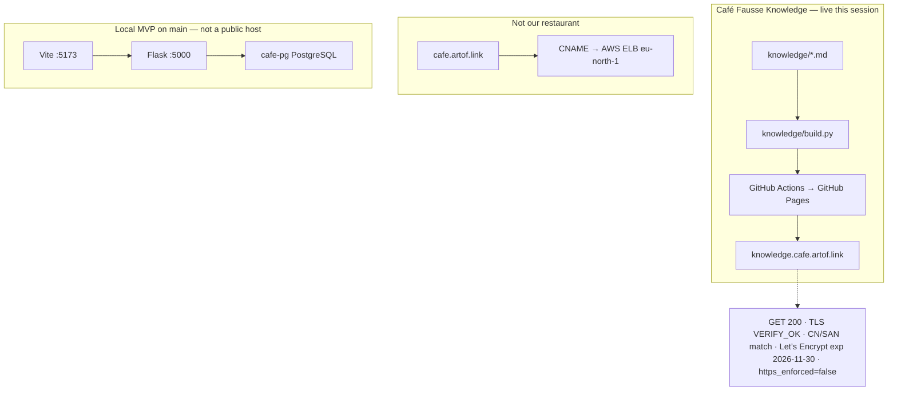
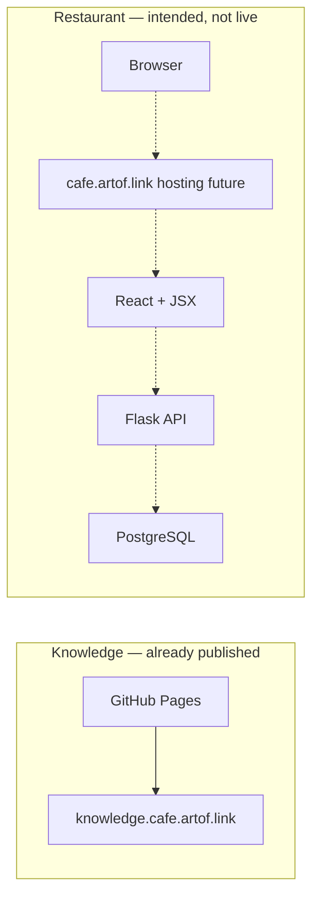

# Stack

Two surfaces, two teams, two hostnames. GitHub only. This page is Café Fausse as used so far, plus an intended restaurant to-be. It is **not** florist Path B, not 14 hats, not Kafka/BFF, not 3DX Lab.

**Probe date:** 2026-09-01 Europe/Berlin (this session).

## Two hostnames

| Hostname | Job | This session |
|---|---|---|
| `knowledge.cafe.artof.link` | This knowledge map | GET **200**. TLS VERIFY_OK. CN/SAN match. Let’s Encrypt, expires 2026-11-30. Pages `cname` matches. **`https_enforced=false`** — owner still needs to tick Enforce HTTPS. |
| `cafe.artof.link` | Intended restaurant | DNS CNAME → AWS ELB `eu-north-1`. **Not our restaurant.** Do not claim Café Fausse App is live there. |

They do not share a load balancer. This site is not the shop.

## Knowledge surface — Café Fausse Knowledge

Allowlisted markdown under `knowledge/` is built to static HTML (`knowledge/build.py`) and published as **GitHub Pages** (workflow `.github/workflows/knowledge-site.yml`). There is no CMS. No GitLab Pages.

## Implementation surface — Café Fausse App

- **Runtime in-repo on `main` (PRs #9 + timezone #12):** React + JSX (`frontend/`), Flask (`backend/cafe_fausse/`), PostgreSQL (`backend/schema.sql`).
- **MVP:** official SRS only (`docs/srs.md`, FR-1..FR-18, NFR-1..NFR-9; PDF SoT).
- **Local path (cts-ai; not probed from this VM):** Vite `http://127.0.0.1:5173`, Flask `:5000`, Docker `cafe-pg`. Journey 1–9 results: **Unknown**.
- **Hosting of `cafe.artof.link`:** future. Not AWS in the restaurant MVP PR.
- Extra features after the SRS belong in [Future](future.md).

## As-is HLD

What is true now: knowledge Pages is live; the restaurant runs locally from `main`; `cafe.artof.link` points at someone else’s ELB.

Static copy (renders if Mermaid JS is blocked): [as-is SVG](assets/hld-as-is.svg).

## Intended to-be HLD

Intended, not a live restaurant probe. Knowledge stays GitHub Pages. The restaurant hostname would terminate TLS, then serve React + JSX talking to Flask talking to PostgreSQL. Dashed = not live this session.

Static copy: [to-be SVG](assets/hld-to-be.svg).

## CI/CD (this repo)

- GitHub Actions only. No GitLab CI, no `.gitlab-ci.yml`, no AWS pipelines here.
- Knowledge: build on pull requests; deploy Pages from `main`.
- App CI (`.github/workflows/ci.yml`): fail closed if `docs/srs.md` / official PDF SHA256 missing; Flask tests against PostgreSQL; frontend test + build.
- Public repository. Assignment collaborator `quantic-grader` is required; **the owner must add that person** — agents must not.
- **Author does not merge their own PR.** MRC COMMENT is role-approve until a distinct GitHub App identity (see PR #14 / issue #13). Merge gate: GitHub `APPROVE` from a non-author.

## Honesty

- `knowledge.cafe.artof.link` was GET 200 this session. Enforce HTTPS is still off.
- `cafe.artof.link` is not Café Fausse App.
- Journey 1–9 pass/fail remains **Unknown**.
- NFR timings without a measured probe remain **Unknown**.
- Do not claim this system is antifragile.
