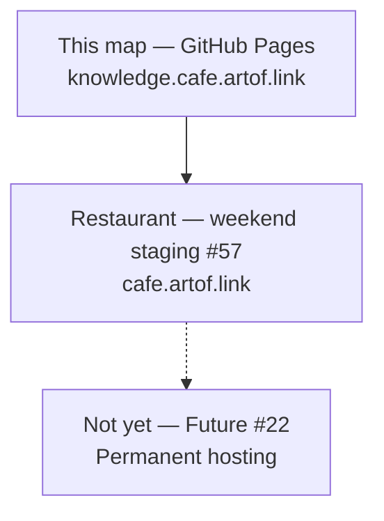
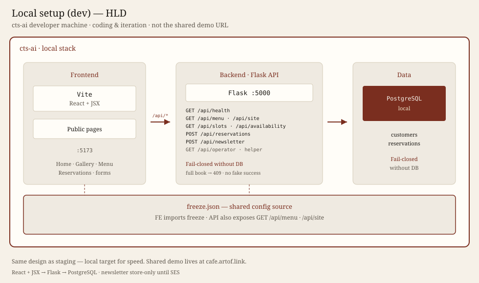
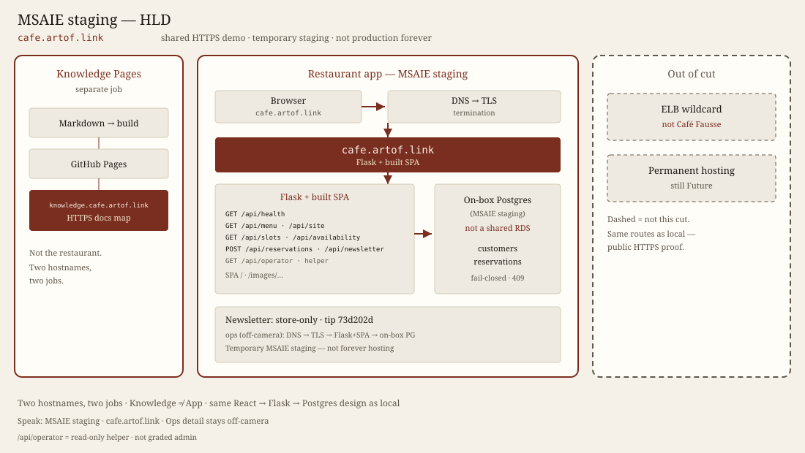
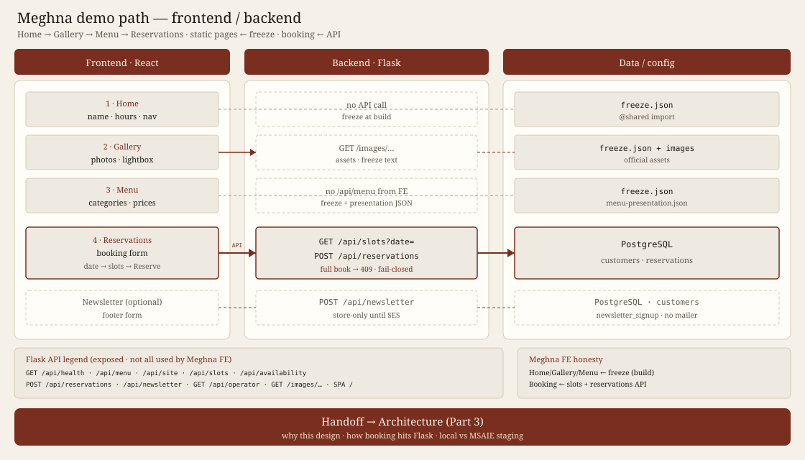
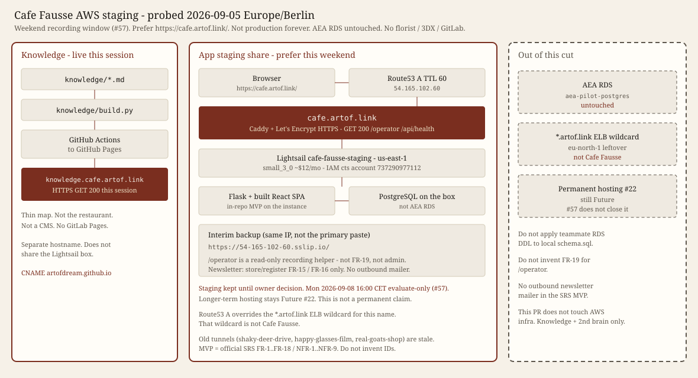
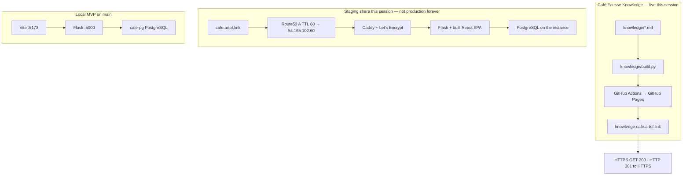
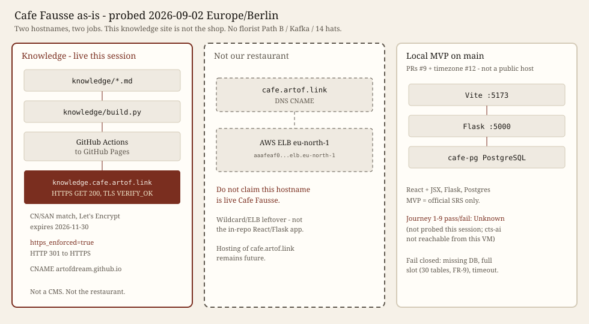
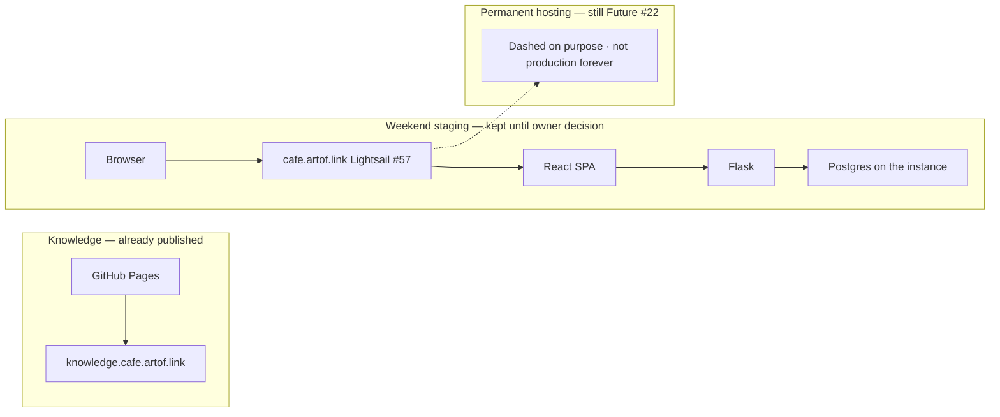
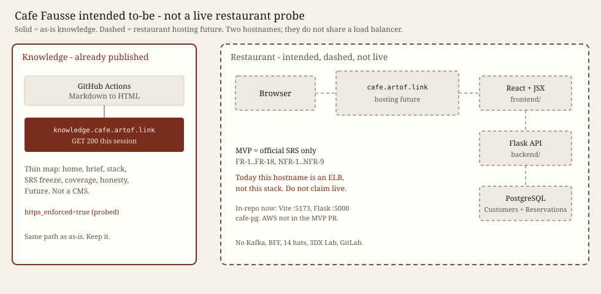

# Stack

**In plain English:** There are two public websites with two jobs. This page is the picture of how they are built and hosted. It is not a florist architecture essay, not Path B, not 14 hats, not Kafka/BFF, and not 3DX Lab.

1. **This knowledge map** at `knowledge.cafe.artof.link` — GitHub Pages. Explains the project. Does not take reservations.
2. **The restaurant app** at `cafe.artof.link` — React + Flask + PostgreSQL. Weekend Lightsail staging ([#57](https://github.com/artofdream/aea-interactive-design/issues/57)), not forever production. Permanent hosting is still [Future #22](https://github.com/artofdream/aea-interactive-design/issues/22).

They do not share a load balancer. GitHub only. Short labels: [Glossary](glossary.md).

**Probe date:** 2026-09-05 Europe/Berlin (this session) for hostname rows. Journey / NFR evidence stays the 2026-09-02 records on [Coverage](coverage.md).

## Two hostnames

| Hostname | Job | This session |
|---|---|---|
| `knowledge.cafe.artof.link` | This knowledge map | HTTPS GET **200**. HTTP **301** to HTTPS. TLS VERIFY_OK. CN/SAN match. Let’s Encrypt, expires 2026-11-30. Pages `cname` matches. **`https_enforced=true`**. Cert **approved**. |
| `cafe.artof.link` | Prefer live share this session (Lightsail staging) | HTTPS GET **200** (SPA + `/operator` + `/api/health`). TLS CN/SAN `cafe.artof.link`. DNS A `54.165.102.60`. [#57](https://github.com/artofdream/aea-interactive-design/issues/57) weekend window — **not** production forever. Longer-term hosting stays [#22](https://github.com/artofdream/aea-interactive-design/issues/22). |

They do not share a load balancer. This site is not the shop.

## Knowledge surface — Café Fausse Knowledge

Allowlisted markdown under `knowledge/` is built to static HTML (`knowledge/build.py`) and published as **GitHub Pages** (workflow `.github/workflows/knowledge-site.yml`). There is no CMS. No GitLab Pages.

## Implementation surface — Café Fausse App

- **Runtime in-repo on `main` (PRs #9 + timezone #12):** React + JSX (`frontend/`), Flask (`backend/cafe_fausse/`), PostgreSQL (`backend/schema.sql`).
- **MVP:** official SRS only (`docs/srs.md`, FR-1..FR-18, NFR-1..NFR-9; PDF SoT).
- **Local path (cts-ai; this VM did not reach it):** Vite `http://127.0.0.1:5173`, Flask `:5000`, Docker `cafe-pg`. App this session: Journey **J1–J8 PASS** (DB up); **J9 PASS** (Vite-only viewports + theme; not Flask+Postgres). After the J1–J8 handoff, App reported `cafe-pg` unreachable. See [Coverage](coverage.md).
- **Hosting of `cafe.artof.link`:** Lightsail `cafe-fausse-staging` this weekend ([#57](https://github.com/artofdream/aea-interactive-design/issues/57)): Route53 A, Caddy + Let’s Encrypt, Flask + built SPA, PostgreSQL **on the instance**. AEA RDS untouched. Not a permanent claim. Longer-term hosting stays [#22](https://github.com/artofdream/aea-interactive-design/issues/22). AWS is not in the restaurant MVP PR.
- Extra features after the SRS belong in [Future](future.md). AWS RDS column dump vs local schema: [map + rationale](future/aws-schema-map.md) (no cts-ai required).

## Local (dev) vs AWS MSAIE staging

**On camera:** say **cafe.artof.link** is the **staging environment for the MSAIE project** (temporary — not production forever). Full architect table + why/how questions: [Local vs AWS](part3-local-vs-aws.md). Lightsail / Caddy / Route53 names stay on this page — not in NATURAL spoken lines.

Same design, two deploy targets. **React + JSX → Flask → PostgreSQL.** Fail-closed without a database. Newsletter is **store-only** (do not claim outbound SES).

| | **Local (dev)** | **AWS MSAIE staging** |
|---|---|---|
| **What was used** | Clone on **cts-ai** at `C:\projects\code\aea-interactive-design` | Deployed staging at **cafe.artof.link** — MSAIE project staging |
| **Explanation** | Coding, iteration, and CI-adjacent work without touching the shared demo | Shared public HTTPS host graders (and the team) can open; same product surface Meghna walks |
| **Rationale** | Fast local iterate | Prove the **same stack** on a public HTTPS host; one URL for the talk |
| **Implementation** | Vite + Flask + **local Postgres** | **Caddy (TLS)** → Flask → **on-box Postgres** (host tip `73d202d`; **not AEA RDS**) |

Talk spine pointer: Part 2 UX/business · Part 3 architecture why/how · Part 4 coding why/how · Part 5 honesty. See [Parts 3–5 materials](parts-345-materials.md). Architect visuals: [Part 3 HLD + Meghna FE/BE](part3-hld-flow-notes.md) · [Part 4 coding overview](part4-coding-overview.md).

**Same usecase, three depths:** Part 2 = frontend/UX view · Part 3 = architecture behind it · Part 4 = how it’s implemented (forms → API → modules → DB). The new diagrams are Part 3 + Part 4 of that ladder.

## Architect dual-env HLD (prefer these)

**On camera:** **cafe.artof.link** is **MSAIE staging** (temporary — not production forever). Same design, two deploy targets. Notes: [Part 3 HLD + flow](part3-hld-flow-notes.md). Older [as-is](assets/hld-as-is.svg) / [AWS staging](assets/hld-aws-staging.svg) SVGs stay below as **history / probe archive**.

**PROTOTYPE** visuals — not Quantic submit.

**Local (dev)** — Vite / Flask / local Postgres on cts-ai. Coding and iteration. Not the shared demo URL.

Fallback raster: [hld-local-720.png](assets/hld-local-720.png).

**MSAIE staging** — browser → DNS/TLS → Flask + built SPA → **on-box Postgres (not AEA RDS)**. Knowledge Pages is a separate hostname. Newsletter **store-only**.

Fallback raster: [hld-aws-msaie-720.png](assets/hld-aws-msaie-720.png).

## Meghna FE↔BE flow

What Meghna clicks vs what hits Flask. **Home / Gallery / Menu** read the **freeze** at build — not `GET /api/menu`. **Booking** = `GET /api/slots?date=` then `POST /api/reservations`. Newsletter optional `POST /api/newsletter` **store-only**. Notes: [Part 3 HLD + flow](part3-hld-flow-notes.md).

Fallback raster: [flow-meghna-fe-be-720.png](assets/flow-meghna-fe-be-720.png).

## Part 4 coding overview

Forms · functions · frontend · backend · API · DB. Static pages import `freeze.json`; booking goes through slots + reservations; newsletter is store-only. Notes: [Part 4 coding overview](part4-coding-overview.md).

Fallback raster: [flow-coding-overview-720.png](assets/flow-coding-overview-720.png).

## AWS staging facts (this weekend)

Owner-probed implementation, not a second product. This session this agent also GET **200** on `https://cafe.artof.link/` (~0.04s), `/operator` **200**, `/api/health` **200** `{"ok":true}`; DNS A `54.165.102.60`; TLS CN/SAN `cafe.artof.link`, Let’s Encrypt `notAfter=2026-12-04`.

| Fact | Status |
|---|---|
| Lightsail | `cafe-fausse-staging`, us-east-1, `small_3_0` (~$12/mo), IP `54.165.102.60` |
| DNS | Route53 `cafe.artof.link` **A** → that IP, TTL 60. Overrides the `*.artof.link` ELB wildcard. That wildcard is **not** Café Fausse. |
| Edge | Caddy + Let’s Encrypt HTTPS |
| App | Flask + built React SPA on the instance |
| Database | PostgreSQL **on the Lightsail instance**. AEA RDS `aea-pilot-postgres` **untouched**. |
| Prefer share | `https://cafe.artof.link/` (+ `/operator`, `/api/health`) |
| Interim backup | `https://54-165-102-60.sslip.io/` (same IP; not the primary paste) |
| Stale tunnels | `shaky-deer-drive.loca.lt`, `happy-glasses-film`, `real-goats-shop` |
| IAM | `cts` account `737290977112` |
| Window | Staging stays **up** until the owner explicitly requests tear-down. Monday **2026-09-08 16:00 Europe/Berlin** is evaluate-only (not automatic tear-down). Whether Quantic graders need the host up for video evaluation remains **Unknown** until the owner shares correspondence ([#57](https://github.com/artofdream/aea-interactive-design/issues/57)). |
| `/operator` | Read-only recording helper. **Not FR-19.** Not an admin console. |
| Newsletter | Store/register **FR-15** / **FR-16** only. No outbound mailer in the SRS MVP. |
| Permanent hosting | Still [Future #22](https://github.com/artofdream/aea-interactive-design/issues/22). #57 does not close it. |

**History / probe archive** (prefer [hld-aws-msaie](assets/hld-aws-msaie.svg) for the architect cut): [AWS staging SVG](assets/hld-aws-staging.svg).

## As-is HLD (history / probe archive)

What is true now: knowledge Pages is live; prefer `https://cafe.artof.link/` as the weekend Lightsail staging share (#57) — not production forever; the restaurant code still lives on `main` (local Vite / Flask / `cafe-pg`).

Static copy (renders if Mermaid JS is blocked): [as-is SVG](assets/hld-as-is.svg) — **history / probe archive**. Prefer [local HLD](assets/hld-local.svg) + [MSAIE staging HLD](assets/hld-aws-msaie.svg) for the architect cut. Same probe facts in more detail: [AWS staging SVG](assets/hld-aws-staging.svg) (also archive).

## To-be HLD (permanent vs staging keep-up)

Knowledge stays GitHub Pages. Weekend staging is **live this session** and stays **up** until the owner explicitly requests tear-down. Monday **2026-09-08 16:00 Europe/Berlin** is evaluate-only (not automatic tear-down). Whether Quantic graders need the host up for video evaluation remains **Unknown** until the owner shares correspondence. Permanent restaurant hosting remains [Future #22](https://github.com/artofdream/aea-interactive-design/issues/22) and stays dashed.

Static copy: [to-be SVG](assets/hld-to-be.svg).

## CI/CD (this repo)

- GitHub Actions only. No GitLab CI, no `.gitlab-ci.yml`, no AWS pipelines here.
- Knowledge: build on pull requests; deploy Pages from `main`.
- App CI (`.github/workflows/ci.yml`): fail closed if `docs/srs.md` / official PDF SHA256 missing; Flask tests against PostgreSQL; frontend test + build.
- Public repository. Assignment collaborator `quantic-grader` is required; **the owner must add that person** — agents must not.
- **Author does not merge their own PR.** MRC **COMMENT** is the role-approve signal (see PR #14 / issue #13). For `artofdream`-authored PRs, `cursor[bot]` may merge after this-run green checks and Bugbot resolve-or-decline.

## Honesty

- `knowledge.cafe.artof.link` was HTTPS GET 200 this session. HTTP GET returned 301 to HTTPS. Pages `https_enforced=true`.
- Prefer `https://cafe.artof.link/` as the weekend Lightsail staging share (#57). Route53 A overrides the `*.artof.link` ELB wildcard; that wildcard is **not** Café Fausse. Postgres is on the instance. AEA RDS untouched. Not production forever. Longer-term hosting stays #22.
- Journey **J1–J8 PASS** (cts-ai, DB up); **J9 PASS** (Vite-only viewports + theme). This VM did not reach Vite.
- **NFR-1** / **NFR-2** local Vite notes (56 ms / 32 ms) are **not** an SRS-budget “met.” **NFR-7** is **partial** (Edge all routes + Firefox home; Chrome/Safari Unknown).
- Mentioned tunnel `https://nine-teams-try.loca.lt/` — GET **timed out** this session.
- Do not claim this system is antifragile.
