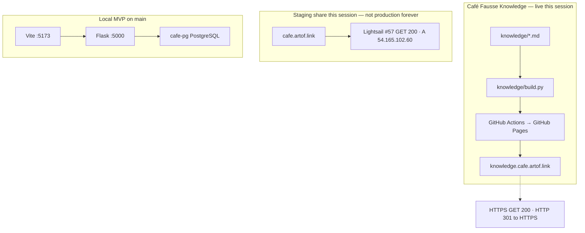
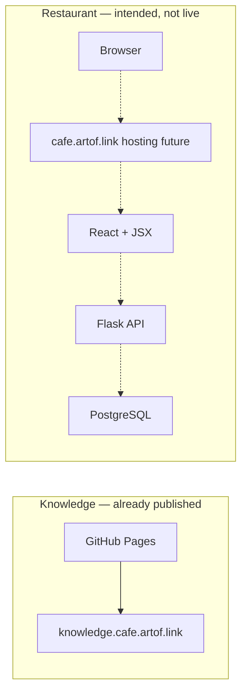

# Stack

Two surfaces, two teams, two hostnames. GitHub only. This page is Café Fausse as used so far, plus an intended restaurant to-be. It is **not** florist Path B, not 14 hats, not Kafka/BFF, not 3DX Lab.

**Probe date:** 2026-09-05 Europe/Berlin (this session) for hostname rows. Journey / NFR evidence stays the 2026-09-02 records on [Coverage](coverage.md).

## Two hostnames

| Hostname | Job | This session |
|---|---|---|
| `knowledge.cafe.artof.link` | This knowledge map | HTTPS GET **200**. HTTP **301** to HTTPS. TLS VERIFY_OK. CN/SAN match. Let’s Encrypt, expires 2026-11-30. Pages `cname` matches. **`https_enforced=true`**. Cert **approved**. |
| `cafe.artof.link` | Prefer live share this session (Lightsail staging) | HTTPS GET **200** (SPA + `/operator` + `/api/health`). TLS CN/SAN `cafe.artof.link`. DNS A `54.165.102.60`. [#57](https://github.com/artofdream/aea-interactive-design/issues/57) weekend window — **not** production forever. Longer-term hosting stays [#22](https://github.com/artofdream/aea-interactive-design/issues/22). |

They do not share a load balancer. This site is not the shop.

## Knowledge surface — Café Fausse Knowledge

Allowlisted markdown under `knowledge/` is built to static HTML (`knowledge/build.py`) and published as **GitHub Pages** (workflow `.github/workflows/knowledge-site.yml`). There is no CMS. No GitLab Pages.

## Implementation surface — Café Fausse App

- **Runtime in-repo on `main` (PRs #9 + timezone #12):** React + JSX (`frontend/`), Flask (`backend/cafe_fausse/`), PostgreSQL (`backend/schema.sql`).
- **MVP:** official SRS only (`docs/srs.md`, FR-1..FR-18, NFR-1..NFR-9; PDF SoT).
- **Local path (cts-ai; this VM did not reach it):** Vite `http://127.0.0.1:5173`, Flask `:5000`, Docker `cafe-pg`. App this session: Journey **J1–J8 PASS** (DB up); **J9 PASS** (Vite-only viewports + theme; not Flask+Postgres). After the J1–J8 handoff, App reported `cafe-pg` unreachable. See [Coverage](coverage.md).
- **Hosting of `cafe.artof.link`:** Lightsail staging this weekend ([#57](https://github.com/artofdream/aea-interactive-design/issues/57)). Not a permanent claim. Longer-term hosting stays [#22](https://github.com/artofdream/aea-interactive-design/issues/22). AWS is not in the restaurant MVP PR.
- Extra features after the SRS belong in [Future](future.md). AWS RDS column dump vs local schema: [map + rationale](future/aws-schema-map.md) (no cts-ai required).

## As-is HLD

What is true now: knowledge Pages is live; the restaurant runs locally from `main`; prefer `https://cafe.artof.link/` as the weekend Lightsail staging share (#57) — not production forever. The static SVG below still shows the older ELB picture; use the mermaid for this session.

Static copy (renders if Mermaid JS is blocked): [as-is SVG](assets/hld-as-is.svg).

## Intended to-be HLD

Intended, not a live restaurant probe. Knowledge stays GitHub Pages. The restaurant hostname would terminate TLS, then serve React + JSX talking to Flask talking to PostgreSQL. Dashed = not live this session.

Static copy: [to-be SVG](assets/hld-to-be.svg).

## CI/CD (this repo)

- GitHub Actions only. No GitLab CI, no `.gitlab-ci.yml`, no AWS pipelines here.
- Knowledge: build on pull requests; deploy Pages from `main`.
- App CI (`.github/workflows/ci.yml`): fail closed if `docs/srs.md` / official PDF SHA256 missing; Flask tests against PostgreSQL; frontend test + build.
- Public repository. Assignment collaborator `quantic-grader` is required; **the owner must add that person** — agents must not.
- **Author does not merge their own PR.** MRC **COMMENT** is the role-approve signal (see PR #14 / issue #13). For `artofdream`-authored PRs, `cursor[bot]` may merge after this-run green checks and Bugbot resolve-or-decline.

## Honesty

- `knowledge.cafe.artof.link` was HTTPS GET 200 this session. HTTP GET returned 301 to HTTPS. Pages `https_enforced=true`.
- Prefer `https://cafe.artof.link/` as the weekend Lightsail staging share (#57). Not production forever. Longer-term hosting stays #22.
- Journey **J1–J8 PASS** (cts-ai, DB up); **J9 PASS** (Vite-only viewports + theme). This VM did not reach Vite.
- **NFR-1** / **NFR-2** local Vite notes (56 ms / 32 ms) are **not** an SRS-budget “met.” **NFR-7** is **partial** (Edge all routes + Firefox home; Chrome/Safari Unknown).
- Mentioned tunnel `https://nine-teams-try.loca.lt/` — GET **timed out** this session.
- Do not claim this system is antifragile.
